# Context
[Nubank](https://nubank.com.br/) was born in 2013 with the mission to fight complexity to empower people in their daily lives by reinventing financial services. It's one of the world’s largest digital banking platforms, serving more than 70 million customers across Brazil, Mexico, and Colombia. As one of the leading technology companies in the world, Nu leverages proprietary technologies and innovative business practices to create new financial solutions and experiences for individuals and SMEs that are simple, intuitive, convenient, low-cost, empowering, and human. Guided by its mission, Nu is fostering access to financial services across Latin America.

 
## User needs 

Our team's objective was to increase our customer's satisfaction, measured by NPS. Through interviews with our clients, we identified that financial support has an important role in family relationships and there's a strong emotional bond that makes that support so important, with an opportunity to connect providers and dependents on a platform that enables sharing and controlling family finances.

In the same research, we identified that clients want more than just provide financial products to their dependents with safety: they want to leverage their social circle connection to be financially stronger and at the same time they want to separate the shared expenses from the personal ones, keeping privacy and also managing shared expenses better.

## The solution

The additional card is a common product found in almost every other bank's portfolio. It's an extra physical card that you request for someone you trust, since they'll be able to do purchases in your behalf using your credit line and you'll be liable for paying the bill.

```grid|1
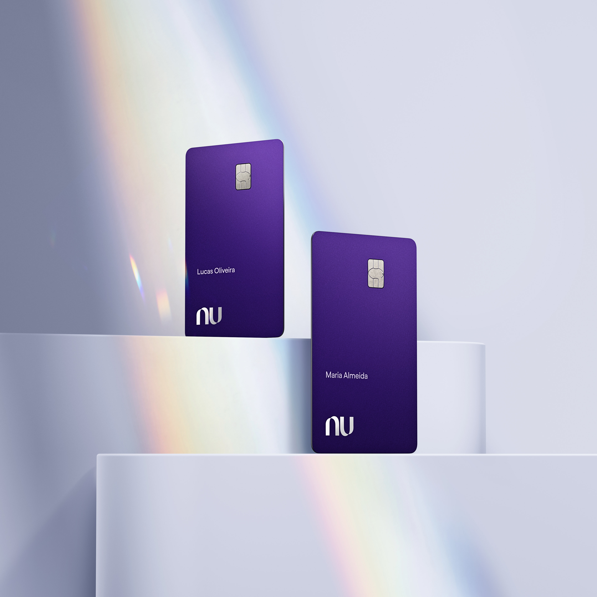
``` 

Although we see many couples using this product as a way to share their finances or optimize credit benefits, it's a product that works very well for parents wishing to initiate their children in the financial world. Generaly, it's used for extending someone's purchase power to a dependent that might not have access to credit products.

Since Nubank didn't offer this product, clients have been finding "hacks" to accomplish these goals, such as sharing a single credit card among people in their households, either via the physical card or sharing the information of their virtual cards. This not only could present risks to their data security, but also offered a bad experience for their shared financial lives.


## Defining success

Our main mission was to provide a delightful experience for anyone wishing to extend their credit purchase power. Nubank is well known for offering innovative solutions and we didn't want to build something incrementally better, but fundamentally different.


```grid|1
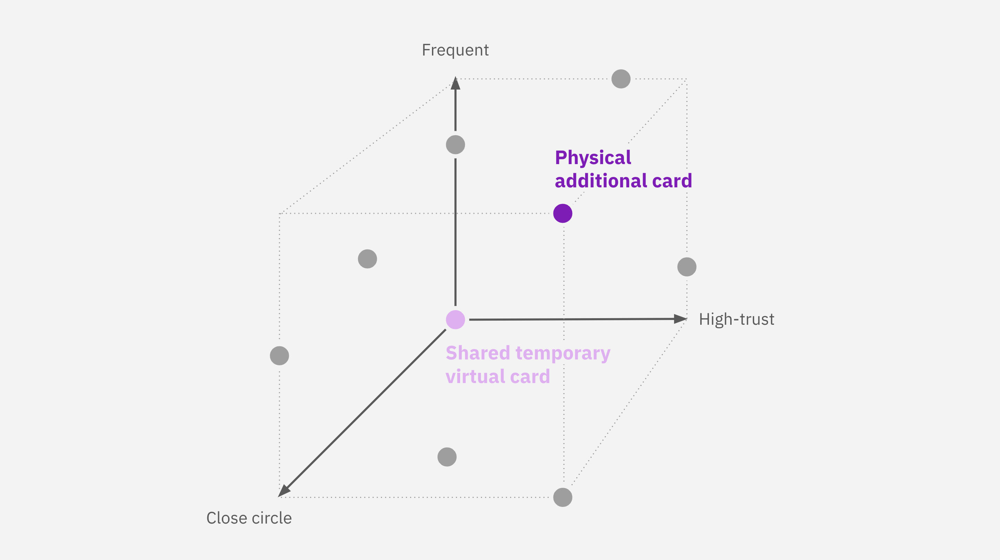
```  

The traditional Additional Card is a good solution for frequently sharing with high-trust people from your close social circle, but we see this as just the first step. We wanted to build a platform on top of which we'd build other features, expanding the coverage for more diverse use cases. One example is enabling users to share Temporary Virtual Cards, more suited for people willing to share with someone they don't trust so much, or that are less frequent, such as friends in need.

In a broader context, this was the first social product being built at Nubank. For that reason, some members of the team, including me, were selected to work on a cross-team taskforce to build a Social Vision for the whole company - but that's an story for other case study ;) This helped us draw a short, medium and long-term for how this product would evolve from being more card-centric, reusing the current App structure, for a more social experience in the future.
 
<jumbo caption="A summary of our short, medium and long-term design vision for the product, moving from a card-centric experience to a more relationship-centred.">
    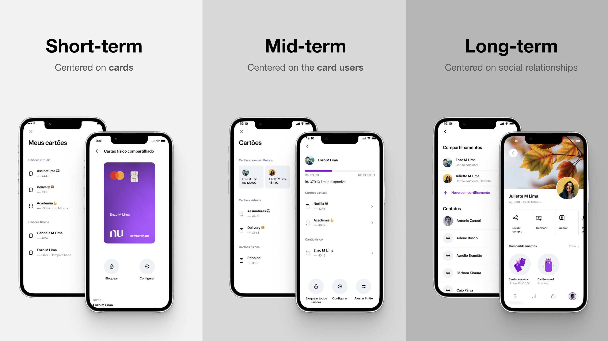
</jumbo>  

Talking about relationships, this project aimed at building actually two full user experiences. This is where the complexity of this product starts to show: not only we have to design and implement a full new credit card product, but also consider two full experiences that have things in common but also important differences.
* One for the **Card Owner**, the person who requests the card and who is actually sharing their credit line. In summary, the Owner need to have visibility of spending, specially when paying the credit card bill. They also need to have control of the card settings, such as defining a spending limit.
* On the other side is the **Card Holder**, who effectively uses the card for purchases. We noticed that in our competitors' solutions these needs are often not prioritized, leaving them without autonomy and visibility. Our focus them was providing a native-like experience, so this person would feel like the card was their own.

<jumbo caption="The card owner and the card holder share many needs, but others are specific to each of these users.">
    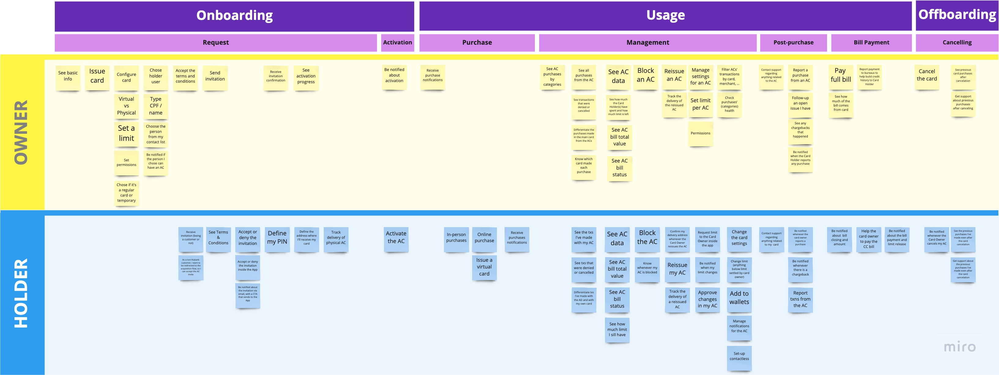
</jumbo> 


# Prototyping

Our objective designing the request flow was to make it as simple as possible but without compromising transparency with the customer. With the constraint of only being able to offer Additional Cards to customers that are already clients, all we needed was the Holder's CPF number (it's like a brazilian social security number). An additional legal requirement was ask the relationship between them. Although not happy with asking such a personal question here, it provided nice data for understanding better our converting users later.

<jumbo caption="The card request flow, designed to be very simple without compromising transparency.">
    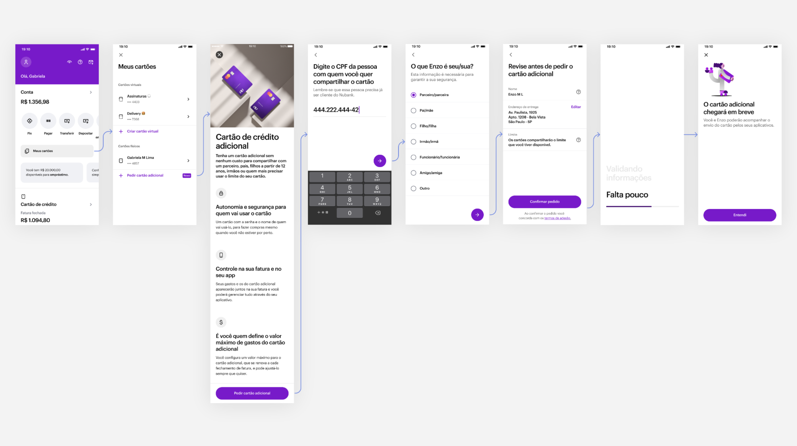
</jumbo>

Nubank has a very mature Design System, which we strongly leveraged as a way to quickly tangibilize ideas and speed up the development process.

But the main challenge of this project was not the onboarding or the request flow, but the actual day-to-day of managing this card and the purchases, and for that I took a step back to understand how Credit Card exists in today's app structure. I noticed we have 3 main areas, and each one had a general theme with specific tasks.

```grid|1
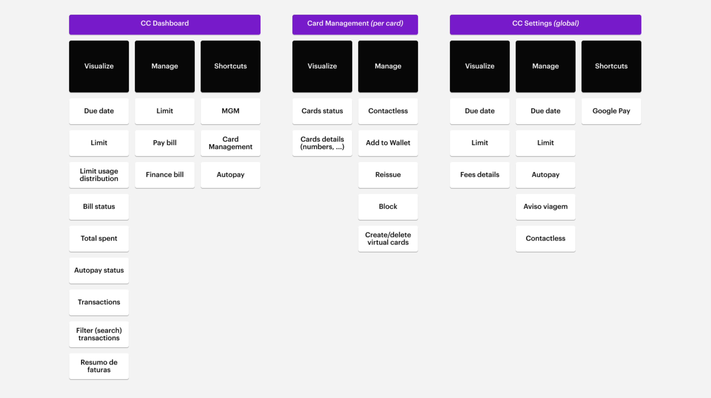
```

Brainstorming with the team about possible ways to solve the problems that were still opened, I've prototype 3 different concepts for the Owner management and 2 for the Holder, exploring in different ways the app architecture. With that it was time to user test them.

## Concept tests

To better understand user's mental model, our UX Researcher Ana Urquiza and I interviewed 16 customers split into different grupos of card owners and card holders.

```grid|1 
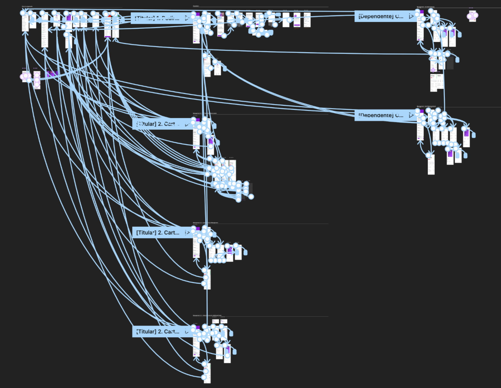
``` 

Our main takeways were:
* User mental models were aligned to how the app is currently structured, so the solutions that maintain this status quo performed better and should be prioritized. 
* We had proposed a solution with filters to better visualize the card's spending. Although this solution performed very well with users, we found out most of the actually used another, more hidden screen. Since we started seen this strong trends since the first interviews, we quickly prototyped a solution there, which proved to be the best according to users.
* The relationship-centered architecture vision is very intuitive and perceived as more clear and organized than our current, but the short-term solution works well too.

```grid|1
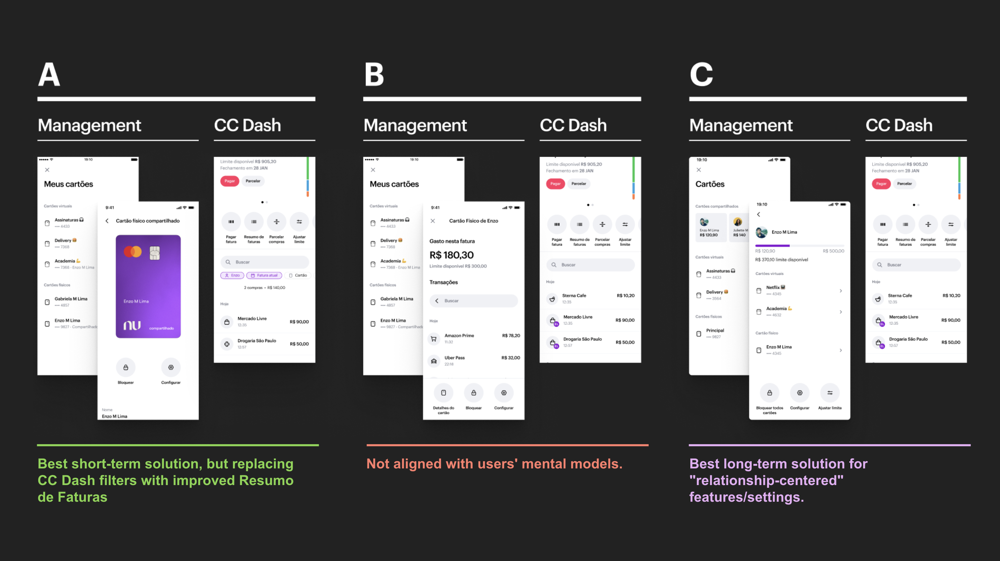 
```

# Plastic design

Since holders might already have another Roxinho with their name, with this project we aimed to offer a better visual differentiation than just the card number on the back.

Raising the main constraints since the beggining was crucial when prioritizing explorations:
* Different changes in the plastic design had different impacts on the card manufacturing process, ranging from weeks to several months. After internal alignments it was decided we could not afford too long delays for the MVP.
* There's a social bias on people that need to use an Additional Card, e.g. when going to a bar with friends and paying with a card given by your parents. This led us to explore visually subtle ideas, that would be helpful to the user itself but not call too much attention.
* Some common customizations we saw in competitors are custom printed names and alternative card colors the user can pick. This was not an option for us for a variety of reasons, but we could leverage this opportunity to bring something innovative.
* Any permanent plastic differentiation needed to scale for the full family of cards: the regulat credit card, the premium card, the new designs being used in Mexico and Colombia.

```grid|1 
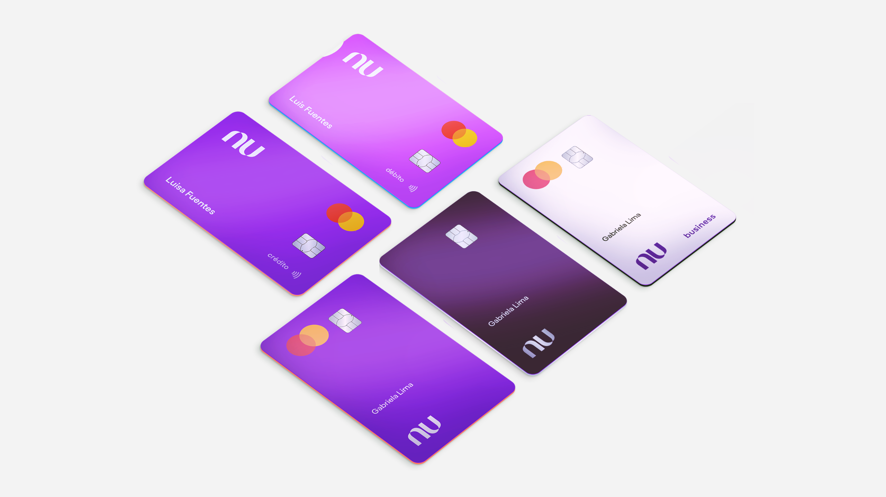
```

After exploring many ideas such as new shapes, colors and extra icons on the card design, I think our final solution is small but elegant: an extra label on the back of the card saying "Compartilhado por" ("shared by") followed by the card owner's name. Not only this helps differentiate among multiple cards, but users mentioned this design values the emotional bond between the two people.
 
```grid|1
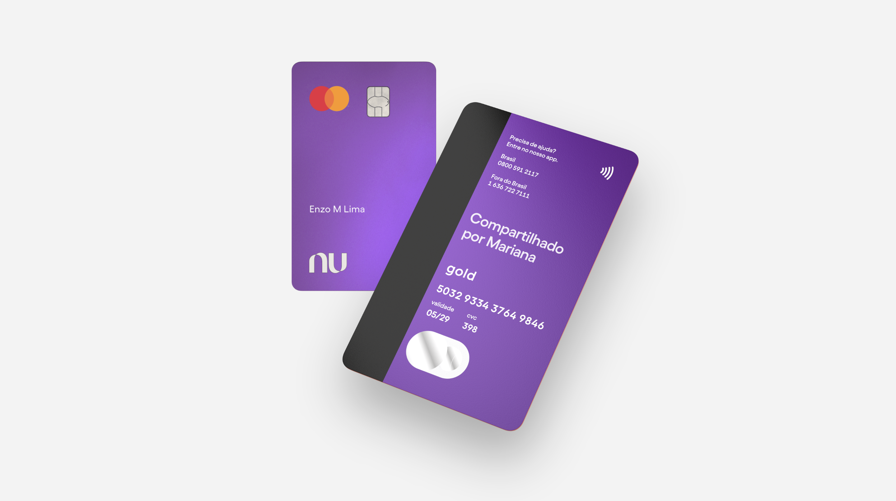
```

# Results

After many months of internal tests and bug fixes, at the moment of writing this article we've just released the product publicly. The main user feedbacks have been requests of features that are already in our roadmap, and some of them you can see on the next section of this text.

<results-banner
    data='{
        "cards requested": "100,000+",
        "average purchase volume": "+ 15%",
        "customer NPS": "...?"
    }'>
</results-banner>


# Future work
 
One of the most requested features is having more visibility on purchases made on a particular additional card. We're implementing a new screen that shows more clearly how much has been spent on that card, with a dedicated transactions feed.

```grid|1
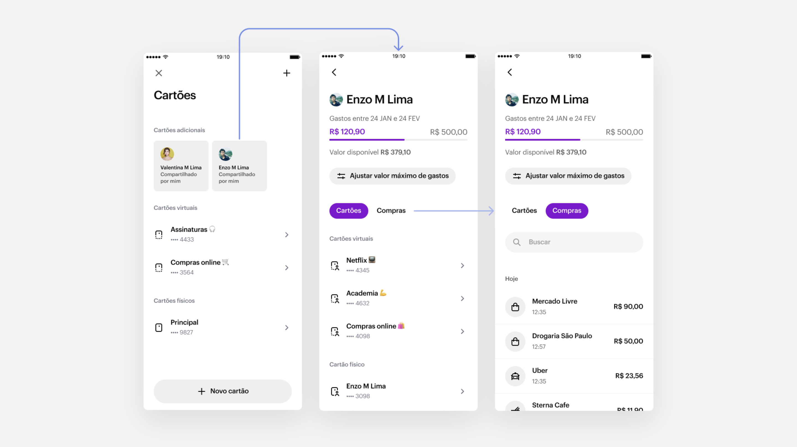
```

We'd like to improve the Card Holder onboarding with a more visual presentation of the main features and where to find them on the app.This might improve customer engagement and reduce churn.

```grid|1
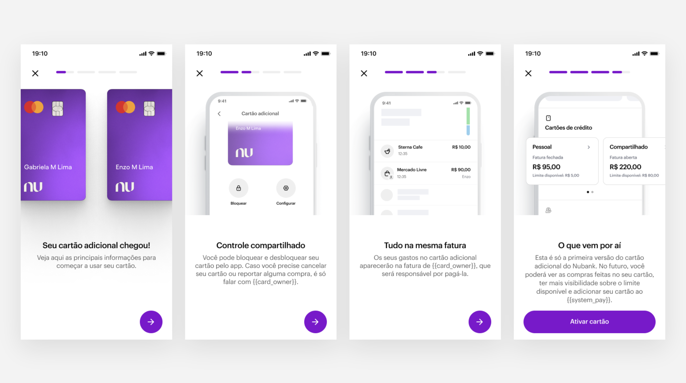
```

Many users have been reporting problems understanding what's the card password, which have been impacting our results. We're exploring hypothesis of the problem and possible solutions to experiment on.
 
```grid|1
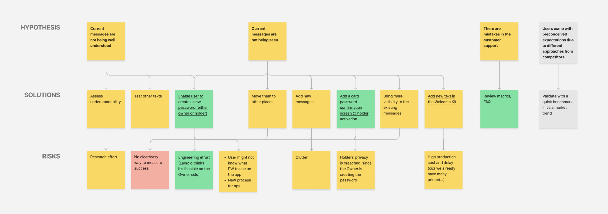
```

To empower our customer support agents to help customers with anything they need related to Additional Cards we designed several improvements to the CX tool.

<jumbo caption="A series of improvements on the customer support tool.">
    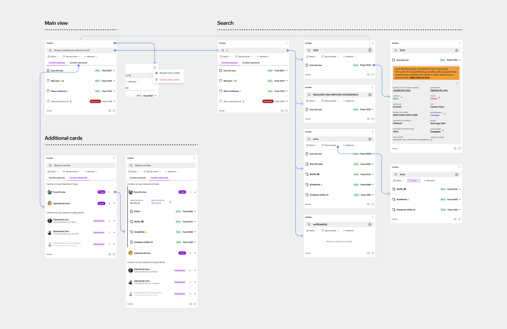
</jumbo>


# Learnings & conclusion

* Lorem ipsum
* Lorem ipsum
* Lorem ipsum


# Links

<links-list
    items='[
        {
            "label": "Public release blog post",
            "url": "https://blog.nubank.com.br/cartao-de-credito-adicional-do-nubank-tudo-o-que-voce-precisa-saber/"
        },
        {
            "label": "Nubank website",
            "url": "https://nubank.com.br/"
        }
    ]'>
</links-list> 
