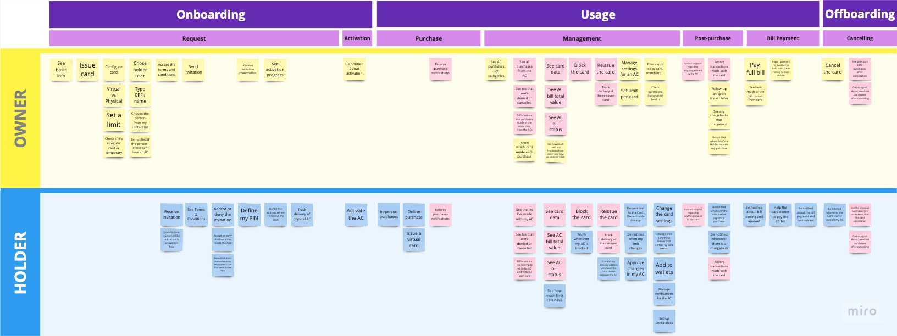
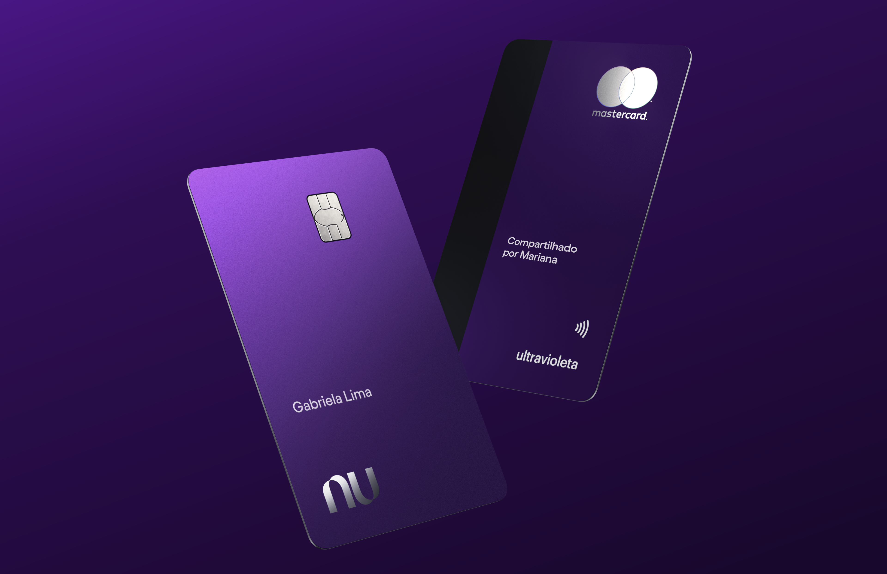

# Context
[Nubank](https://nubank.com.br/) is the largest digital bank in the world. It was founded in 2013 by 3 people, one of them only actually is brazilian, the others are colombian and american. Nubank's first product was a free credit card, a very simple product that proved itself as very innovative. It's a public company since this years' IPO, and it's starting to become reference already in two other latin american countries: Mexico and Colombia.
 
# Understanding the problem

The additional card is a common product found in almost every other brazilian bank's portfolio. It's an extra physical card that you request for someone you trust, since they'll be able to do purchases in your behalf using your credit line, and you'll be completely responsible for paying this bill later.

```grid|1

``` 

Although we see many couples using this product as a way to share their finances or optimize credit benefits, it's a product that works very well for parents wishing to initiate their children in the financial world or any other kind of person that wishes to extend their purchase power to a dependent that might not have access to credit products.

Since Nubank didn't offer this product, clients have been finding "hacks" to accomplish these goals, such as sharing a single credit card among people in their households, either via the physical card or sharing the information of their virtual cards. This not only could present risks to their data security, but also offered a bad experience for their shared financial lives.


## Defining success

Our main mission was to provide a delightful experience for anyone wishing to extend their credit purchase power. Nubank is well known for offering innovative solutions and we didn't want to build something incrementally better, but fundamentally different.


```grid|1

```  

The traditional additional card is a good solution for frequent, high-trust and close circle, but we see this as just the first step. We wanted to build a platform in which we'll build other features that will expand it. One example is enabling users to share Temporary Virtual Cards, a feature we would build right after it and that could better support the use case of sharing to people you don't trust so much, or that are less frequent. 

As far as app experience is concerned we envision this product in the broader context of social features we're building in the app, and we understand the Additional Cards as actually the first social product of the company.
 
<jumbo caption="A summary of our short, medium and long-term design vision for the product, moving from a card-centric experience to a more relationship-centred.">
    
</jumbo>  

Talking about relationships, this project aimed at building actually two full user experiences. In one side is the Card Owner, who is the person who requests the card and who is actually sharing their credit line. On the other side is the Card Holder, who traditionally is not prioritized and thus has no autonomy or visibility and we aim to change that by offering a native experience for them as well, very similar to what they'd have for their personal card. This is where the complexity of this product starts to show: not only we have to design and implement a full new credit card product, but also consider two full experiences that have things in common but also important differences.

<jumbo caption="Card owner and holder share many needs, but others are specific to each of these users.">
    
</jumbo> 


# Research

Our team's objective was to increase our customer's satisfaction, measured by NPS. Through interviews with our clients, we identified that financial support has an important role in family relationships and there's a strong emotional bond that makes that support so important, with an opportunity to connect providers and dependents on a platform that enables sharing and controlling family finances.

In the same research, we identified that clients want more than just provide financial products to their dependents with safety: they want to leverage their social circle connection to be financially stronger and at the same time they want to separate the shared expenses from the personal ones, keeping privacy and also managing shared expenses better.

This complemented an older insight from Amanhã, the main foundational research. In that, we found out that Brazilians want to create social support networks to make financial aid easier among family members and support groups.

# Prototyping

Our objective designing the request flow was to make it as simple as possible, without compromising transparency with the customer. With the constraint of only being able to offer additional cards to customers that are already clients all we need is their CPF number (it's like a brazilian social security number). An additional legal requirement requires us to ask what's the relationship between them.

<jumbo caption="The card request flow, designed to be very simple without compromising transparency.">
    
</jumbo>

Done that we have a simple screen to review the data and we're good to go. But the main challenge of this project was not the onboarding or the request flow, but the actual day-to-day of managing this card and the purchases, and for that I took a step back to understand how Credit Card exists in today's app structure.


```grid|1

```

So grayed out here is our app home, and from there we can reach 3 different sections of the app: the card management, the CC dashboard and the CC settings.
I've designed 3 different concepts for the Owner management and 2 for the Holder, exploring in different ways the app architecture. With that it was time to user test them. It was not usability tests, but conceptual tests.

# Concept tests

To better understand their mental model, with the help of our UX Researcher we interviewed 16 customers split into different grupos of card owners and card holders. We've learned that people's mental models were aligned with the app structure, and they understood very clearly each section's goals and had no problem in finding and using them.  

```grid|1 

``` 

Our main takeways were:
* User mental models are aligned to how the app is currently structured, so the solutions that maintain this status quo should be prioritized. 
* Improving the Bill Summary screen should be prioritized over building filters - although they did perform well.
* The relationship-centered architecture vision is very intuitive and perceived as more clear and organized.

```grid|1
 
```

We've learned that the relationship-centered organization made a lot of sense, and people understood clearly how those cards would be organized and that you'd be able to give a limit to that person in the future.


# Results

```grid|1
 
```

<results-banner
    data='{
        "cards requested": "100,000+",
        "average purchase volume": "+ 15%",
        "customer NPS": "...?"
    }'>
</results-banner>

# Future work
 
One of the most requested features is having more visibility on purchases made on a particular additional card. We're implementing a new screen that shows more clearly how much has been spent on that card, with a dedicated transactions feed.

```grid|1

```

We'd like to improve the Card Holder onboarding with a more visual presentation of the main features and where to find them on the app.This might improve customer engagement and reduce churn.

```grid|1

```

Many users have been reporting problems understanding what's the card password, which have been impacting our results. We're exploring hypothesis of the problem and possible solutions to experiment on.
 
```grid|1

```

To empower our customer support agents to help customers with anything they need related to Additional Cards we designed several improvements to the CX tool.

<jumbo caption="A series of improvements on the customer support tool.">
    
</jumbo>


# Learnings & conclusion

Lorem ipsum


# Links

<links-list
    items='[
        {
            "label": "Public release blog post",
            "url": "https://blog.nubank.com.br/cartao-de-credito-adicional-do-nubank-tudo-o-que-voce-precisa-saber/"
        },
        {
            "label": "Nubank website",
            "url": "https://nubank.com.br/"
        }
    ]'>
</links-list> 
