# Overview

Revolut's ATM network is part of the company's **physical presence** strategy: designing the experience of the next generation of ATMs in Europe. My role was end-to-end UX design—from the customer-facing kiosk to the backoffice that manages the network—and setting the foundations for a brand new medium for Revolut by borrowing patterns from both Web and Mobile while fitting the constraints of a large, tactile, public screen.

The product launched in Spain with plans to expand across Europe. Users can withdraw and deposit cash for free, get a Revolut card from the machine, and use contactless support, in a sleek, branded experience.


# The opportunity

## Revolut, the team, and stakeholders

[Revolut](https://www.revolut.com/) is a British multinational neobank that offers services for individuals and businesses in over 48 countries. Launched in the UK in 2015 with money transfers and exchange, it now has more than 55 million customers using dozens of innovative products. ATMs are a physical extension of that product: they had to feel consistent with the app and brand—simple, fast, trustworthy—while serving users in short, often time-pressed sessions.

```grid|1
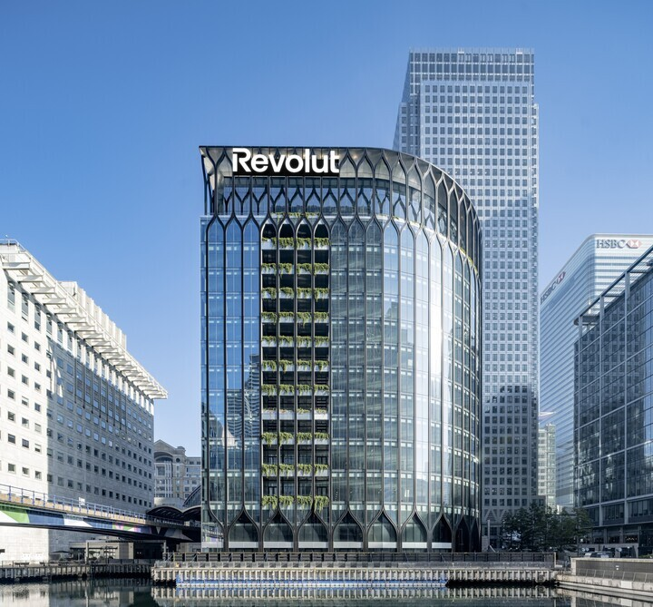
``` 

The core team was small and cross-functional: 1 Product Manager, 1 Product Designer (me), 9 Engineers, 5 Ops Managers, and 2 Business Developers. Stakeholders included CEO and CTO, Legal, Fincrime, Creatives, Mobile, and partners such as Visa and Mastercard. Aligning all of them on scope, compliance, and brand was part of the design challenge.

## Why Spain, and why ATMs

We framed the opportunity around two main themes: why Spain, and why ATMs are ripe for change.

### Cash is still strong

Spain remains one of the most cash-reliant economies in Europe, with **cash representing over 60% of payments** according to the Bank of Spain. It's also a market where Revolut's digital services already have strong traction, with nearly 5 million customers. So the need for cash and the relevance of the Revolut brand were both clear.

### An outdated market

ATMs have barely evolved and still often feature **clunky interfaces, hidden fees, poor exchange rates**, and limited functionality. A big part of that is **legacy technology**, which limits how much better the experience can get. That gap was our design space.

<quote>ATMs have barely evolved and continue to feature clunky interfaces, hidden fees, poor exchange rates, and limited functionalities. Part of the reason is the legacy technology powering these machines, which imposes lots of limitations to offer better experiences.</quote>

## What users told us (trust and NPS)

Beyond general NPS (which we could track by country and city), we looked at the "Factors Deep Dive: categorisation of responses" in customer surveys. User quotes made the themes tangible: *"I've had issues with a product/service being unavailable when I needed"*; *"I worry Revolut doesn't have a physical office, representation in my country, local IBAN"*; *"Fees and conditions are not transparent"*. Addressing these through a visible, reliable physical touchpoint was part of the strategy.

## What we set out to achieve

We defined clear objectives and how we'd measure them:

* **Launch in the Spanish market** — starting with 50 ATMs in Barcelona and Madrid.
* **Increased brand awareness and consumer trust** — measured with surveys before and after.
* **Revenue from transactions** — to offset CAC and support the business case.
* **Increased sign-ups via the machine** — tracked via QR code and activated cards.

<!-- <results-banner
    data='{
        "Launch": "50 ATMs in Barcelona and Madrid",
        "Trust": "Survey before and after",
        "Revenue": "Offsets CAC",
        "Activation": "QR code tracking + activated cards"
    }'>
</results-banner> -->

# Laying the foundations

Before detailing the UI, we had to lock in regulatory constraints and hardware foundations.

## Accessibility first (EDA compliance) 

We designed for the [European Accessibility Act](https://eur-lex.europa.eu/legal-content/EN/TXT/?uri=CELEX%3A32019L0882) (Directive (EU) 2019/882 on accessibility requirements for products and services). For lateral approach by wheelchair users, interactive elements had to fall within defined reach ranges: horizontal clearance **A > 0,30 m** and vertical reach **B < 1,40 m**. We also defined the operational area (screen, card reader, keypad, cash vault) and advertising area, with overall height in the 2,05–2,15 m range and clear space in front of the machine (**< 30 cm** toe/knee clearance) so that the ATM could be used comfortably by everyone.

```grid|1
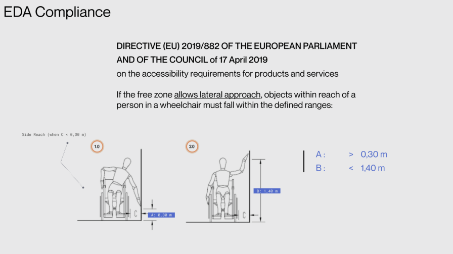
```

## Industrial design: the machine and the screen

The hardware had to feel like Revolut: sleek, dark, with clear zones for screen, card reader, NFC reader, card dispenser, keypad, and cash vault. The main screen is a large multitouch display (1920×1080 px, 68 ppi), and we used RGB lighting for feedback and wayfinding. We compared our screen size and density to a typical smartphone (e.g. iPhone) to make sure we weren’t just scaling a mobile UI—the ATM is a different context and needed a dedicated layout.

```grid|1
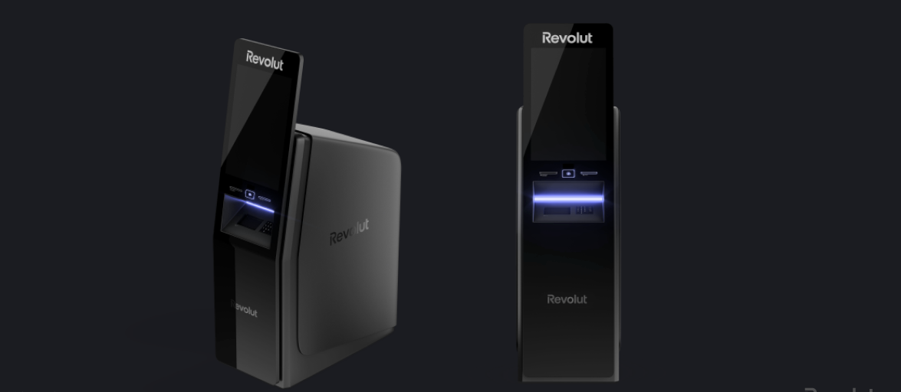
```

```grid|1
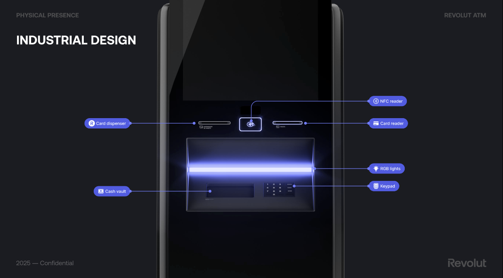
```

## Screen size and density: not a blown-up app

The ATM screen is large (1920×1080 px, 68 ppi, multitouch)—very different from a smartphone. We explicitly compared it to a typical phone (e.g. ~5.4" display, much higher pixel density) to avoid the trap of scaling the Revolut app 1:1. The kiosk is used at arm’s length, in a standing position, often in a hurry; we needed a dedicated layout, larger touch targets, and a clear hierarchy so the experience felt native to the machine, not a blown-up app.

## UI components and patterns

We defined reusable components for the main flows: a clear **amount hero** and quick-amount buttons for withdrawal, a primary action button, and secondary tiles for Deposit cash, Get a Revolut card, and View balance. For receipt we kept it optional: “Do you need a receipt?” with “We will send your receipt via SMS”, then **Send receipt** or **Skip**, so we didn’t add friction for users who didn’t want a receipt. These patterns were documented so the UI stayed consistent across flows and future markets.

## Aligning with the Revolut app

The ATM had to feel part of the same ecosystem as the Revolut app. We referenced the app’s patterns—accounts, balance, language selector, exit—where it made sense, so existing customers felt at home while we still optimised for the physical, single-session context. That balance between familiarity and kiosk-specific design was a constant in the foundations.

# The experience

## What the ATM does

The Revolut ATM experience centres on a few core actions:

* **Free cash withdrawals and deposits**
* **Card dispensing** — get your Revolut card from the machine
* **Contactless support** — tap to get started
* **Sleek, branded design and intuitive interface**
* **Advanced security features**

The main screen offers quick access to **Withdraw cash**, **Deposit cash**, **Get a Revolut card**, and **View balance**, with clear denomination options (e.g. €10, €20, €50, €100, €200), “No fees” messaging, and a primary Withdraw action. We also designed flows such as **receipt via SMS** (optional, with “Send receipt” or “Skip”) so that the experience stays simple and consistent with Revolut’s transparency.

```grid|1
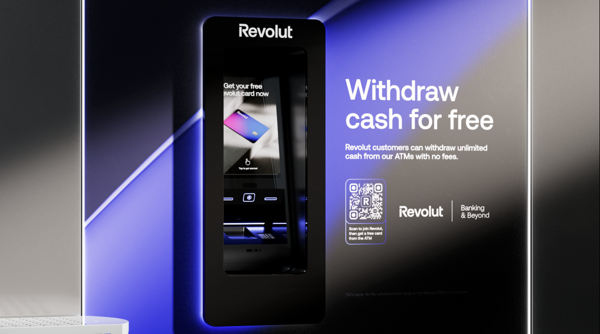
```

```grid|1
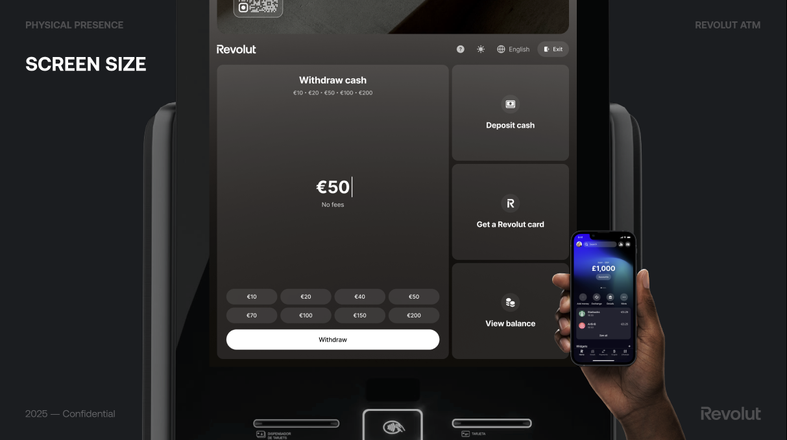
```

```grid|1
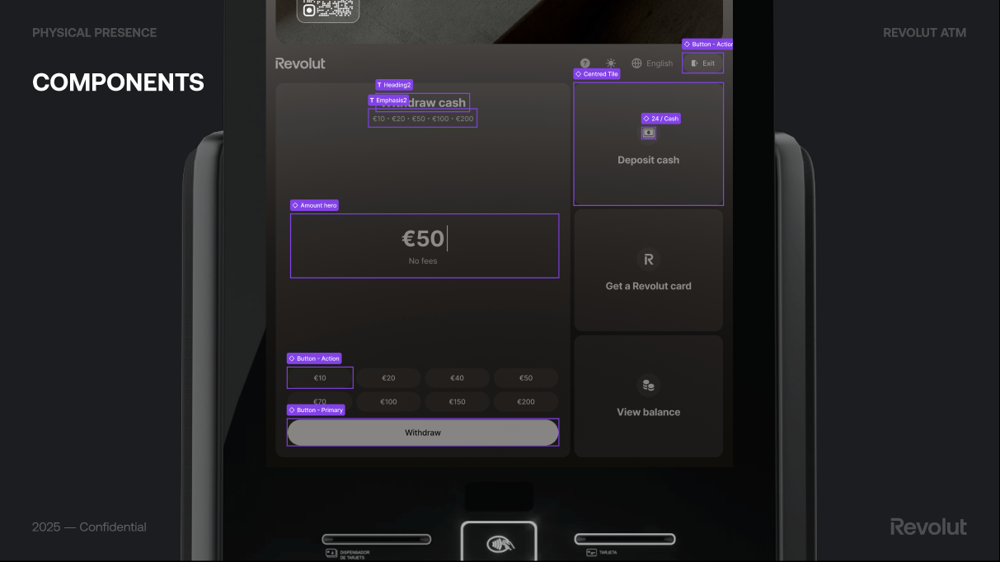
```

## From concepts to final design

We explored several concepts for the home screen and withdrawal flow.

**Concept #1** focused on a **personalized welcome** (“Good morning, John”), **quick access to balance** (with a privacy toggle to show or hide the amount), and an **easy-to-access toolbar** for Withdraw cash, Deposit cash, Get a card, and More.

**Concept #2** put **Withdraw cash** upfront with a large amount input (€0 and quick options like €50, €100, €200) and a Withdraw button, while keeping Deposit cash, Get a card, and View balance as secondary actions. We experimented with **default app wallpapers**, **user picture customization**, and **glass-like blur effects** to make the ATM feel closer to the Revolut app without copying it.

**Concept #3** used a 2×2 grid of primary actions with an **app-like hide effect**, a **left-aligned, more modern look**, and **bigger buttons leveraging 3D icons** for better visibility and touch.

The **final design (New design)** kept the withdraw flow central and added: **subtle gradient background**, **transparent icons**, **available banknotes** clearly stated, **standardized components**, and a **scalable menu**. Preset amounts (e.g. €20–€1,000), Get a Revolut card, View balance, and PIN options completed the supporting actions.

```grid|1
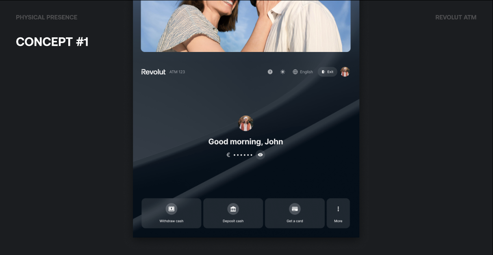
```

```grid|1
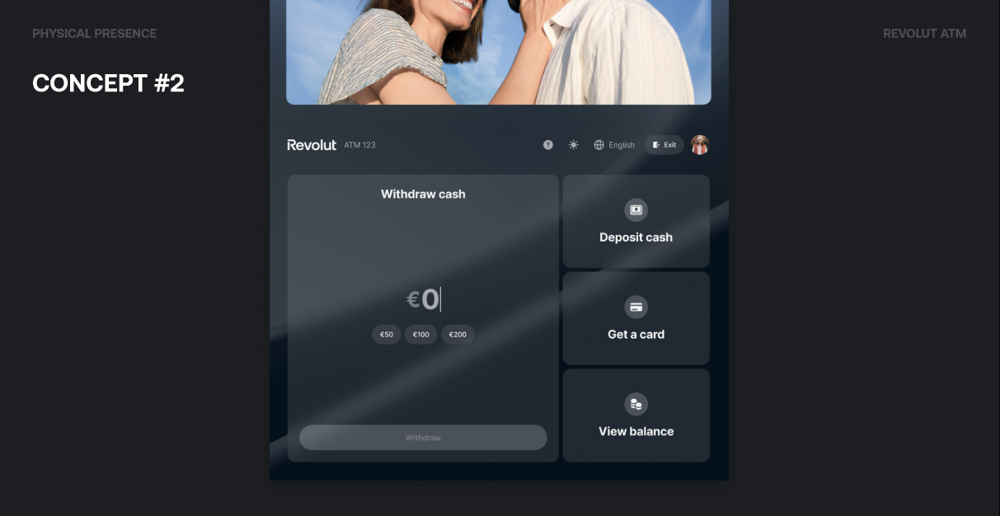
```

```grid|1
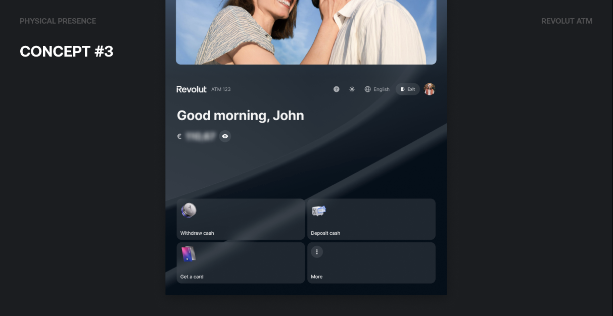
```

```grid|1
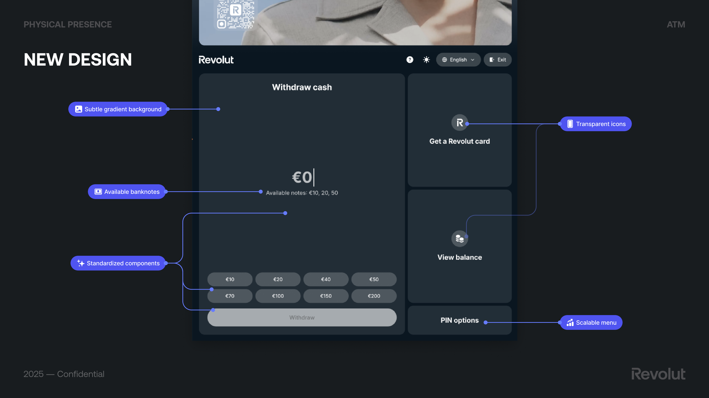
```

## Core flows: auth, withdraw, deposit, overlays

```grid|1
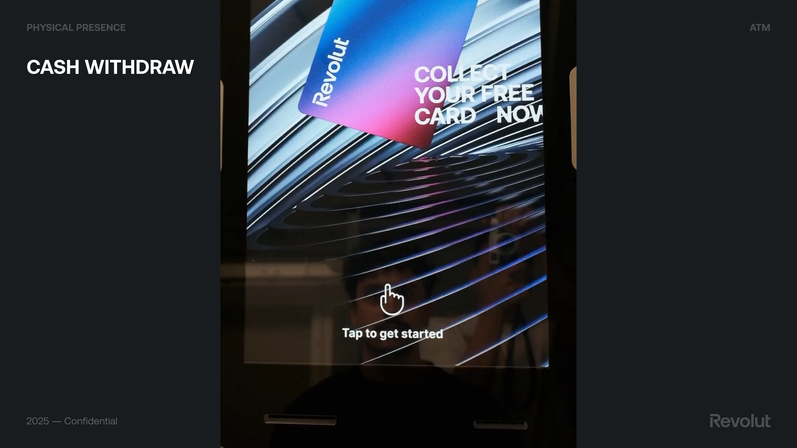
```

Beyond the home screen, we designed the full journey: **authentication** (e.g. Sign in with Revolut as the preferred method for Revolut users—practical, fast, and secure), **cash withdraw** (including Login with Revolut and Account Switcher), **overlays** available at any time (Language picker, Get support, Exit button so users aren’t forced through an extra step), and **cash deposit**. We also defined an **ads system**: a carousel of static, clean creatives with soft transitions so ads don’t distract users performing operations on the bottom half of the screen.

## Language for everyone: the picker we shipped

```grid|1
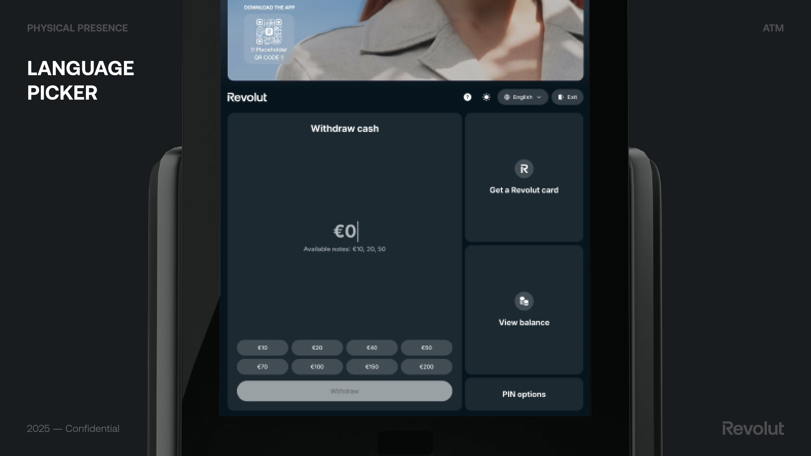
```

We iterated from v1 to v2 based on usability and stakeholder input: a **new overlay style** and a **new design-system component** tailored for ATM screens, aligned with Revolut’s transparent brand direction. We prioritised **most frequent languages** using Barcelona and Madrid touristic statistics, **kept Catalan** (stakeholders had suggested removing it; we made the case to keep it), **removed flags** to avoid sociopolitical concerns (e.g. flag display for English), and made the list **scroll-free** so most users could choose without scrolling—faster and more intuitive.

## Dynamic Currency Conversion: clear and compliant

```grid|1
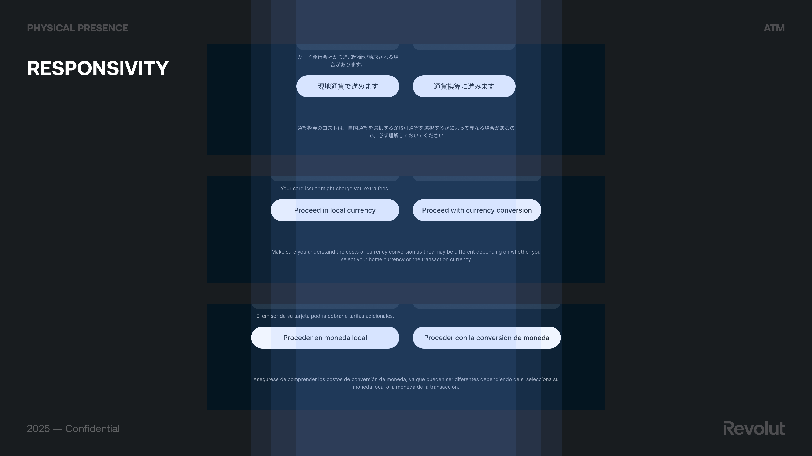
```

When paying with a card in a foreign country, **DCC** lets the user choose to pay in their home currency instead of the local one; the terminal shows the amount in their currency. Convenient at first glance, but the rate and fees are often less favorable than letting the card issuer convert—so the user can end up paying more. Visa and Mastercard have strict rules on how DCC must be presented: offer wording, selection buttons (e.g. “Proceed with currency conversion” vs “Proceed in local currency”), exchange rate, mark-up, and fees must all be disclosed clearly and consistently on screen and on the receipt.

Our **v1** had an unclear title, missing exchange-rate mark-up, missing fee breakdowns, missing required disclaimer, and a non-compliant nudge. We went through several rounds of **scheme feedback** (e.g. “Please choose the currency to be charged to your account”, neutral choices, markup on screen, same font size for all disclosures, ATM Access Fee wording, total local currency amount). We explored **Screen A** (single screen, less steps but crowded, required info not well labeled) vs **Screen B** (two-column layout per Visa guidelines, more transparent and easy to understand but more steps). The **final** design met all content requirements and made the choice clear without nudging users toward the more expensive option.

## How we benchmarked competitors

```grid|1
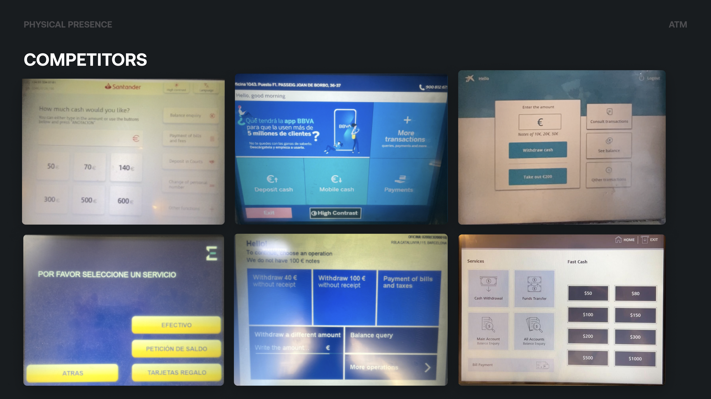
```

We benchmarked incumbent and digital-first players, including CaixaBank, Santander, Sabadell, Euronet, BBVA, and Tinkoff Bank. We mapped how they handled flows such as general intro, language selection, unauthorised cards, withdraw and deposit cash, collect card, exit session, and loading/performance. That gave us a clear picture of industry norms and where we could differentiate on clarity, transparency, and a mobile-app-like feel.

# Testing with real users

## Why research mattered

This was a large initiative for Revolut and a move into unknown territory. Running regular research and folding insight into development helped ensure we built something that met user needs, was innovative and easy to use, and didn’t require heavy rework post-launch because of missed UI/UX issues.

## What we tested and how

```grid|1
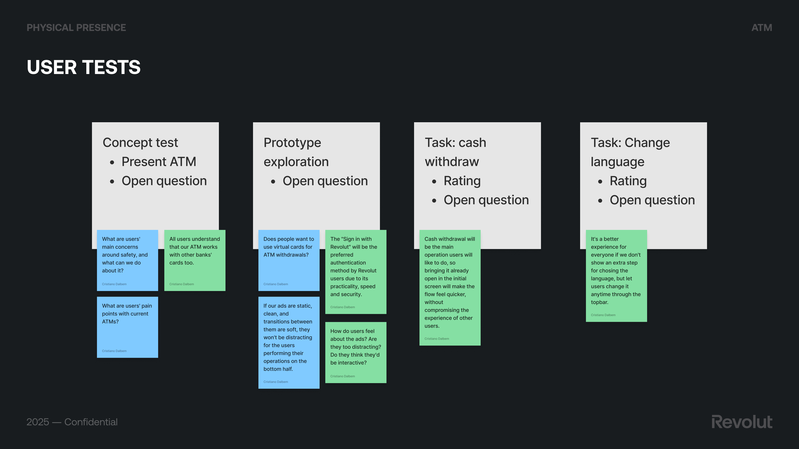
``` 

We ran **user tests** with a mix of concept tests (e.g. “What are users’ main concerns around safety?”), **task-based scenarios** (cash withdraw, change language), and **prototype exploration** (e.g. virtual cards for ATM withdrawals, preference for “Sign in with Revolut”). Key takeaways: users understood that our ATM works with other banks’ cards too; bringing cash withdrawal already open on the initial screen made the flow feel quicker; letting users change language anytime via the top bar was better than an extra step; and static, clean ads with soft transitions weren’t distracting. We used **Maze** for unmoderated research to run tests quickly and at scale.

## Results and changes we made

```grid|1
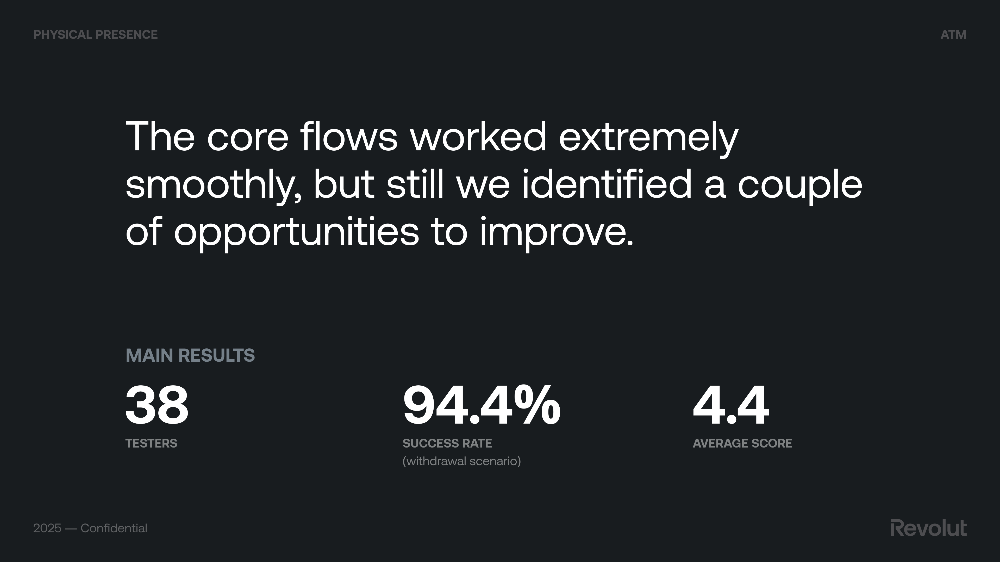
```

Core flows worked very smoothly; we still identified opportunities to improve.

<results-banner
    data='{
        "testers": "38",
        "success rate (withdrawal)": "94.4%",
        "avg. screens per task": "~4.4"
    }'>
</results-banner>

**Positive:** intuitive and user-friendly, attractive and cohesive design, fluid performance. **Neutral:** prototype-specific issues (scrolling, zoom, some buttons in Maze). **Negative:** ads were noticed (with minor improvement suggestions); automatic session closure after an operation caused frustration.

**Changes we implemented:** a **privacy layer** and accessibility settings where possible; **improved receipt experience** (making it clear that the phone number for SMS receipt is optional). Session management (keeping the session open after one operation) wasn’t technically possible at the time.

# Running the network

## The backoffice

```grid|1
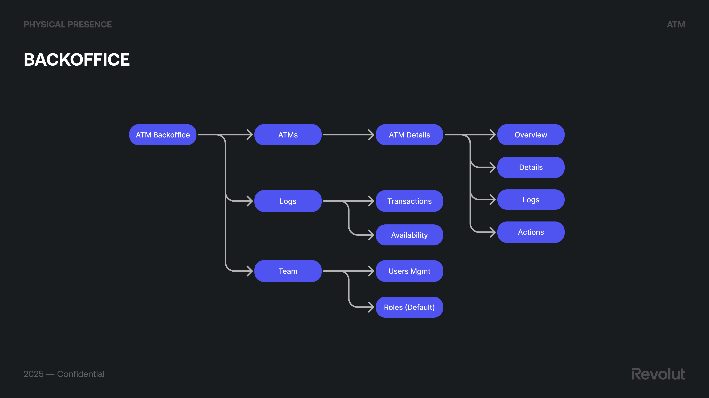
```

We worked with the vendor’s ATM management system (**Monimanager**) and designed Revolut’s **ATM Backoffice** on top: **ATMs** list and **ATM details** (Overview, Details, Logs, Actions), **Transactions**, **Availability**, **Users management**, **Roles** (e.g. default team roles), **main dashboards**, and **user management**. This gave ops and support a single place to see machine status, handle incidents (cash levels, connectivity, errors), and configure settings. Future improvements (e.g. richer analytics, automation) were scoped so the product could evolve without losing clarity for day-to-day operations.

## App and beyond

```grid|1
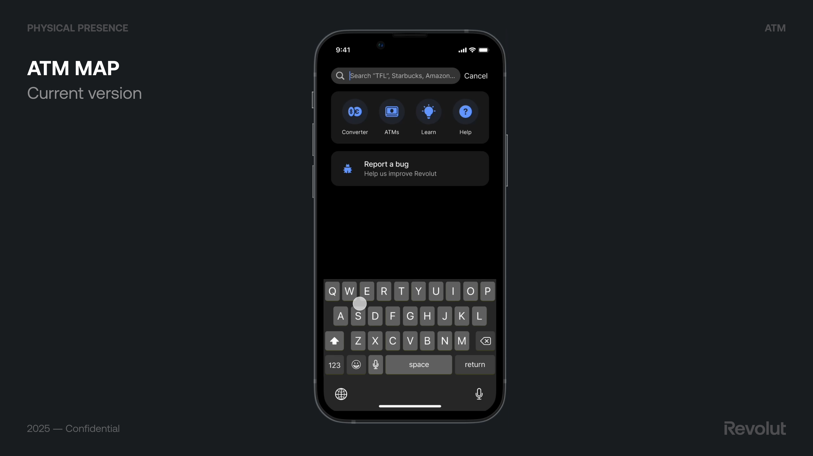
```

We aligned **app changes** with the ATM launch: **ATM map** (find machines), **card activation** from the ATM, and **SSO login** so the experience felt continuous. We also explored **accessibility settings** (e.g. privacy layer on screen) and **future directions**: Face ID as identification (not only authentication), **numeric vs alphanumeric keypad** (numeric for PIN on screen vs physical keypad trade-offs; alphanumeric for scenarios like receipt by email but with trade-offs on typing and time), and **ATM survey** to keep learning after launch.

# Outcomes

The product went live in Spain with a focus on **brand trust**, **withdrawal fee revenue**, and **activation rate**. Success on these metrics supports the case for rolling out to more countries and expanding the range of services on the machines.

<insights
    title="Main learnings"
    items='[
        {
            "title": "The sum of the parts is greater than the whole",
            "description": "Foundations (compliance, industrial design, components), flows (auth, withdraw, DCC, language), tests, and backoffice together make the product—no single piece was enough on its own."
        },
        {
            "title": "Standing on the shoulders of giants",
            "description": "We reused clarity and navigation from web and short, goal-driven flows from mobile; we also leaned on scheme guidelines (Visa, Mastercard) and accessibility standards so we didn’t reinvent the wheel."
        },
        {
            "title": "Keeping the mind open",
            "description": "As Don Norman put it: do not solve only the problem you were asked to solve. We kept research and iteration in the loop so we built something that met real user needs and didn’t miss UI/UX issues post-launch."
        }
    ]'>
</insights>


# See more

<links-list
    items='[
        {
            "label": "Revolut ATMs (Spain)",
            "url": "https://www.revolut.com/es-ES/atm/"
        },
        {
            "label": "Presentation deck (Figma)",
            "url": "https://www.figma.com/deck/WNLM6EOethyCCQ9B54njuK/Revolut---ATMs--presentation-?node-id=4-22524"
        }
    ]'>
</links-list>

<ai-disclaimer></ai-disclaimer>
