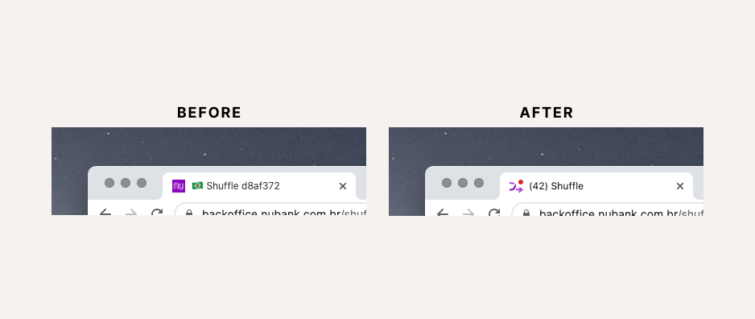

# Context

## The company
```grid|1
 
``` 

[Nubank](https://nubank.com.br/) was born in 2013 with the mission to fight complexity to empower people in their daily lives by reinventing financial services. It's one of the world’s largest digital banking platforms, serving over 75 million customers across Brazil, Mexico, and Colombia. Nubank is one of the most recognized digital product companies in the country and is often associated with products and services that are simple, intuitive, and transparent.

## Customer Support at Nubank
Since the creation of Nubank, the founders David, Cris, and Ed had a clear mission in mind: fighting complexity to empower people in their daily lives by reinventing financial services. As difficult as this task is, it was easy to find opportunities for this, and any Brazilian you asked could tell: abusive rates, complex products, and inefficient, cold customer service. This last point is familiar to banking services since we suffer from long waits, countless transfers, limited chatbots, endless menus, and unfriendly attendants in several services we use daily. From the beginning, the founders of Nubank knew that offering an effective, efficient, and humanized service was essential to differentiate the company in the market while compensating for the lack of physical branches.

```grid|1

``` 

And this is how the role of Xpeer was born, which remains today as a fundamental part of the customer experience that Nubank offers. Xpeers are our professionals in customer service and problem-solving. They understand our products and services like a few others. They also know how to listen to customers, understand their problems, and conduct the conversation in ways that respect the customer's time while reinforcing the human aspect of it.

Nubank's customer service numbers are impressive. After all, it takes a lot of work to provide 24-hour support simultaneously in multiple channels for more than 80 million customers in various countries. We won't bother you with too many numbers now, but to give you an idea, since you started reading this article our support team has already assisted more than 200 people!


## CXP: a team dedicated to building internal tools for customer support

Nubank is well known for offering great experiences for its customers, from an app that is very easy to use to humanized customer support. But did you know we have lots of people focused on offering a great experience internally too?
To guarantee that we'd be able to handle all this contact volume and that we will have control over these processes from the beginning, Nubank has invested in developing internally the software platform that supports this entire operation. The CXP BU (Customer Excellente Platform Business Unit) is the team that focuses on monitoring the operation's metrics and developing the products that Xpeers use in their day-to-day work. These metrics can be split into two groups:
* Efficiency: customer waiting time, agents' idleness, etc.
* Quality: CSAT (user satisfaction), number of completed calls, etc.

In addition to being a product team, CXP is also what we call a platform team, serving three different layers of users and stakeholders whose needs need to be considered. We provide the tools and documentation that will allow Developers, Designers, and PMs across Nubank. At the same time, Xpeers depend on using it for their daily work. All this without forgetting the main stakeholder impacted by all this work: the customer. 

Only by being a platform, and having a core and small team taking care of this platform, that the software can scale and grow, enabling its users to extend it to suit the needs of their own products and features.
 
```grid|1

``` 

The product in the middle of all this is Shuffle, which is the tool used by Xpeers on a day-to-day basis to carry out the vast majority of their work. Like most of the rest of the platform, it was an internal creation of Nubank, made especially for our needs and systems, based on a microservices architecture. Despite looking complex, Shuffle's main screen is divided into 5 main parts, from left to right:

<jumbo caption="Shuffle, the main CX Platform tool, and its parts.">
    
</jumbo> 

* [1] The sidebar on the left offers navigation through the main parts of Shuffle, which are the different service channels. If you are taking the Chat channel, it will also bring the other simultaneous calls that Xpeers can take. Lastly, on the bottom, the Autotake component is where agents choose how many simultaneous calls they want to take.
* [2] An integrated chat interface with the customer. Apart from the messages of both parts, it shows some metadata such as the predicted contact reason, transfers made previously, and even a complete history of previous contacts from that customer.
* [3] A "job" or a "ticket" is the representation in the system of a customer issue. This top bar, called Job Bar, is where the agent classifies the issue and controls the job to either mark it as solved or transfer it to another team. Agents can also "skip" a job to the next agent in line. They usually do it if they're already too busy, or believe they're not the best to solve that problem.
* [4] PersonDeck: The heart of Shuffle, this is where all customer information lives. In it, we have the tags, which identify unique properties of the clients, and the widgets, which encapsulate the information and actions that an Xpeer may need to do during a service. Fun fact: it's called a "deck" because it's made of "cards" - now you might get where the name Shuffle comes from ;)

Not visible here, but an essential part of Shuffle is the canned responses system. This feature helps guarantee the quality of service by assisting Xpeers to remember all information that needs to be given to or requested, as well as bringing more consistency to the thousands of attendants. We'll cover this later in this article.

# Broadening and deepening the understanding of our users

As a designer joining the team, my first reflex was to get to know more about the users: who they are, what they do, and what are their motivations and pain points. Getting close to them was easy since they're Nubank employees. They're colleagues who, if it weren't for Nubank's home office policy, could be sitting next to me. Even so, we realized that not everyone building Shuffle had such close contact, except for occasional meetings with operation leaders or scattered feedback.

A fascinating existing ritual was the Xpeer Xperience: a whole day dedicated to all Nubankers working as an Xpeer. Although the ritual helped put us in the shoes of our users, it was not enough: we'd use different machines than them, have different levels of knowledge, different motivations, and so on. It was crucial to tap into the Xpeer mindset in a more direct, less biased way.

This is how a new ritual was born, the Weekly Shadowing. Once per week, we'd have one hour dedicated to observing Xpeers in their "natural habitat", doing their work while we watched how they used the tools we helped build and maintain. Despite being difficult, it was essential to avoid interacting with the person being observed, as we wanted to have the closest possible experience to their natural behavior. We had to avoid them entering a "demonstration mode", in which they'd involuntarily falsify a way of working that made them seem like better professionals. We provided a little playbook for guests to ensure these kinds of things were clearly aligned before joining the session.

The weekly shadowings, in addition to creating greater empathy and connection between the team and our users, helped reveal great insights and made us review many of the preconceived ideas we had about how the product was actually used. One of the most striking examples is that, for someone who doesn't work with the tool every day, Shuffle can appear as having an overwhelming UI that demands a lot of cognitive effort. But we noticed that when you use this tool every day for several hours, you become professional in using it, and memorize the location of all information and actions - Xpeers were ninjas using Shuffle! If you use any professional tool for work, like Photoshop or Figma, you can relate to this steeper-than--normal learning curve.

```grid|1

``` 

Another important lesson learned was that a large volume of small feedback actually never reached the team. These agents' day-to-day work was very hectic, and they prioritized bringing to us only more severe problems that would affect the operation. Moreover, as creative and resilient people, they often managed to find a way around the small frictions of the tool.

This meant, for example, that they didn't report the performance problems the tool had on their machine so much - they'd think it was their fault, or they'd blame the wifi or the VPN. This is one of the problems that didn't appear when we did the Xpeer Xperience, as Developers and Designers at Nubank use extremely performant machines. 

<jumbo caption="A simplified schematic of how the customer's and Xpeer's journeys intersect.">
    
</jumbo>

At the same time, the team, mostly comprised of seasoned back-end developers, was highly attentive to metrics such as system stability and network performance. Still, they only considered the back-end side (e.g., how fast the services respond) and not the front-end side (e.g., how quickly the browser renders the page and makes it available for interaction).

When in doubt about what should be the success metrics of Shuffle we looked at why we did what we did. If our mission was to provide tools for the customer support team, our objectives should be aligned with them. Thus everything we do to improve Shuffle should impact and improve our operation and ultimately be felt by the customer.


# Prioritizing the problems and solutions

As a Product Designer, it was not enough to bring dozens of user insights and learnings to the team but also to help them gain clarity on what was most important and what to do next. And here, we're not just talking about focusing on what most impacts the user, but also what impacts the whole: from other users of the platform (which are multilayered, as we covered earlier), the customer itself, and what makes sense for the business and product strategy.

At this point, it was essential to balance the company's strategic drivers, the product's mission, and how different project ideas fit into this. For example, redesigning the interface components and creating a Design System could generate a great visual impact and empower Designers. But, compared to other bigger issues, the usability improvements of these projects would be minimal, and we'd probably not detect a significant increase in agents' productivity.

```grid|1

```  

We also realized that there were a lot of "low-hanging fruits": minor, low-effort improvements that improved the users' quality of life and, together, could make a real dent in the product's usability. While we invested in in-depth Discovery to investigate more significant issues, we've tackled these small issues bit by bit, generating a much more positive atmosphere among Xpeers, who said that Shuffle hadn't had improvements for a long time. Here are just some of the examples: 
* **Notifications**: During Shadowing sessions, we noticed that Xpeers frequently switched to other browser tabs to investigate issues. However, Shuffle did not alert them if there were new customer messages in the meantime. We added sound effects for different notifications and a custom favicon and page title to reflect the status.
* **Chat panel**: From the very first sessions, we noticed how sluggish it was to type. The problem was so severe that we often observed agents typing their messages in the browser address bar or another simple text editor to later copy and paste into Shuffle. As engineers were migrating this panel's underlying technology, we prioritized delivering better performance.
* **Autotake**: before, users had to manually request new tickets, which was tiring and inefficient even if there was a keyboard shortcut. In the field, we even heard reports of people leaving small weights on their keyboards to keep pressing the action shortcut. Autotake is, as the name implies, a system with a minimal UI where the Xpeer sets the number of chats they wish to take at the same time, press "play", and the system will automatically allocate these as they come.
* **Typography**: moving from Open Sans to Inter, we increased the legibility of small text due to it being more optimized for screens. It also reduced screen real-estate usage due to its taller x-height, which works better for high-density designs.
* **Keyboard shortcuts**: Essential for those who work with professional tools, they were not reliable due to bugs and we identified opportunities for new ones. One example was that there was a shortcut for concluding a job but not for choosing the contact reason from a dropdown menu, which had to be done with the mouse cursor.


```grid|1

```  

All these improvements, despite being very difficult to measure their impact individually when shipped, helped give a feeling of a product that was no longer frozen in time and made the Xpeers trust the team and ask for more. Following are two bigger projects we ran while these small changes were being shipped.

<jumbo caption="Before/after: instead of a full redesign, by compounding multiple small changes we could drastically change the overall look & feel, making users feel like the product was not stuck in time. Most importantly, the changes improved not only form but function, driving real results by impacting the users' productivity and satisfaction with the tool.">
    
</jumbo>


# Redesigning the canned responses experience

While analyzing and organizing the dozens of insights, our attention started to gravitate toward a set of issues regarding how agents used canned responses, which are ready-made answers to common customer questions and problems. Although Shuffle had its own huge database of canned responses with an integrated search engine, most agents preferred to use a sketchy Chrome extension for handling those!

Organizing a repository of all insights we identified was crucial to navigate in this complex and new universe, helping us identify patterns while keeping everyone on the same page.

In addition to bugs that made users lose all their data and usability issues that led to inefficiencies and errors, there was a high-security risk of using an external browser extension over which we had no governance. Apart from these problems, we were leaving on the table a huge opportunity to apply usage data to improve our Artificial Intelligence models, which are the CX platform's cornerstone.

After gathering insights from sources such as surveys, in-depth interviews, and our dear Shadowing sessions, we used the Problem-Solution Tree framework to visualize the main opportunities, categorize them and relate them to possible solution ideas.

<jumbo caption="The Opportunity Solution Tree was a helpful framework to help us map and visualize our objective, problems we wanted to solve, and ideas for solutions. Click to see it larger.">
    
</jumbo>  

After prototyping and testing several concepts with users, we arrived at a new system that allows agents to search for information without losing focus on the customer. We also introduced new features that users loved:
* The ability to customize the existing canned responses shortcuts, so they could employ their preferred mnemonics, and also the ability to customize the content to adapt them to their personal tone of voice. Also, being able to create whole new responses.
* Not only we'd enable editing the content, but we also use rich formatting to highlight parts of it better. We also introduced a "smart placeholder" feature that automatically fills details of the canned response with data from the customer, e.g., `{{customer_name}}`, `{{account_balance}}`, etc.
* Instead of an interstitial modal that covered the whole screen (think of something like macOS' Spotlight), the winning design was a sidebar that allowed agents to keep an eye on the chat and widgets while searching for canned responses.
* Several improvements on how the search worked, such as being more flexible with typos and accented characters and also being more contextual, ranking the results based on the agent's team and current case classification.

<jumbo caption="The new Shuffle system for searching, managing and using canned responses integrated.">
    
</jumbo>
 

 
# Optimizing the visualization of customers' data

One of the most significant signs that the product had not scaled so well with the company and agents' needs is the Widgets area. While there might have been half a dozen in the beginning, we were currently approaching more than 50 widgets! Even if agents had very different tasks and customer problems to solve, the way Shuffle organized and sorted these widgets was the exact same for everyone.

During the Shadowing Sessions, we often saw agents overlooking critical info on the customer profile. We hypothesized that this was caused by an interface that had a high cognitive load and poorly structured information architecture and visual hierarchy, all negative effects of that sea of widgets.

From talking with agents, facilitating some co-creation workshops, and taking a close look at the data, we mapped the main objectives and constraints for this project:
* Agents are accustomed to the current layout of widgets, where they memorize positions and can quickly scroll directly to that position. We know any changes will have an initial negative impact, but we must make sure it's a real improvement.  
* Some agents are in teams with very predictable work, always solving similar customer issues and using the same widgets. Other agents were the opposite; depending on their current task or allocation, they needed to access unique data sets.
* We found out that when agents requested to improve the widgets organization, they expected this would improve Shuffle performance, one of their main complaints. That would not be the case, depending on how we'd develop these improvements.
* If we split the PersonDeck into multiple "decks," it's crucial that we don't also fragment the load time into multiple ones. This effect would make the agent even less productive than before when she had to wait a while for everything to load - but at least it was only once.

<jumbo caption="Wireframe prototypes designed to gather reactions from the Xpeers of different approaches we could explore to improve the organization of widgets.">
    
</jumbo>  

Since many ideas were on the table, we built several small wireframe prototypes to test the different concepts. After user-testing those, we gathered the engineering and product team to discuss them using a Decision Matrix technique.

```grid|1

``` 

We concluded that a "low-hanging fruit" would be to implement filters for the widgets, organizing them by categories. These filters would be "remembered" by Shuffle for each agent, thus making a lot fewer widgets needed to be loaded and potentially improving one of the biggest problems reported by users: the software performance.
Another simple-to-implement feature that would generate a lot of value is favoriting widgets. A simple extra button in the lower right corner would allow users to choose their most used widgets to always be on top of the rest.
Combining these two features would allow an entirely new level of customization of widget visibility and ordering. Although it was not a fully realized flexibility, this was much easier to implement and use than a full-blown PersonDeck editor for each agent.


```grid|1
 allowed Xpeers to customize their views while keeping the system simple to use and maintain.")
``` 


# Conclusion & learnings

Designing an internal, professional product such as Shuffle was very different from anything I've done before. However, keeping in mind the principles of good Design, all the rest follows. Here is a summary of the main learnings we had:
* Yes, offering great customer support is a lot about people. But providing the right tools to those people is equally important. Providing a great experience for our Xpeers is one of the best ways of leading by example and inspiring them to offer a great experience to our customers.
* Putting ourselves in the user's shoes is not enough since we might be very different from them. When the user is so different from the people building the products, the role of Design and Research becomes even more important. Observing the agents in their day-to-day work with Shadowing sessions and doing interviews was arguably the best way to understand them deeply.
* An internal product that is a platform not only has many stakeholders with potentially conflicting interests, but it also has many users. It's crucial to map them, their needs, and how they intersect or not.

We believe and hope that this work has set a foundation for future work, which is currently being done by an even larger team that nowadays is focusing on improving Shuffle. Even if a complete overhaul of the product was not feasible before due to too many uncertainties, after many learnings, this is being considered and might be a reality very soon. So, stay tuned for future articles on Designing Shuffle.
