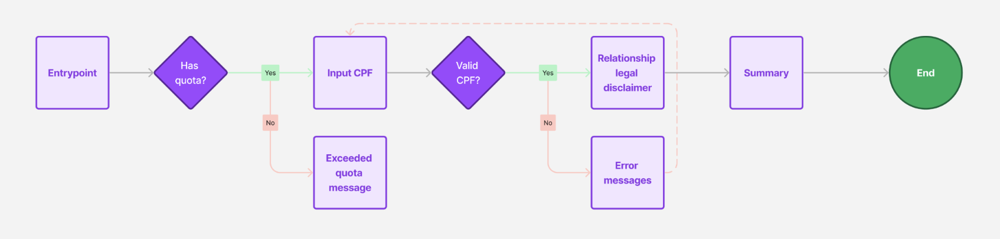
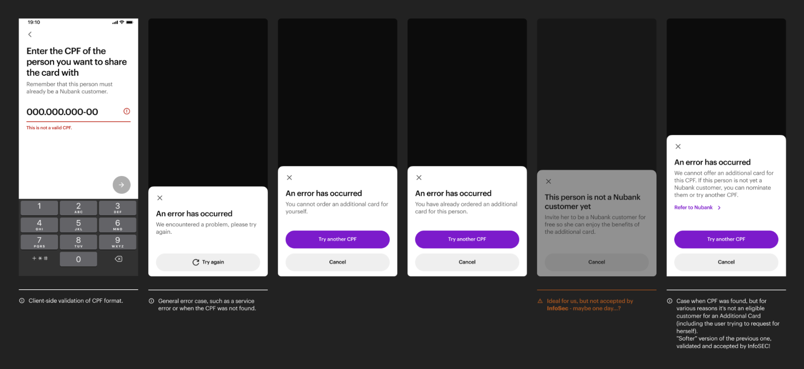
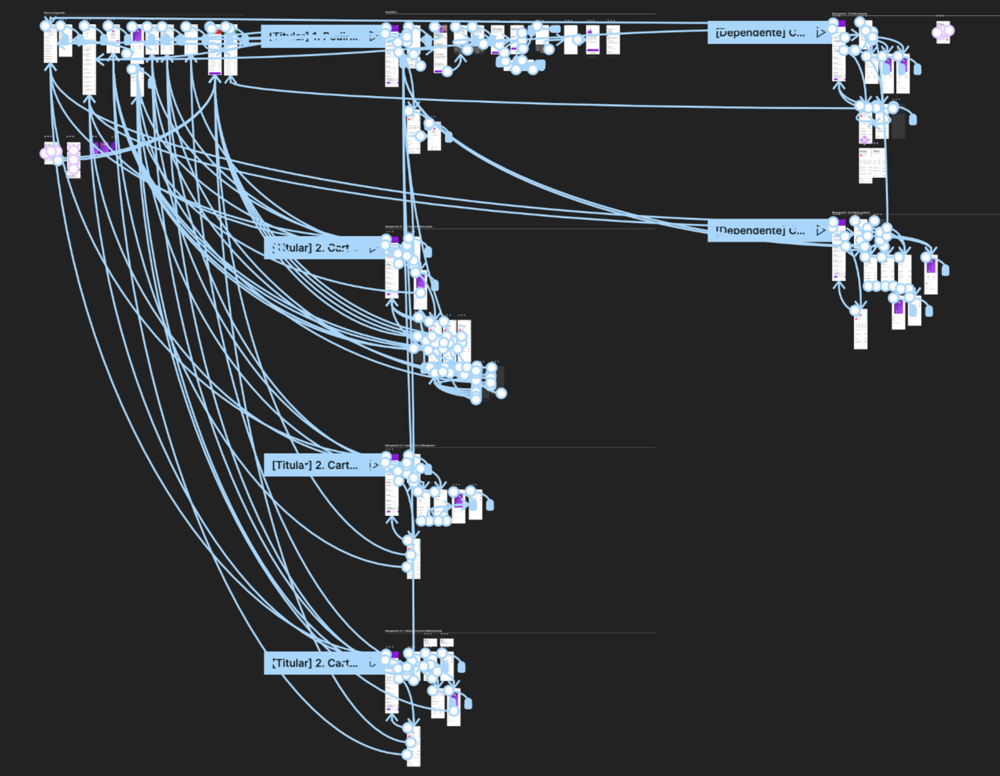
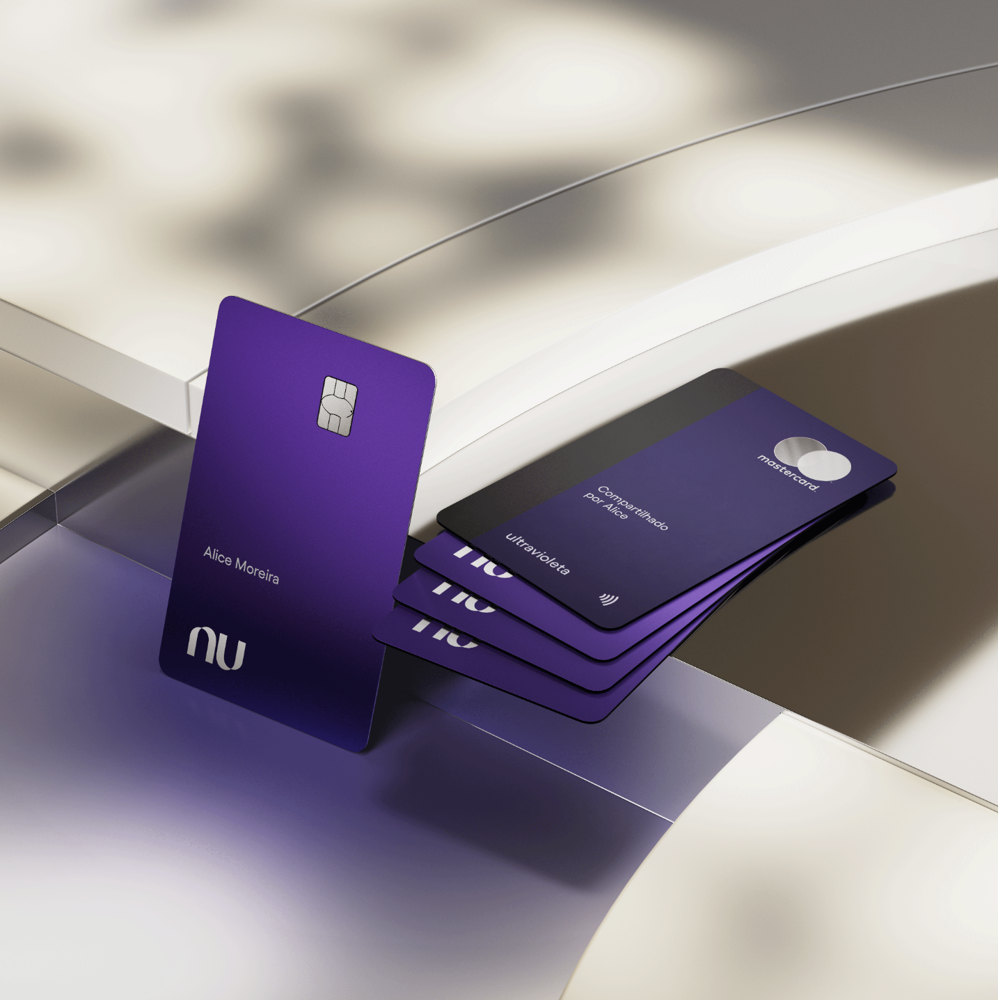
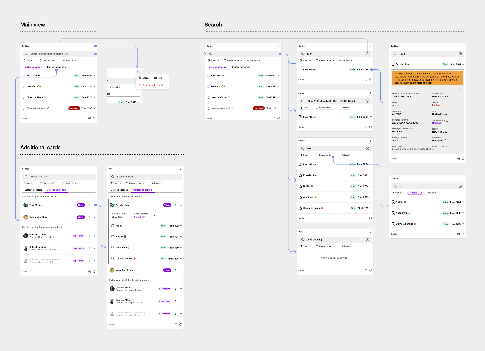
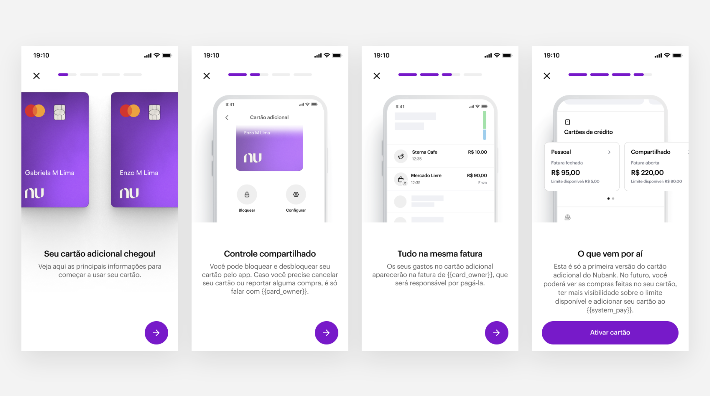
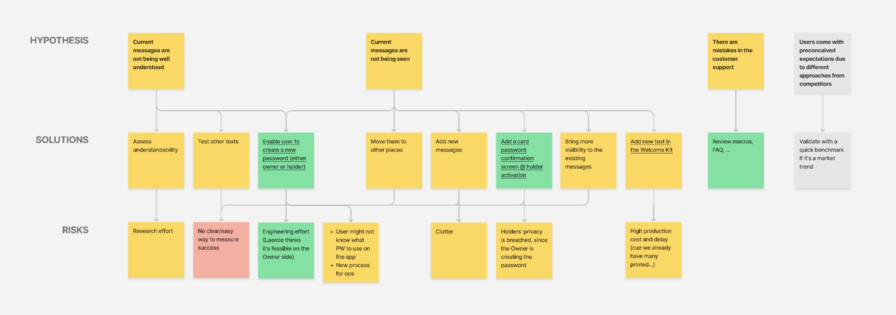
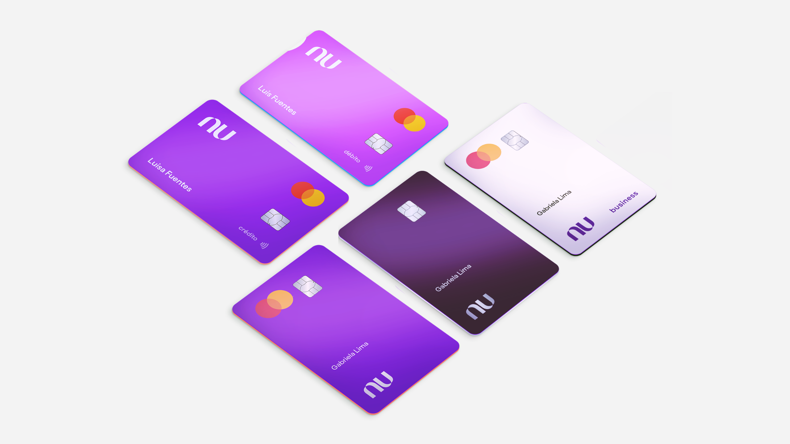
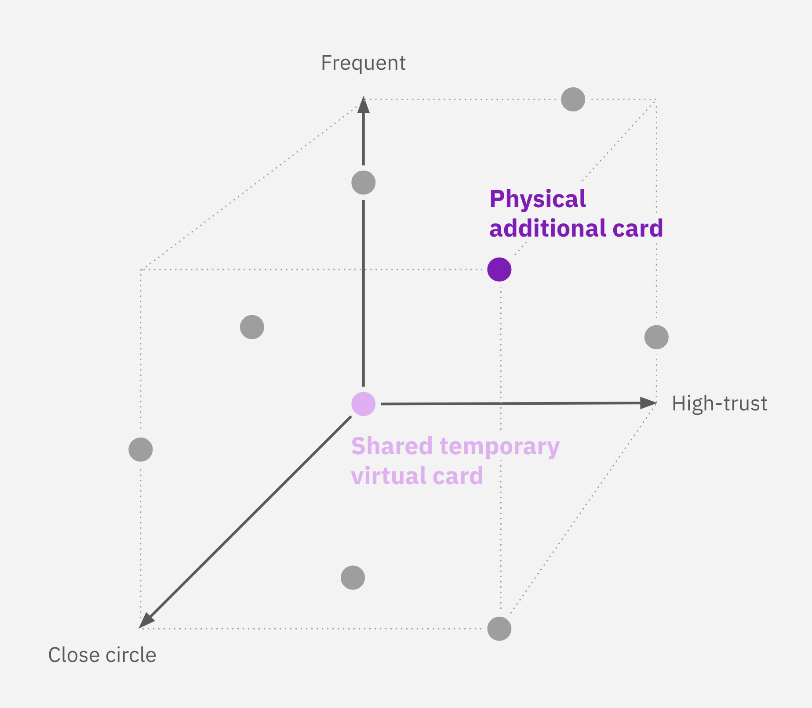

---
projectType: 'project'
date: "2022-02"
date2: "2024-06"
lastUpdated: "2025-02"
title: "Nubank's Additional Cards"
minibio: "Enabling people to extend their credit to loved ones."
description: "Designing from end-to-end the first social product of the company's portfolio. The Additional Card is an extra card users may request to extend their purchase power to family and friends. It brings all the complexity of a complete Credit Card product with the challenge of meeting the card owner's and cardholder's needs."
metrics: ['Incremental NPS', 'Incremental avg purchase volume']
tags: ['product design', 'UX research']
team: ['Gabriela Oeda (PM)', 'Ana Urquiza (UX Research)']
color: '#820ad1'
cover: './cover.png'
liveLink: "https://blog.nubank.com.br/cartao-de-credito-adicional-do-nubank-tudo-o-que-voce-precisa-saber/"
--- 

# Context

## The company

[Nubank](https://nubank.com.br/) (NYSE: NU) was born in 2013 with the mission to fight complexity to empower people by reinventing financial services. It's one of the world’s largest digital banking platforms, serving over 100 million customers across Brazil, Mexico, and Colombia. Nubank is considered one of the most innovative companies in the world ([Fast Company](https://www.fastcompany.com/91040515/nubank-most-innovative-companies-2024)) and is often associated with products and services that are simple-to-use, intuitive, and transparent.

```grid|1 
 
``` 
  
## What's an Additional Card?

Also known as **Authorized User**, **Additional Cardholder** or **Shared Card**, is a financial product found in some banks' portfolios. It's an extra physical card that you request for someone who'll be able to make purchases on your behalf using your credit line, and you'll be liable for paying the bill.

```grid|1

``` 

Although we see many couples using this product as a way to share their finances or optimize credit benefits, it's a product that works very well for parents wishing to initiate their children into the financial world. In summary, it's a solution for those wanting to extend their purchase power to a dependent that might not have access to credit products.


## Problem statement

Since Nubank didn't offer this product, we found out that clients have been finding "hacks" to accomplish these goals, such as sharing a single credit card among people in their households. These hacks not only could present risks to their data security but also offered a bad experience for their shared financial lives.

Our team's objective was to increase our customer satisfaction, measured by NPS. Through previous interviews with our clients, the Research team identified that financial support has an important role in family relationships, and there's a strong emotional bond that makes that support so important, with an opportunity to connect providers and dependents on a platform that enables sharing and controlling family finances.

<!-- Our main mission was to provide a delightful experience for anyone wishing to extend their credit purchase power. Nubank is well known for offering innovative solutions and we didn't want to build something incrementally better but fundamentally different. -->


## One product, two sides

This project aimed at building two full user experiences. This is where the complexity of this product starts to show: not only do we have to design and implement an entirely new credit card product, but we also have to consider two sides that have things in common but also significant differences. In collaboration with the Product Manager, we mapped the needs of these two users:
* **Card Owner**: the person who requests the card and shares their credit line. They need to have visibility of spending, especially when paying the credit card bill, and have control of the card settings, such as defining a spending limit.
* **Cardholder**: the person who effectively uses the card for purchases. By looking at the competitive landscape, we noticed the holder needs are often not prioritized, leaving users lacking autonomy and visibility. Our focus was providing a native-like experience, so this person would feel like the card was their own.

<jumbo caption="The card owner and the cardholder share many needs, but others are specific to each of these users. Here, only the pink postits are where needs overlap.">
    
</jumbo> 


# Prototyping

After mapping the main user needs, the next step of the Discovery phase was to start prototyping the ideas we had in mind so we could put them in the user's hands as soon as possible. Nubank has a very mature Design System, which enabled me to make ideas tangible in high fidelity quickly, and later it would speed up the development process.

```grid|1

```

I started with the request flow. My objective was to make it as simple as possible while not compromising transparency with the customer. With the constraint of only being able to offer Additional Cards to those who are already a client, all we needed was the Holder's CPF number (it's like a Brazilian social security number).


<!-- An additional legal requirement was to ask about the relationship between them. Although I was not happy with asking such a personal question here, it provided excellent data for understanding better our converting users later. My approach to make this not feel so weird was to add a small copy explaining why we needed that information at that point: "This information is necessary for your own safety and legal reasons." -->

<jumbo>
    
</jumbo>

## Balancing security and legal requirements with UX

Since this flow is open to all users, it was really tricky thinking on what we could and couldn't inform to the user about that CPF. If we inform too much, bad actors can use this flow to reveal personal information about that CPF. If we reveal too little, users can be confused.

<jumbo>
    
</jumbo>


## Leveraging a platform

The main challenge of this project was the actual day-to-day of managing this card and the purchases, and for that, I took a step back to understand how Credit Card exists in today's app structure. I noticed we have three main areas, each with a general theme with specific tasks.

<!-- ```grid|1

``` -->

Brainstorming with the team, I've prototyped three concepts exploring in different ways the app architecture.

## Concept testing

To better understand our user's mental model, our UX Researcher Ana Urquiza and I interviewed 16 customers split into different groups of card owners and card holders. This user test was not a regular usability test: we focused less on tasks, and more on talking with the users using the prototypes as conversation-starters.

```grid|1 

``` 

<insights
    title="Main insights"
    items='[ 
    {
        "title": "Validating the existing information architecture",
        "description": "User mental models about credit cards were aligned to how the app was currently structured, so we should prioritize the solutions that maintain the status quo and perform better."
    },{
        "title": "Whats better than filters",
        "description": "Although the Transactions Feed filter solution performed very well with users, most users preferred using another part of the app. Seeing this was a strong trend since the first interviews, we quickly prototyped a solution for that in the middle of the research, and it proved to be the best according to users."
    },{
        "title": "Balancing short and long term",
        "description": "The relationship-centered architecture vision is very intuitive and perceived as more clear and organized than our current one - but the short-term solution works well too."
    }]'>
</insights> 

<!-- ```grid|1

``` -->

## Extending audiences & benefits

Although for most of the development process we've been targeting our Core audience, recent business developments enabled us to also extend it new strategic segments: Under 18 and Premium. This led to some last minute changes in designs to make sure the experience continue cohesive, but at the same time that it communicated what was most important to each audience. 

```grid|1

```

## A stronger value prop for premium customers

Ultravioleta, the premium card by Nubank, has an unique set of features that makes it stand from its competitors: 1% of instant cashback on every transaction. By requesting additional cards, the Ultravioleta user could multiply this benefit by having more people doing more transactions on their behalf. Not only that, but since it's a Mastercard Black card, the primary cardholder can extend to their loved ones all its perks such as free travel insurance, purchase protection, VIP Lounges access, concierge, and much more.

<video-container> 
    <video autoPlay controls class="center" loop type="video/mp4">
        <source src="./request_uv.mp4" type="video/mp4">
    </video> 
</video-container> 


# Post-MVP features

After the launch I helped monitor data and respond to user feedback. Apart from bugs, we're glad that most feature requests are already either in development or on our roadmap. Here are some of the main features we've brainstormed, user-tested, and developed to improve the MVP.
 
## Card feed
 
One of the most requested features is having more visibility on purchases made on a particular Additional Card. We're implementing a new screen that shows more clearly how much has been spent on that card, with a dedicated transactions feed.

<jumbo caption="Improving the experience for monitoring spendings with the Additional Card.">
    
</jumbo>


## Customer support tooling

To empower our customer support agents to help customers with anything they need related to Additional Cards we designed several improvements to the CX tool.

<jumbo caption="A series of improvements on the customer support tool.">
    
</jumbo>

## Holder onboarding

We want to improve the Card Holder onboarding with a more visual presentation of the main features and where to find them on the app, which might improve customer engagement and reduce churn.

<jumbo>
    
</jumbo>

## "What's the card password?"

After the launch, one of the main questions CX received was about the card password. The problem is that we unintentionally took a direction that was totally different from the market, assuming this would be innovative and well received.
 
```grid|1

``` 

The team decided to experiment adding more clarifications in key moments of the journey, but it hasn't been showing improvements. Our best bet will be asking the user to confirm the password when activating the card, so we have an opportunity to teach them if they get it wrong.


# Designing the physical card

Since cardholders might already have another Nubank Credit Card with their name, we wanted to offer a better visual differentiation than just the card number on the back. Understanding these main design constraints since the beginning was crucial when exploring the solution space:
* **Impact on manufactoring process**: Design changes could impact the card manufacturing process ranging from weeks to several months.
* **The need to be subtle**: Some Additional Card users suffer from social prejudice, e.g., when going to a bar with friends and paying with a card given by your parents, so the design shouldn't call too much attention.
* **Innovating under constraints**: Some competitors use custom-printed names and custom card colors for their additional cards. We couldn't do that at this moment, so it was an opportunity to be innovative.

```grid|1 

```

In collaboration with the Marketing and Brand teams, we explored many ideas such as new shapes, colors, and extra icons on the card design. After many alignments and a Design Review with the VP of Design, we moved forward with a solution that is very elegant in its simplicity: an extra label on the back of the card saying "compartilhado por" ("shared by") followed by the card owner's name. Not only this helps differentiate among multiple cards, but users mentioned this design values the emotional bond between the two people.
 
<!-- The new design of the Additional Card brings a subtle text on the back, helping the user differentiate between their cards and reinforcing the relationship bond. -->

<jumbo>
    
</jumbo>


# The future of shared cards

The traditional Additional Card is a good solution for frequently sharing with **high-trust** people from your **close social circle**, but we see this as just the first step. We wanted to build a platform on top of which we'd build other features, expanding the coverage for more diverse use cases.

One example is enabling users to share Temporary Virtual Cards, a more suited product for people willing to share with someone they don't trust so much, or that are less frequent, such as friends in need.

```grid|1
 
```  


## A social vision for the company

In a broader context, this was the first social product being built at Nubank. For that reason, me and our PM were selected to work on a cross-team,. cross-functional task force to build a Social Vision for the whole company - but that's a story for another case study. ;)

Working on this task force in parallel to the Additional Cards project has helped us understand how a short-term solution could evolve into a long-term vision, from being card-centric with the current App structure, for a more social experience in the future.
 
<jumbo caption="A summary of our short, medium and long-term design vision for the product, moving from a card-centric experience to a more relationship-centered.">
    
</jumbo>


# Results & learnings

After many months of internal tests and bug fixes, at the moment of writing this article, the team is thrilled that we've just released the product publicly! Its launch was covered by most of the big Brazilian tech and financial portals, with extensively positive takes.

Although we can already see an increase in customers' Purchase Volume (how much each costumer spends on average on their credit card), we still couldn't reach statistical evidence to assess changes in NPS.

<results-banner
    data='{
        "increase in purchase volume (dez/23)": "+ 25%",
        "active users (mar/24)": "411k",
        "total purchase volume (feb/24)": "R$ 191MM"
    }'>
</results-banner>


This was the longest and most complex project I've worked on at Nubank. It was a team effort of dozens of people with various specialties and teams. Here are a few of my main learnings from this experience:

* We reprioritized the product roadmap many times during the process, which was very important since we were constantly uncovering new technical challenges. Although it was a little sad leaving so many good ideas for later, it was an excellent exercise for everyone to focus on what is essential to our users.
* Nobody in the team expected this to be so hard. Although one might think it's a simple project because "it's just an extra card", it was actually the work of remaking the whole credit card experience twice. It had many moving parts and points of contact with other teams we needed to align with.
* Cardholders have been having a hard time understanding what the card password is. We decided to do it differently than any competitor, and while we did so thinking it was the best for the user, we should have acknowledged their mental model.
* One of the biggest challenges was designing the physical card, which initially seemed daunting. Still, after deeply understanding the problem, uncovering all the constraints, and collaborating with multiple people, the solution emerged.
* We went back and forth with the product naming decision many times. We needed clarity on who was responsible for the final decision, and we had doubts about either using a more common name or going for something more innovative. Ultimately, I wrote a document detailing the rationale to gather feedback and spread the word, but I could've done it sooner.

Being able to design something from the very start and seeing it go live was a fantastic experience. The team was excellent too. We collaborated and lot, and everyone involved learned something new.


<ai-disclaimer>
<ai-disclaimer/>


# Learn more

<links-list
    items='[
        {
            "label": "Public release blog post",
            "url": "https://blog.nubank.com.br/cartao-de-credito-adicional-do-nubank-tudo-o-que-voce-precisa-saber/"
        },
        {
            "label": "Nubank website",
            "url": "https://nubank.com.br/"
        }
    ]'>
</links-list> 
