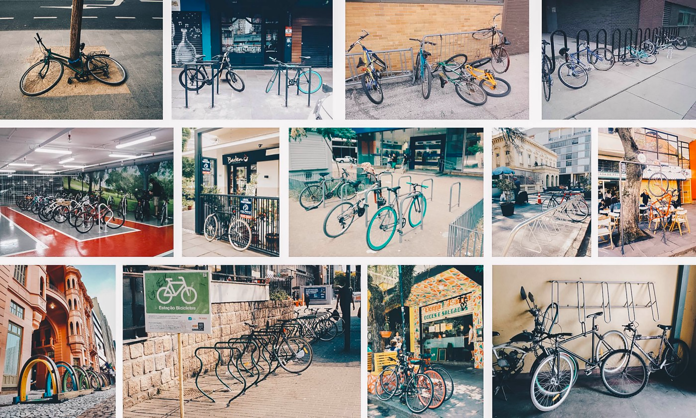
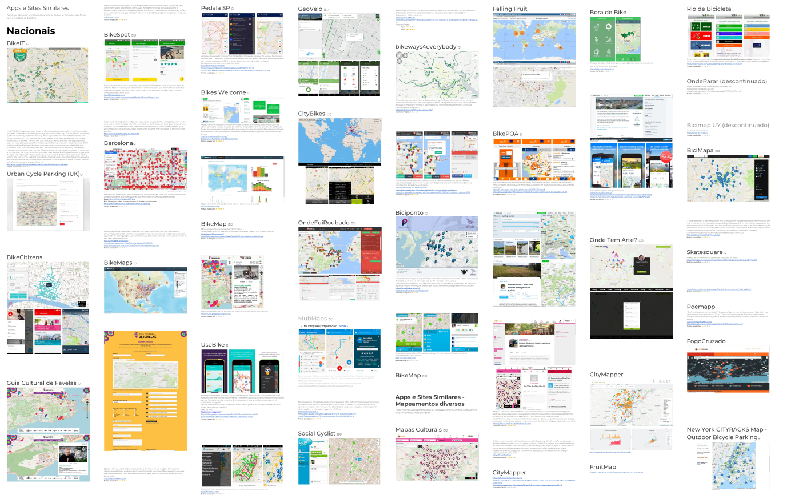
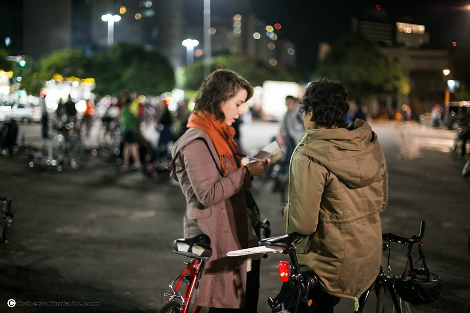

# Overview

<!-- ```grid|1

``` -->

We believe that the bicycle is the future of urban mobility, and that having better bike parkings is a great way of promoting the bike culture in our cities. This project intends to push forward the discussion of what are good bike parkings, at the same time we collect data about the presence and evolution of this kind of structure in the cities of Brazil.

The collaborative aspect allows the active participation of citizens, fostering a positive reinforcement that encourages more people commute with their bikes. On top of that the reviews and our bike parking guide bring information about best practices in a friendly way that educates about safety and encourages better structures to be installed.

This has been a great project to put in practice so many tools and concepts I've been learning in the past years about web development, UX Design and Analytics. Working in bike de boa I've learned how important it is to go beyond aesthetics and Usability to create a great product. And, most of all, beyond just improving hard skills, this has been a project with a social purpose.

 
## How it all started

Everything started as a simple project at a local hackathon, held in Isobar IWS, the place where I worked at that time. The theme of that year was "improving people's lives with technology". A few friendly people joined me trying to make come true an old idea of creating this platform to map bike parkings. We felt in love with it and extended the project much further than those 24h.

The team also grew a lot, and we ended up creating an independent collective of people from diverse backgrounds that were interested in promoting the bicycle culture in Brazil with this project.

```grid|1 

``` 

 
# The problem

I wanted to contribute in some way to foster the local culture of urban biking. Analyzing the many problems people face when commuting with bicycles I identified a big one that I felt could be addressed in an efficient and innovative way using technology: where to park my bike safely?

Most cicling apps at that time seemed to focus too much either on cicling as a sport or in routing. But how can even the most advanced pathplanning algorithms help you if you happen to live in a city with few to no cyclable paths and traffic is chaotic and super dangerous? This is a cultural problem, and probably no app can fix that. Most of our western cities are "carcentric" by design, and drivers think they have the streets all to themselves and their noisy, air-polluting, stress-inducing machines.



Bike racks, as they call structures to park bicycles, are made to offer confort and safety to ciclists and even work as some kind of subliminar marketing for the daily ciclist. There is even research that say they can boost local economy by increasing customers and sales.

Many places already offered good structures to their clients to park their bikes, but people didn’t seem to know about them. Also there are big misconceptions on what it means to safely park a bike, so there was a big opportunity to reach people and educate them.


# Research



We back all our decisions with user interviews and extensive research for content on bike safety and urban guidelines from around the world. I started getting really active on online biking communities to reach all kinds of opinions. With that we designed a system that gives a voice for people to say how safe they feel at places and also educates them with good practices from experts.

 

The idea of mapping safe places to park wasn't that new at all. We found out there were actually several collaborative maps throughout Brazil with this objective, which proved many others had also though it was a good idea. However as designers and developers we though we could drastically improve this by building a custom platform with our users needs in mind.

The main problems we found with the actual collaborative maps were:

* **Lack of trust.** How good are the mapped bike racks? None had a uniform way of ranking the pins.
* **Consistency.** Each user helping with the mapping gave focus to the attributes they were most interested in, so each pin had very different information than the others. This made really hard to detect patterns in the data, track progress, etc.
* **Easy of use.** It's expected to happen a tradeoff when you use a generic map platform for a very specific need. We though we could offer a better experience building a platform tailored for this scenario.
* **Findability (SEO).** Solutions using native apps were simply not indexed at all by web search engines.


## Development

Building native apps, although they offer the best performance, are very cost-intensive. Using web technologies we found a way to have one single code base while offering a cross-platform and cross-device experience. An emerging technology called PWA caught our attention as a way to bridge the native app experience with the accessibility of the Web.

We use web technology because it’s the most democratic platform ever. We’ve been using modern tools and concepts like Progressive Web Apps to offer great experiences from low-end to high-end Mobile and Desktop devices while still being free of friction.

```grid|2


```

Since then dozens of people have passed by this project, contributing as they could. As part of a small group of contributors I was responsible for a little bit of everything. Most of the time however has been invested in the UX research and design and front-end development.

Using simple project management and communication tools such as Trello, GitHub and Slack proved to be essential to enable so many people to contribute asynchronously. Making this project Open Source was also a natural choice.


## Process

<!-- For this project to reach its potential of conveying messages of positivity, encouragin -->


<!-- ```grid|1

``` -->

```grid|1
 
```

```grid|2

 
```

```grid|2


``` 

```grid|1

```

### Results

```grid|2

 
```

<!-- ```grid|1

``` -->

```grid|1

```

```grid|1

``` 

## Final product

### Desktop

```grid|1
 
```

```grid|1

```

<video-container> 
    <video autoPlay controls loop width="100%" type="video/mp4">
        <source src="./desktop1.mp4" type="video/mp4">
    </video> 
</video-container>

<video-container> 
    <video autoPlay controls loop width="100%" type="video/mp4">
        <source src="./desktop2.mp4" type="video/mp4">
    </video> 
</video-container>

```grid|2
 

```

Education is an important part of this project. Concepts are explained in more details with contextualized tooltips.

```grid|1
  
```
 
For even more in depth tips on bike parkings and safety we create guides. These are based on international urbanism guides, which we made an effort to simplify and make as accessible as possible.

<!-- 
```grid|2


``` -->

### Mobile

```grid|3 


```

```grid|3


```
 
## Results

We're very happy that all the work has had good results. We've managed to burst the bubble and expand to all the country, and the engagement numbers are quite good for a project with zero marketing budget.

<results-banner
    data='{
        "cities mapped": "62",
        "mapped bike racks": "2,700+",
        "unique users every month": "400",
        "map pin clicks": "43,000+"
    }'>
</results-banner>

We also were featured in many places:
 
```grid|1

```

## Some more pics of our team

```grid|1

```

```grid|2


```

```grid|2


```

```grid|2


```


## Links

<links-list
    items='[
        {
            "label": "Website",
            "url": "https://www.bikedeboa.com.br"
        },
        {
            "label": "Github",
            "url": "https://github.com/bikedeboa"
        },
        {
            "label": "Facebook",
            "url": "https://www.facebook.com/bikedeboaapp/"
        },
        {
            "label": "Instagram",
            "url": "https://www.instagram.com/bikedeboa/"
        }
    ]'>
</links-list>