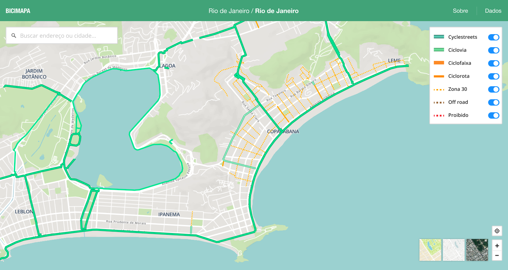

# Overview

Today in Brazil we face a big challenge of not having data on the cycling infrastructure available in our cities. This makes it very hard to paint a clear picture of our reality and calculate the relevant metrics to measure the opportunities and impacts to society of improving urban mobility. The most common problems are data not being standardized, making it hard to compare between localities, data not being available publicly or sometimes it not existing at all.

I've teamed up with two important civil society organizations on cycling and urban mobility to design and developed the first cycling maps platform encompassing all Brazilian cities. We've leveraged the data and collaborativeness of OpenStreetMap (OSM), the Wikipedia of maps. I've created an open-source web application, free and accessible from any computer or smartphone, aimed at both the average citizen who wants to know more about their city, and researchers, who now have easy access to data without needing OSM knowledge.

The first version of this platform is already on production but we consider it to be a first prototype and we have lots of ideas to develop it even further in the future.


# Understanding the problem

## Kick off

UCB (Brazil Cyclists Union) and ITDP (Transport and Development Policy Institute) are two civil society organizations that have joined forces to solve once and for all the problem of access to data on Brazil's cycling infrastructure. As the main stakeholders of the project my first activity was conducting a workshop using the Lean Canvas framework so we could make sure we were aligned on what we were going to build.


```grid|1

```

The main problems we wanted to solve was: 

* The lack of centralized, standardized and updated bike maps of brazilian cities.
* OpenStreetMaps contributors found disencouraging that there wasn't good applications that reuse its data.
* Contributing to OSM demands some technical knowledge, and there isn't good documentation written in Portuguese.


We had some unfair advantages: UCB and ITDP and 2 of the biggest organizations of this kind which could at that time invest in this project and would be able to mobilize the community. Also everyone on the team already had experience with similar projects involving webapps, maps and OSM data.

Everything went well except the Customer Segments part, which was the most polemic one. At this point in the project it was not clear to us who our users were exactly, so it raised a yellow flag to me that we should revisit that in the future.


## Research

One of the first steps was to understand OSM data about cycling structures. Fortunately we had on the team a specialist on OSM, but still we had to go through lots of documentations and lengthy (but healthy) discussions on how we'd interpret them. The main thing is that OSM is very objective, and the way it tags its entities are quite granular and details. We, however, wanted to abstract all this complexity to the end users, while at the same time educating on how good the different types of cycling structures are to the cyclists.

```grid|1

```

An important part at this step as well was to understand what other similar tools were available "on the market". I documented this on a simple Google Docs were I included main screenshots, a general and personal rating and some comments on the positives and negatives.

At this step we validated that our solution was innovative, since there wasn't any other like this, but there were many intersections with existing tools.

```grid|1

```

# Prototyping

```grid|1

```

With the references in mind and the typologies well defined I started sketching different ways we could lay out these feature in the screen. The concept always was to have the map as the main thing. Second came the current city in focus, and third the complementay UI elements to control the map such as typology filters, address search field, "about" link and the data download button.

```grid|1

```


# Executing

The entire development was done by me. It's always a challenge to separate the engineering and design mindsets in the process, so I forced myself to always ideate on Figma first, validating with the peers and only then creating cards on Trello to document the task and prioritize it.

```grid|1
 
```

The overall system architecture passed by 2 iterations. The first one, way simpler, barely did its job but was useful to validate some hypothesis concerning the OSM API. On the second version I could mitigate some of the problems we've found and improve the user experience.

```grid|1

```


# Branding

With a very functional first version of the system up and running before the schedule I found myself with some extra time to MAKE IT POP. Based on all the process up to now I've devised some brand principles to start thinking on the more graphical part of the project so we could improve the presentation of this project:

* It should be **serious**, not playful, since we're dealing with important data that can impact how our cities and built. But we're not formal or academic, we want to be **relatable**, so we can speak to the masses.
* We're **assertive** and **trustworthy**: we're experienced specialists on cycling and technology.
* **Collaborative**, **communal** and **educative**, since it's based on OpenStreetMaps.

This helped me decide about the he color palette, typography and tone of the UX writing.


```grid|1

```

```grid|1

```


# Promoting

I helped creating some arts to promote the project and our launching webinar in different social media channels.

```grid|1
  
```

Check below our full webinar, in Portuguese, with participation of the entire team as well as some special guests discussing the overall panorama.

`youtube: https://www.youtube.com/watch?v=IrPPbCnKPsI` 


# Looking ahead

With the current version in production we wanted to start gathering context to think about its future. We had some ideas in our mind but lots of people also came with others. Although we had a product vision of what the future could look like we didn't have a clear strategy of what should be focused first. So I've planned a research to interview users and other specialists all around Brazil to understand in more depth their needs and also get feedback about the product.

We've just finished this research, and our main conclusions have been:
* A pesquisa validou que o CicloMapa é inovador (não tem paralelo claro com outra soluções já existentes de mercado) e traz valor para a comunidade por facilitar a visualização dos dados do OSM. 
* Porém a ferramenta é vista como em estágio inicial, e tem um grande potencial inexplorado.
Levantamos uma grande lista de sugestões de pequenas melhorias que ajudariam a "arredondar as arestas" e aumentar o impacto do produto. Também identificamos que podemos melhorar nossas ações de divulgação da ferramenta e de conhecimento através de tutoriais, eventos e articulações.
* Não tivemos clareza de que funcionalidades mais custosas (ex. editor de infra cicloviária integrada à ferramenta) trariam um grande benefício, por enquanto. Também não há nenhuma indicação de que precisamos pivotar o produto (mudar de público-alvo ou de objetivos principais).


## Links

<links-list
    items='[
        {
            "label": "Website",
            "url": "https://ciclomapa.org.br/"
        },
        {
            "label": "Github",
            "url": "https://github.com/cmdalbem/ciclomapa"
        },
        {
            "label": "Launch Webinar video",
            "url": "https://www.youtube.com/watch?v=IrPPbCnKPsI"
        }
    ]'>
</links-list> 
