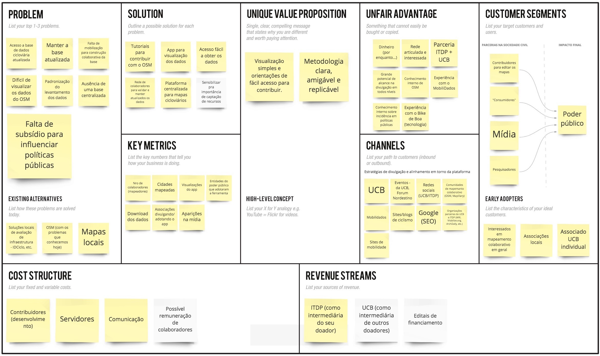

# Overview

Today in Brazil, we face the immense challenge of not having data on the cycling infrastructure available in our cities, which makes it very hard to paint a clear picture of our reality and measure the opportunities and impacts to society of improving urban mobility.

I've teamed up with [UCB (Brazil Cyclists Union)](https://uniaodeciclistas.org.br/) and [ITDP (Transport and Development Policy Institute)](https://itdpbrasil.org/), two important brazilian civil society organizations on cycling and urban mobility, to design and develop the first platform of cycling maps encompassing all Brazilian cities.

We've leveraged the data and collaborativeness of [OpenStreetMap (OSM)](https://www.openstreetmap.org/), a huge global initiative similar to a Wikipedia of maps. I’ve created an open-source web application, free and accessible from any computer or smartphone, aimed at the average citizen who doesn’t know her city’s bike paths and researchers, who now have easy access to data to analyze further.


# Understanding the problem

## Kick-off

As the main stakeholders of the project, my first activity was conducting a workshop using the Lean Canvas framework to ensure alignment on what we were going to build.

```grid|1

```
 
We decided the main problems we wanted to solve were: 

* The lack of centralized, standardized, and updated bike maps of Brazilian cities.
* OpenStreetMap contributors found it discouraging that there weren’t good applications that reuse its data.
* Contributing to OSM demands some technical knowledge, and there isn't good documentation written in Portuguese.

We also found out some of our “unfair” advantages: UCB and ITDP are two of the most prominent organizations of this kind that could invest in this project and would be able to mobilize the community. Also, everyone on the team already had experience with similar projects involving web apps, interactive maps, and OSM data.


## Research

Our first step was diving into OSM documentation and learning about cycling infrastructures. Fortunately, we had on the team a specialist on OSM who helped us abstract the super granular and technical tags into something more accessible.

<jumbo caption="Documenting how we'd model the data and the information would be shown to the users, including labels, textual descriptions, and visual representations of data. Spreadsheets are a potent prototyping tool that designers often overlook!">
    
</jumbo>

We also did a deep dive into everything available on the market, from other map-based web apps to some PDF cycling maps from cities worldwide. At this step, we validated that our solution seemed to be innovative and unique since there didn’t seem to exist anything precisely like it. Still, we found intersections with existing solutions that gave us inspiration and new ideas on how to solve the problems.

<jumbo caption="Benchmark research looking for similar digital tools and official bike maps from cities around the world.">
    
</jumbo>
 

Our main insights were:

* Solutions based on OSM are very technical and hard to use, and none had clear instructions about the collaborative dimension and how to contribute to the mapping.
* Bike maps rarely explain their terminologies which are not very friendly to the broad public.
* When the maps present multiple typologies, these are often colored in somewhat random ways, producing a final result that is not only unappealing but, most importantly, confusing and overwhelming.
* Almost none were adapted to Mobile devices.

```grid|1

```


# Prototyping

It was important to start with a very low-fidelity prototype to validate the main features and visual hierarchy without putting on the table discussions on visuals. Although it looks very different from the final version, the overall experience didn’t change much!

<!-- ```grid|1

``` -->

<video-container> 
    <video autoPlay controls loop width="100%" type="video/mp4">
        <source src="./prototype.mp4" type="video/mp4">
    </video> 
</video-container>

[Figma interactive prototype](https://www.figma.com/proto/QjH5j2kdQnN1iUZCYxjNsDwt/CicloMapa?node-id=363%3A113&viewport=-3270%2C2793%2C0.45554399490356445&scaling=scale-down-width)

With the references in mind and the well-defined typologies, I started sketching different ways to lay out these features on the screen. The concept always was to have the map as the main thing. Second, came the current city in focus, and third, the complementary UI elements to control the map, such as typology filters, address search field, “about” link, and the small but essential data download button.


# Implementing

I was the only developer on the team. It’s always a challenge to separate the engineering and design mindsets in the process, so I forced myself to always ideate on Figma first, validating with the peers and creating cards on our Trello board to document the task and prioritize it for development.

<!-- 
```grid|1
 
``` -->

The overall system architecture passed by many iterations. I started with straightforward ones to test concepts concerning the [OSM Overpass API](https://wiki.openstreetmap.org/wiki/Overpass_API). I slowly added more complexity to mitigate the problems we saw, getting feedback from the stakeholders and always aiming to improve the user experience.

```grid|1

```

To build the UI I, chose [Ant Design](https://ant.design/), which has super high-quality React components and excellent documentation. I did all the styling with [TailwindCSS](https://tailwindcss.com/), a fantastic CSS framework.

For this project, I also wanted to try out [Mapbox](https://www.mapbox.com/), an open map library built on top of OpenStreetMap. It’s also super modern and well done and offers way more flexibility than any other library I’ve used. In addition, it was a pleasure using [Mapbox Studio](https://www.mapbox.com/mapbox-studio), their interactive map customization tool, which is a terrific product and enabled me lots of controls to be creative in designing our base map.
 
```grid|1 

``` 


# Visual design 

<!-- With a very functional first version of the system up and running ahead of schedule I found myself with some extra time to _make it pop_. Based on all the process up to now I've devised some brand principles to start thinking on some visual directions:
 
* **Serious** instead of playful, since we're dealing with important data that can impact how our cities and built. But we're not formal or academic, we want to be **relatable**, so we can speak to the masses.
* **Assertive** and **trustworthy**: we're experienced specialists on cycling and technology.
* **Collaborative**, **communal** and **educative**, since it's based on OpenStreetMap. -->

<!-- The main colors are dark because it gives a "data dashboard" vibe. It also resembles the aerial look of a cityscape at night, with the bike paths lighten up as if they were neon lights, which is pretty cool. The color palette is made of steps in a gradient from green to red representing the safety and "goodness" of the different typologies. These were optimized to the best visibility possible on both the dark map as well as available variation of a satellite map. -->

The visual identity draws inspiration from data dashboards from sci-fi movies, with a dark-themed color palette. The map style is highly subdued, making the bike infrastructure look like neon stripes glowing in the dark.

<jumbo>
    
</jumbo>

<!-- ```grid|1
 
``` -->

<jumbo caption="Final version of the UI and map style, now with a present brand.">
    
</jumbo>

```grid|1

```
```grid|1

```

<!-- <jumbo caption="The variation with satellite imagery as the base map. It was important that the color palette worked for both scenarios. The images were processed to have reduced brightness and saturation to better keep contrast with the UI.">
    
</jumbo> -->

<!-- 
<jumbo caption="Some sketches of how the mobile experience could look like. We didn't go much further with this part.">
    
</jumbo> -->

Some nice little interaction details are the tooltips on the layers filters. They help educate the user about what each layer type is about.

<video-container> 
    <video autoPlay controls loop width="100%" type="video/mp4">
        <source src="./tooltips.mp4" type="video/mp4">
    </video> 
</video-container>


# Promoting

I was also responsible for designing social media posts highlighting the different features. These included posts on Instagram, Facebook, Linkedin, and Twitter

```grid|1

```

```grid|1

```

```grid|1

```


# Results

Since its launch, CicloMapa has become Brazil's leading platform for bike maps, even without any money spent on advertising it.

We're glad with the organic coverage from different media channels, mainly with [Mobilize](https://www.mobilize.org.br/noticias/11986/um-mapa-com-quase-todas-as-ciclovias-do-brasil.html) and [ArchDaily](https://www.archdaily.com.br/br/933497/ciclomapa-um-mapa-colaborativo-da-infraestrutura-cicloviaria-das-cidades-brasileiras), big portals specialized on mobility. One of ITDP's webinars that presented CicloMapa also got highlighted on [Hacker News's](https://news.ycombinator.com/item?id=30791874) front page, the legendary tech news portal by Y Combinator.

<jumbo>
    
</jumbo> 

CicloMapa also had accepted presentations at important conferences, such as [FOSS4G (Free and Open Source for Geospatial Conference)](https://callforpapers.2021.foss4g.org/foss4g2021/talk/TDTR7F/), [Velocity 2018](https://ecf.com/projects/velo-city/velo-city-2018-rio-de-janeiro) and [FMB 10 (Forum Mundial de la Bicicleta)](https://www.youtube.com/watch?v=if5O6F-xC7I)

<results-banner
    data='{
        "brazilian cities viewed": "737",
        "users / month": "400",
        "pageviews total": "700,000",
        "avg user rating": "4.4/5"
    }'>
</results-banner>

This success guaranteed yearly budget updates from the client, which always gave us lots of freedom to design and build the platform's next steps. Proof of this trust is that in 2022, instead of jumping into building all feature requests we received throughout the years, we instead ran a major Product Discovery research that revealed big new opportunities for the platform. (This project might become a new case study here on my website at some point :)


## Links

<links-list
    items='[
        {
            "label": "CicloMapa.org.br",
            "url": "https://ciclomapa.org.br/"
        },
        {
            "label": "Presentation video @ FOSS4G, 2021",
            "url": "https://ciclomapa.org.br/"
        },
        {
            "label": "GitHub",
            "url": "https://github.com/cmdalbem/ciclomapa"
        },
        {
            "label": "Educational website [Portuguese]",
            "url": "https://uniaodeciclistas.org.br/atuacao/ciclomapa/"
        },
        {
            "label": "Launch webinar video, 2019 [Portuguese]",
            "url": "https://www.youtube.com/watch?v=IrPPbCnKPsI"
        }
    ]'>
</links-list> 
