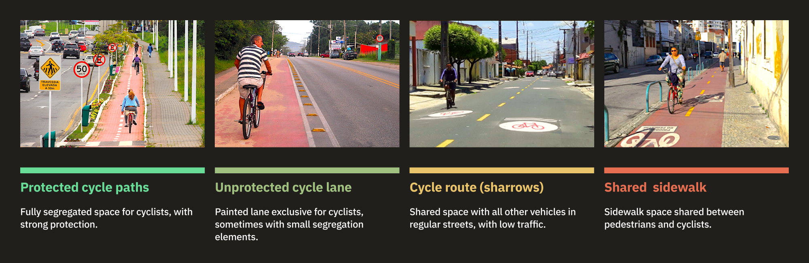
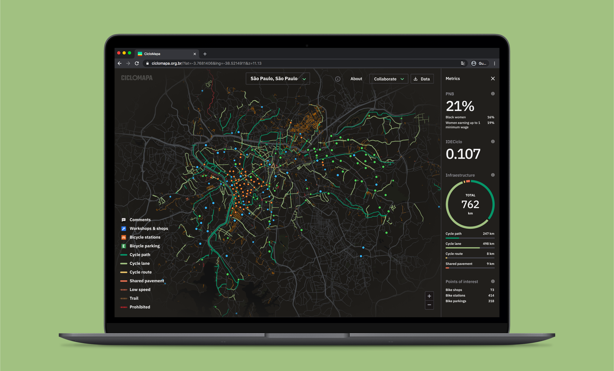

# Overview

Today in Brazil, we face the immense challenge of not having data on the cycling infrastructure available in our cities, which makes it very hard to paint a clear picture of our reality and measure the opportunities and impacts to society of improving urban mobility.

I've teamed up with [UCB (Brazil Cyclists Union)](https://uniaodeciclistas.org.br/) and [ITDP (Transport and Development Policy Institute)](https://itdpbrasil.org/), two of the most relevant civil society organizations in Brazil for cycling and urban mobility. We set to design and build the first unified platform of cycling maps, encompassing the entirety of the country's cities.

This project leveraged the data and collaborative nature of [OpenStreetMap (OSM)](https://www.openstreetmap.org/), a huge global initiative, like a Wikipedia of maps. I’ve created an open-source web application, free and accessible from any computer or smartphone, aimed at the average citizen who doesn’t know their city’s bike paths and researchers, who now have easy access to data in an unprecedented scale.


# Understanding the problem 

As the main stakeholders of the project, my first activity was conducting a workshop using the Lean Canvas framework to ensure alignment on what we were going to build.

```grid|1

```

We decided the main opportunities we wanted to focus on this solution were: 

<insights
    title="Main opportunities"
    items='[ 
    {
        "title": "An unified Brazilian map",
        "description": "Solving for the lack of centralized, standardized, and up-to-date bike maps of Brazilian cities. Currently cities use different tools which makes data hard to make comparisons."
    },{
        "title": "Encouraging open collaboration",
        "description": "OpenStreetMap contributors found it discouraging that there weren’t good, consumer-facing applications of its data."
    },{
        "title": "Democratizing the data",
        "description": "Although the project could benefit the average urban cyclist, our focus was on advocacy agents of low technical savviness who needed an easier access to up-to-date data."
    }]'>
</insights> 

We also found out some of our “unfair” advantages: UCB and ITDP are two of the most prominent organizations of this kind that could invest in this project and would be able to mobilize the community. Also, everyone on the team already had experience with similar projects involving web apps, interactive maps, and OSM data.


# Research

To start organizing the Information Architecture, our first step was diving into OSM documentation and manuals on cycling infrastructures. Fortunately, we had on the team a specialist on OSM who helped us abstract the technical tags into something more accessible.

I started understanding the main types of bike paths, how they appear in Brazilian cities and what place in the a "quality and safety gradient" they would be placed.

<jumbo>
    
</jumbo>

I used this spreadsheet to organize the information architecture, documenting how we'd model the data filters, including labels, textual descriptions, and visual representations of data.

<jumbo> 
    
</jumbo>
  
<!-- ```grid|1

``` -->

I did a deep dive into everything available on the market, from other map-based web apps to some PDF cycling maps from cities worldwide. At this step, we validated that our solution seemed to be innovative and unique since there didn’t seem to exist anything precisely like it. Still, we found intersections with existing solutions that gave us inspiration and new ideas on how to solve the problems. We learned that:
* Solutions based on OSM are very technical and hard to use, and none had clear instructions about the collaborative dimension and how to contribute to the mapping.
* Bike maps rarely explain their terminologies which are not very friendly to the broad public.
* When the maps present multiple typologies, these are often colored in somewhat random ways, producing a final result that is not only unappealing but, most importantly, confusing and overwhelming.
* Almost none were adapted to Mobile devices.

<jumbo caption="Benchmark research looking for similar digital tools and official bike maps from cities around the world.">
    
</jumbo>

From these insights I facilitated workshops for brainstorming and prioritizing the main features we wanted to build. One of the frameworks we used to prioritize features in the beginning was the classic Effort/Complexity Matrix. I facilitated workshops with the team to fill the matrix, choose was features we'd build and their order.
 

```grid|1

```


# Prototyping

It was important to start with a [low-fidelity Figma prototype](https://www.figma.com/proto/QjH5j2kdQnN1iUZCYxjNsDwt/CicloMapa?node-id=363%3A113&viewport=-3270%2C2793%2C0.45554399490356445&scaling=scale-down-width) to validate the main features and visual hierarchy without putting on the table discussions on visuals—at least for now. Although it looks very different from the final version, the overall experience didn’t change much! We validated this prototype with potential users we started gathering on a small mapping enthusiasts community on Telegram.

<!-- ```grid|1

``` -->

<!-- <video-container> 
    <video autoPlay controls loop width="100%" type="video/mp4">
        <source src="./prototype.mp4" type="video/mp4">
    </video> 
</video-container> -->

```grid|1

```

With the references in mind and the well-defined typologies, I started sketching different ways to lay out these features on the screen. The concept always was to have the map as the main thing. Second, came the current city in focus, and third, the complementary UI elements to control the map, such as typology filters, address search field, “about” link, and the small but essential data download button.

<jumbo caption="A simplified view of how the webapp is composed by 3 layers: the Mapbox interactive base map, the OSM data and the UI for controls and metrics. ">
       
</jumbo>

## Prototyping with code

At this point I was iterating on the prototype and validating with the community. However quickly I realized that such a complex interactive product, with all its interactions and microinteractions would be hard to validate solely on Figma prototypes. So, as soon as we had the basic features and mechanics set, I started moving to code.


# Implementation

As the only developer on the team, it’s always a challenge to separate the engineering and design mindsets in the process. I forced myself to always ideate concepts on Figma first, validating with the peers and creating cards on our Trello board to document the task and prioritize it for development.

The overall system architecture passed by many iterations. I started with straightforward ones to test concepts concerning the [OSM Overpass API](https://wiki.openstreetmap.org/wiki/Overpass_API). I slowly added more complexity to mitigate the problems we saw, getting feedback from the stakeholders and our user community and always aiming to improve the user experience.

```grid|1

```

## Exploring new technology

To build the UI, I chose [Ant Design](https://ant.design/), a high-quality open React library with excellent documentation. I did all the styling with [TailwindCSS](https://tailwindcss.com/), a fantastic CSS framework, to customize the Ant components to our visual identity and create layouts.

For this project, I also wanted to try [Mapbox](https://www.mapbox.com/), an open map library built on top of OpenStreetMap. It offered much more flexibility and more advanced features compared with the Google Maps SDK I was used to. In addition, it was a pleasure using [Mapbox Studio](https://www.mapbox.com/mapbox-studio), their interactive map customization tool. It's a terrific product and enabled me lots of controls to be creative in designing our base map.
 
```grid|1 

``` 

Beyond just customizing color palettes, the editor allows us to add new data layers, filter what we want to show, how, at what zoom level, and much more. When designing the points of interest layer, I created 2 hierarchy levels based on what are more "complex" data points.

```grid|1 

``` 


# Visual identity 

<!-- With a very functional first version of the system up and running ahead of schedule I found myself with some extra time to _make it pop_. Based on all the process up to now I've devised some brand principles to start thinking on some visual directions:
 
* **Serious** instead of playful, since we're dealing with important data that can impact how our cities and built. But we're not formal or academic, we want to be **relatable**, so we can speak to the masses.
* **Assertive** and **trustworthy**: we're experienced specialists on cycling and technology.
* **Collaborative**, **communal** and **educative**, since it's based on OpenStreetMap. -->

<!-- The main colors are dark because it gives a "data dashboard" vibe. It also resembles the aerial look of a cityscape at night, with the bike paths lighten up as if they were neon lights, which is pretty cool. The color palette is made of steps in a gradient from green to red representing the safety and "goodness" of the different typologies. These were optimized to the best visibility possible on both the dark map as well as available variation of a satellite map. -->

The visual identity draws inspiration from data dashboards from sci-fi movies, with a dark-themed color palette. The map style is highly subdued, making the bike infrastructure look like neon stripes glowing in the dark. Another source of inspiration was the view you have of the city lights from an airplane window, again, with the streets glowing.

```grid|1
 
```

With the typography and basic palette set, I started customizing the Mapbox base map and the Ant Design components to match the style.

<!-- ```grid|1
 
``` -->

<jumbo>
    
</jumbo>


# Features highlights

The map is fully interactive, and I focused on offering a seamless experience for exploring different cities and zoom levels.

```grid|1
  
```  

The bike paths have a special, colorful tooltip. On the bottom, buttons invite the user to quickly edit that data in the OSM official website, or to leave a comment inside CicloMapa.
 
```grid|1

```

```grid|1

```
 
Tooltips for points of interest have more details, which were curated from the several metadata present in the OSM nodes. We made a big effort of understanding which were more important for the common user, as well as translating the technical names.

```grid|2
 
 
```

<jumbo caption="Final version of the UI and map style.">
     
</jumbo>

<!-- <jumbo caption="The variation with satellite imagery as the base map. It was important that the color palette worked for both scenarios. The images were processed to have reduced brightness and saturation to better keep contrast with the UI.">
    
</jumbo>  -->

Some nice little interaction details are the tooltips on the layers filters. They help educate the user about what each layer type is about.

<video-container> 
    <video autoPlay controls loop width="100%" type="video/mp4">
        <source src="./tooltips.mp4" type="video/mp4">
    </video> 
</video-container>


# Marketing assets

I was also responsible for designing social media posts highlighting the different features. These included posts on Instagram, Facebook, Linkedin, and Twitter. Although outside my comfort zone, it was fun being able to hone my skills with graphic design, which is not my main strength and I rarely have opportunity to do as a Product Designer inside the companies I've worked.

```grid|1

```

```grid|1

```

 
# Results

Since its launch, CicloMapa has become Brazil's leading platform for bike maps, even without any money spent on advertising it.

We're glad with the organic coverage from different media channels, mainly with [Mobilize](https://www.mobilize.org.br/noticias/11986/um-mapa-com-quase-todas-as-ciclovias-do-brasil.html) and [ArchDaily](https://www.archdaily.com.br/br/933497/ciclomapa-um-mapa-colaborativo-da-infraestrutura-cicloviaria-das-cidades-brasileiras), big portals specialized on mobility. One of ITDP's webinars that presented CicloMapa also got highlighted on [Hacker News's](https://news.ycombinator.com/item?id=30791874) front page, the legendary tech news portal by Y Combinator.

```grid|1

```

CicloMapa also had accepted presentations at important conferences, such as [FOSS4G (Free and Open Source for Geospatial Conference)](https://callforpapers.2021.foss4g.org/foss4g2021/talk/TDTR7F/), [Velocity 2018](https://ecf.com/projects/velo-city/velo-city-2018-rio-de-janeiro) and [FMB 10 (Forum Mundial de la Bicicleta)](https://www.youtube.com/watch?v=if5O6F-xC7I).

<results-banner
    data='{
        "brazilian cities accessed": "737",
        "users / month": "400",
        "pageviews total": "700,000",
        "avg user rating": "4.4/5"
    }'>
</results-banner>

This success guaranteed yearly budget updates from the client, which always gave us lots of freedom to design and build the platform's next steps. Proof of this trust is that in 2022, instead of jumping into building all feature requests we received throughout the years, we instead ran a major Product Discovery research that revealed big new opportunities for the platform. This project might become a new case study here on my website at some point :)


## Links
 
<links-list
    items='[ 
        {
            "label": "CicloMapa.org.br",
            "url": "https://ciclomapa.org.br/"
        },
        {
            "label": "GitHub",
            "url": "https://github.com/cmdalbem/ciclomapa"
        },
        {
            "label": "Presentation video @ FOSS4G, 2021 [En]",
            "url": "https://ciclomapa.org.br/"
        },
        {
            "label": "Educational website [Pt]",
            "url": "https://uniaodeciclistas.org.br/atuacao/ciclomapa/"
        },
        {
            "label": "Launch webinar video, 2019 [Pt]",
            "url": "https://www.youtube.com/watch?v=IrPPbCnKPsI"
        }
    ]'>
</links-list> 
