---
projectType: 'personalHighlight'
date: "2020-08"
date2: "2021-04"
lastUpdated: "2025-03"
title: "Escapista"
minibio: "A video streaming website created during the COVID-19 pandemic to help users relax, explore the world, and enjoy staying home."
description: "Choose a channel and let your mind wander with the continuous stream of great Slow TV and ambient videos we handpicked for you. Relax with the natural images and sounds while you work, put on your TV or invite your friends to watch together."
tags: ['design','front-end','product management']
metrics: ['Video visualizations','Total playback time','Unique users']
cover: './cover.png'
# hover: '/covers/escapista.gif'
team: ["Gabriela Catão (product, concept, content curation)"]
color: '#006E6E' 
liveLink: 'http://escapista.app/'
--- 
 
# Overview
 
For a long time I've been in love with the concept of [Slow TV](https://en.wikipedia.org/wiki/Slow_television), and from the beginning of the COVID pandemic I started collecting some YouTube channels I was shocked with how much amazing stuff was out there. I started sketching ideas for a webapp that would help promote all this amazing content, something with a frictionless experience that would attempt to fix once and for all the choice paralysis present in so many video streaming platforms these days.

From a survey we ran in [the Reddit Slow TV community](https://www.reddit.com/r/SlowTV/), I focused on designing an experience that would be calming, "playing to the affective experience of watching Slow TV itself". I draw inspiration from Scandinavian design, birthplace of the original Slow TV shows, and Japanese culture, both well-known for its minimalism and contemplative natures.

```grid|1  

```

<!-- ```grid|1 
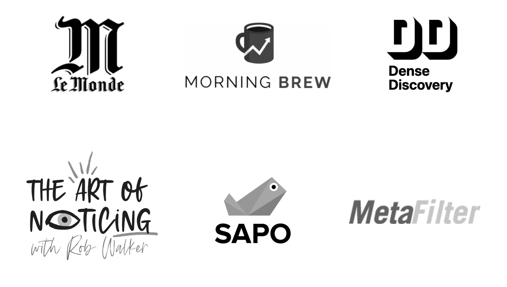
```  -->


# Research

Our research started diving into the topics of Slow TV, reading all articles, watching all talks and listening to all podcasts we could find on the subject. We also read a lot also current trends for online streaming and a growing trend on transcending the algorithms and bringing human curation back.
 
We also learned there's also a growing discussion about "the Netflix effect", a frustrating experience of "analysis paralysis" that affects video platforms as well as other products that offer too many options to the user.

<!-- We documented everything on Notion, as you can see below.
 -->

<jumbo>
    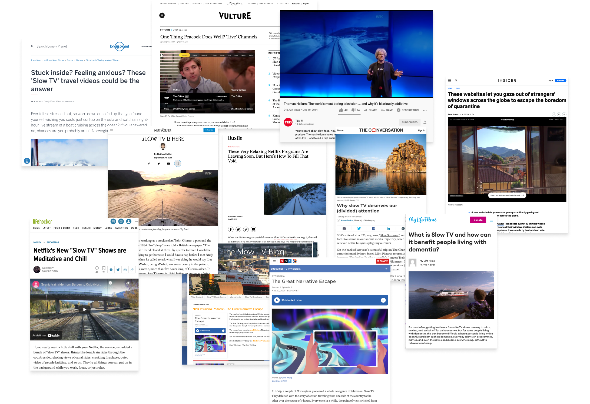
</jumbo> 

This project was co-created with [the Reddit Slow TV community](https://www.reddit.com/r/SlowTV/), where we understood the whys and hows of those users. We [posted a survey](https://www.reddit.com/r/SlowTV/comments/iuuwoo/help_me_design_a_slow_tv_app/g5nfv64/?context=3) asking people to help me build this app.

<!-- Some of the things we wanted to find out were:
* Why, when and how do people watch Slow TV content?
* What kind of experience or features people miss from the current websites where they get their content?
* What makes for good Slow TV content?
* How much interactivity/control would they want from this experience? (more like YouTube, or more like Cable TV?) -->

```grid|1
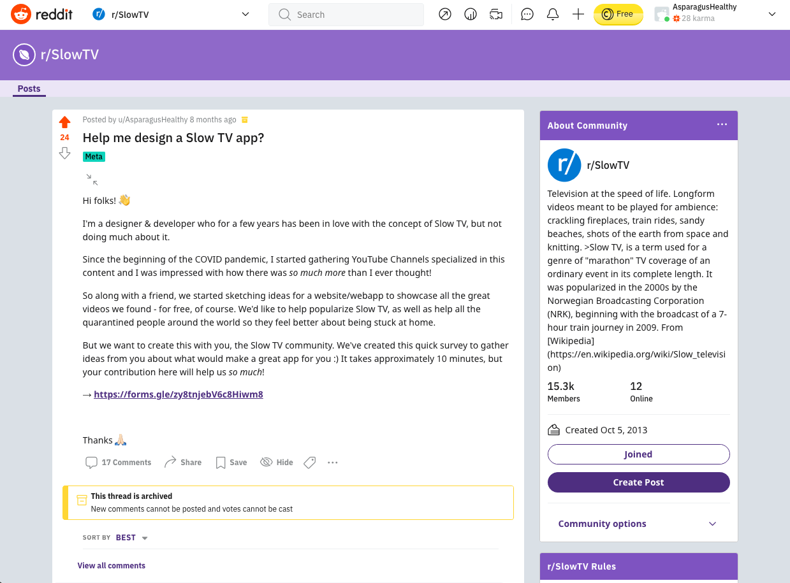
``` 

After analysing these responses we made sure to [post again on the community](https://www.reddit.com/r/SlowTV/comments/kccdky/presenting_escapista_a_new_experience_of_watching/) thanking for the interest and the great feedback, sharing [a small report of the main findings](https://www.notion.so/Slow-TV-Community-Survey-1c0838bac8c84383b49b8f03eaeed04f).

<jumbo>
    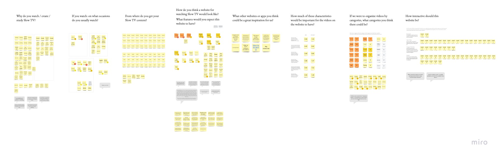
</jumbo> 

<insights
    title="Main learnings"
    items='[ 
    {
        "title": "Why people watch Slow TV",
        "description": "For relaxation, virtual travel, and cultural exploration, which became even more relevant during quarantine. Some also find it useful for focus, creating ambiance to help with creativity and anxiety relief, and as a background for exercise."
    },{
        "title": "How people watch",
        "description": "Mostly at home, primarily on TVs and big screens, followed by computers and second monitors. It is often played while doing other activities like working, eating, socializing, writing, or crafting."
    },{
        "title": "What viewers want in a platform",
        "description": "Should have a minimalist and calming interface. Some prefer a full-featured streaming service with browsing and search options, while others want a simple, curated experience with fewer but high-quality videos."
    },{
        "title": "Content and categorization",
        "description": "Viewers prioritize high technical quality and prefer unedited footage. Categories include nature, urban landscapes, and transportation-based experiences like walking, trains, cars, and boats."
    },{
        "title": "Viewing experience",
        "description": "Some users want a cable TV-style approach with continuous live channels. Others prefer a fuller experience with search, browse, and playlists features, but are aware that YouTube already covers that."
    }]'>
</insights> 

<!-- Following are highlights of what we learned from the survey ([read the full research report here](https://www.notion.so/Slow-TV-Community-Survey-1c0838bac8c84383b49b8f03eaeed04f) )

## Consumption habits

We learned that most people watch Slow TV to _relax_, to _travel and meet new places_ and cultures, something even more important now during the quarantine. Also, some mention helping focus, create a specific atmosphere in the room (either calming or exciting), and even helping to do exercises at home.

<quote>[Slow TV] is meditative. It can get my creative juices flowing. The moving picture stimulates my brain, without invading my thoughts. My mind is able to fly free in a state of flow.</quote>

Most often people watch at _home_, _mainly on TV_ and big screens, secondly on the computer and 2nd monitors. People watch it while doing a high variety of activities: _working_, with _friends_, with _music_, _eating_, writing, drawing, knitting, folding laundry, ... Various mentions to smart TV devices and video-games, but no mobile.

<quote>I suffer from anxiety and this is a method of calming down or remaining calm in times of stress.</quote>


## Product requirements

As for the website experience, almost everyone mentioned the interface should be _minimalist and calming_. Also very often is the concept of _categories, or themes,_ that organize the main types of videos.

<quote>Try to play to the same affective experience of watching slow tv itself. Minimal, make a few choices press play and don't touch for as long as possible.</quote>

Some people say it should be exactly like other streaming services, with a full catalog where you can browse, search, and filter. Others state the contrary: it should be very simple and minimalist, with more curated, high-quality content. 

> "Not overwhelming or overstimulating. A good recommendation system, but not too many options shown all at once on the landing/home page."


<jumbo>
    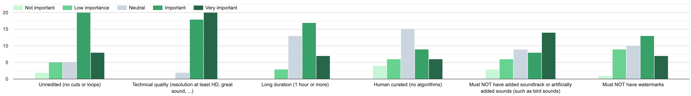
</jumbo>

<quote>What I would not want is to load it and be presented with a busy YouTube-esque interface.</quote>

In terms of content, the most important aspects seem to be _technical quality_ (good resolution, sound, ...) and _unedited_. Most common requested categories were _nature_, _urban_, _walking, train_, _car, boat_, and the most important aspect for categorizing videos seems to be the types of _transportation_ and _location._

Several people would like to have a YouTube-like experience, where they can browse and search for the videos they want, build playlists, etc. Still, several also like the idea of a Cable TV-like experience, where you're presented with a few live channels. Some mentioned a combination of both approaches would be cool. -->


## Asking for permission, not forgiveness
 
Finally, we also reached out to our favorite YouTube creators to see what they think. While we didn't get responses from many, everyone that replied was very positive about the idea and some even very excited and thankful, such as [Japan Potato](https://www.youtube.com/channel/UCHG0_GSE0q02ywTfSoq2s3g) and [Chill & Explore](https://www.youtube.com/c/ChillExplore/featured):

 
```grid|2  
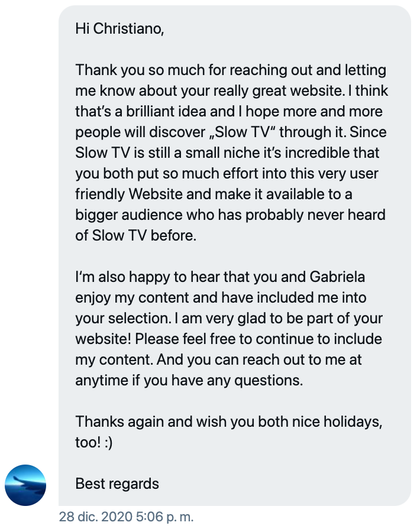
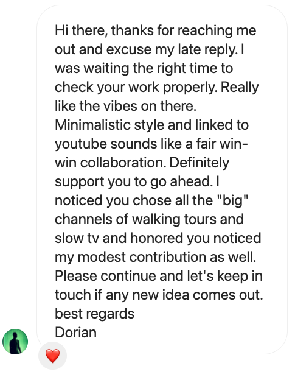
```


# Visual identity

<!-- <jumbo caption="blablabla">
    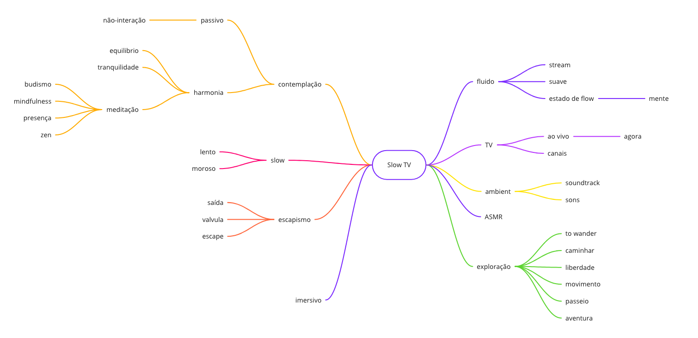
</jumbo> -->

I drew inspiration from an overlap between Scandinavian design and adventure magazines. Scandinavia is the birthplace of the original Slow TV shows, and I've learned they have a design tradition of minimalism, subdued colors, geometric typography and high usage of photography laid out in asymmetric grids.
 
<jumbo>
    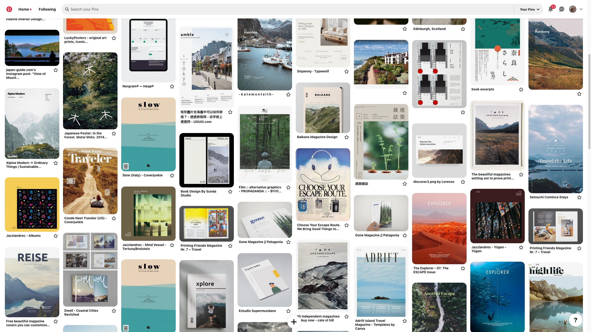
</jumbo>

<!-- On the typography studies I explored possibilities for 3 families:
* "Nordic" fonts, to be used in all caps
* Geometric and other swiss-type Sans Serif fonts, very commonly found in the references too
* Didone fonts, which seems to be really popular nowadays and could bring a modern feel

```grid|1
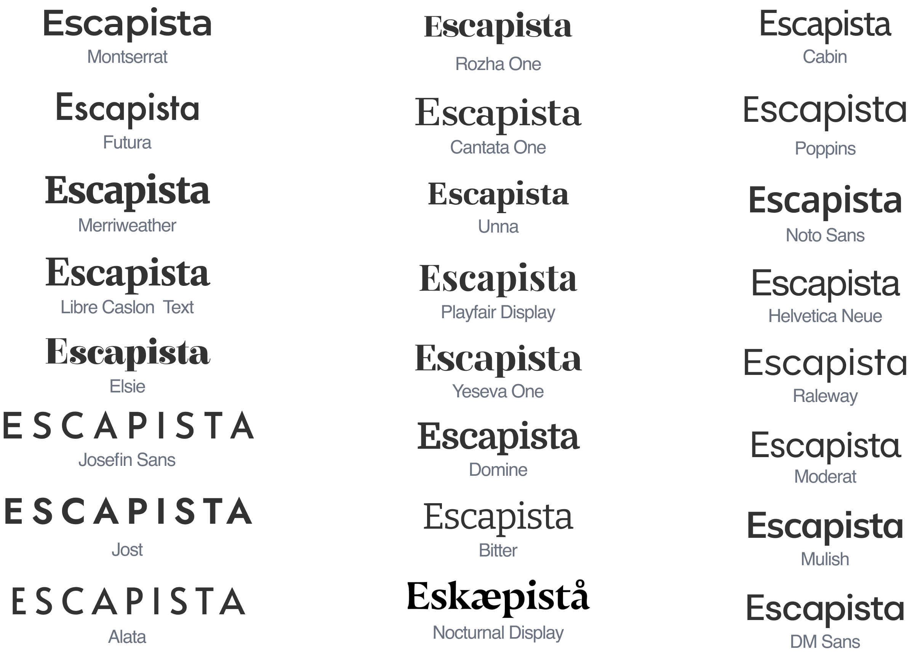
``` -->

## Logo and illustrations

I drew inspiration from Hanafuda, traditional Japanese cards. As the Scandinavians, Japanese culture is also very centered on nature and contemplation. One that particularly caught my attention was the Full Moon card, which depicts beautiful natural scenery with a big full moon that seems ambiguously seems to be hiding or being revealed from behind a hill. 

<jumbo>
    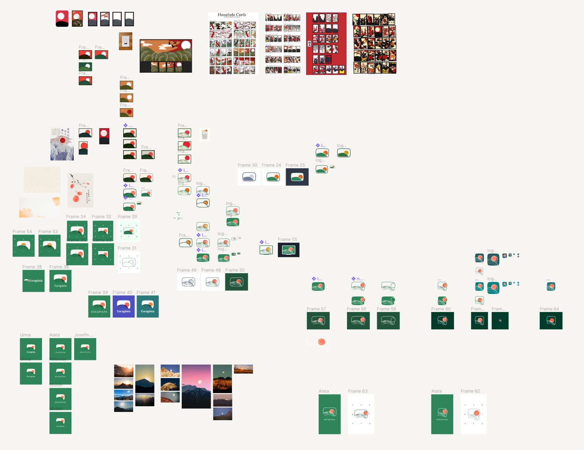
</jumbo>
 
I really felt this expressed my feeling of being stuck at home, wanting to go out but at the same time trying to take care of me and others.

```grid|1

```

The illustration would also be explored with a fun and engaging parallax effect in the landing page.

<video-container jumbo="true">
    <video autoPlay controls loop width="100%" type="video/mp4">
        <source src="./landing.mp4" type="video/mp4">
    </video> 
</video-container>

I also have fun with the concept in this message that appears on mobile if you're holding the device in portrait mode.

<!-- ```grid|1
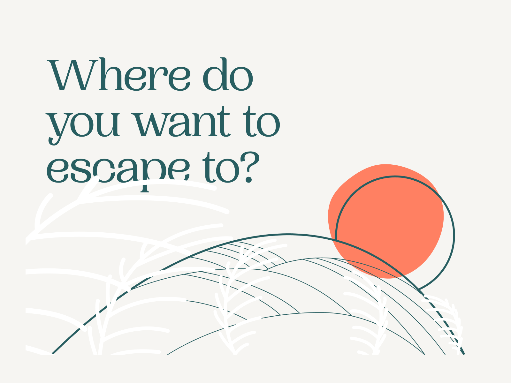
``` -->

<video-container>  
    <video autoPlay controls loop width="100%" type="video/mp4">
        <source src="./rotate.mp4" type="video/mp4">
    </video> 
</video-container>

 
# Prototyping 

To kick off exploring UI solutions we did some benchmarks, looking for similar immersive web experiences and TV UI references. This was particularly important since it was my first time designing such kind of product.

<jumbo>
    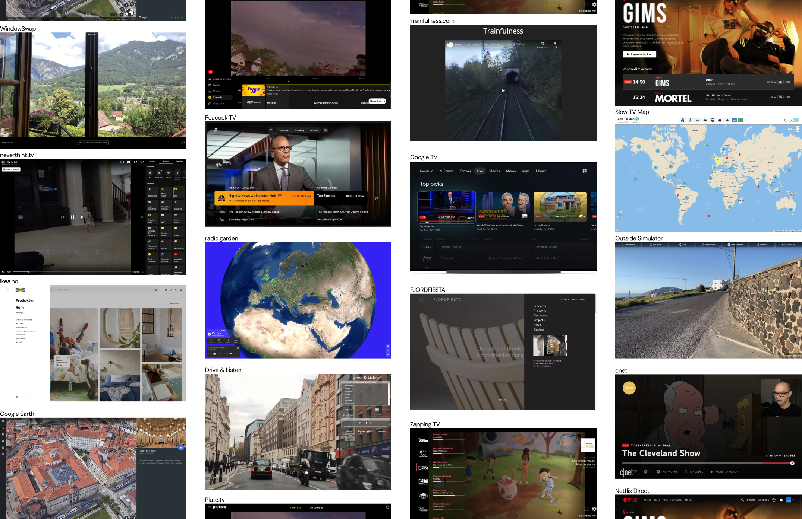
</jumbo> 

<!-- <jumbo caption="blablabla">
    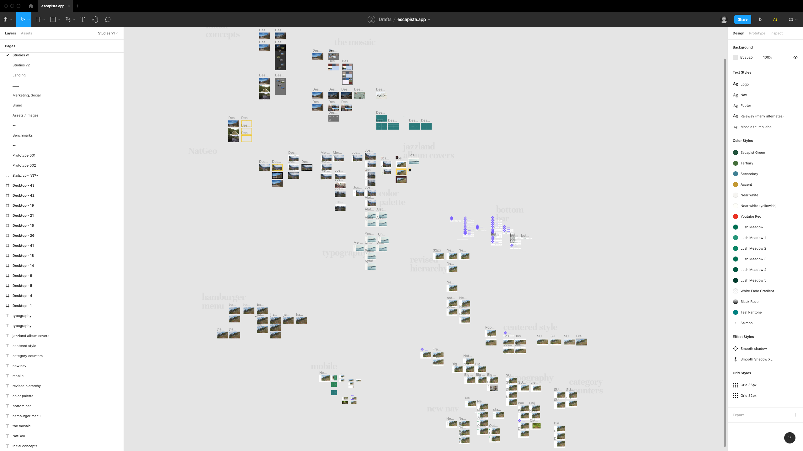 
</jumbo> --> 

## Design principles

I've explored many alternatives, searching for something that made sense to our vision of a UI that "play to the same affective experience of watching Slow TV itself", as one survey respondent said. To guide my explorations and help us make decisions, I devised 3 design principles for the product:
* Minimalism as a way for calm and focus
* Immersive meditation
* Less controls, more contemplation

 
<jumbo>
    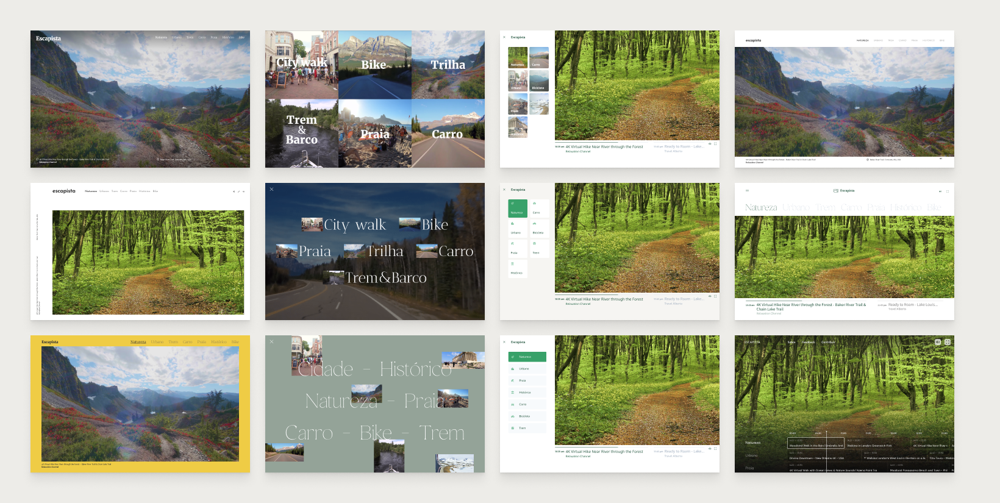 
</jumbo>

The bottom bar component was one that I painstakingly explored, trying to find the perfect balance of useful information about the schedule without damaging the extremely minimalistic visuals.

<jumbo> 
    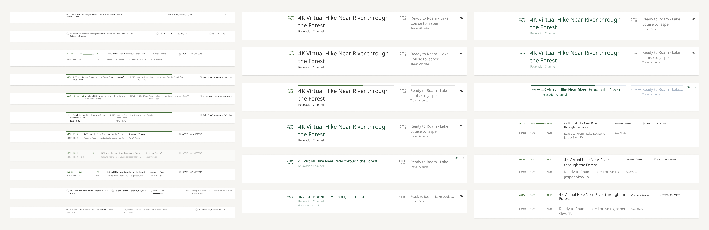
</jumbo> 
 

## Finding the essential

For the final version I ended up removing several details normally found in video players so I could focus on the bare essentials. The "up next" section, for example, will only appear if the current video is about to end in a few minutes, otherwise it's hidden too.
 
<jumbo> 
    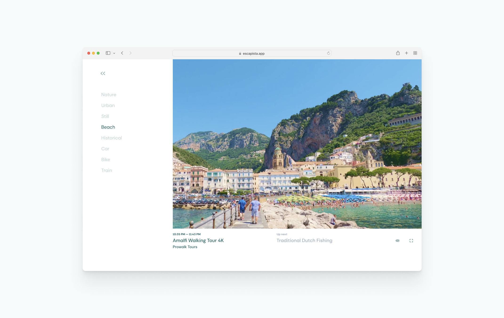
</jumbo>
 

## Fine-tuning motion

For my favorite concepts ones I created simple prototypes to see it in action and get feedback from users. At that time Figma didn't support videos, but by converting some short Slow TV clips to GIFs I managed to create fairly realistic prototypes. 
 
<!-- <jumbo>
    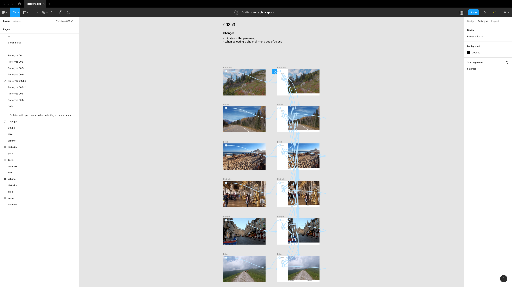
</jumbo> -->

<video-container>  
    <video autoPlay controls loop width="100%" type="video/mp4">
        <source src="./prototype.mp4" type="video/mp4">
    </video> 
</video-container>


<!-- > Thank you so much for reaching out and letting me know about your really great website. I think that’s a brilliant idea and I hope more and more people will discover Slow TV through it. Since Slow TV is still a small niche it’s incredible that you both put so much effort into this very user friendly Website and make it available to a bigger audience who has probably never heard of Slow TV before. I‘m also happy to hear that you and Gabriela enjoy my content and have included me into your selection. I am very glad to be part of your website! -->

<!-- ```grid|1 

``` -->

<!-- > Hi there, thanks for reaching me out and excuse my late reply. I was waiting the right time to check your work properly. Really like the vibes on there. Minimalist style and linked to youtube sounds like a fair win-win collaboration. Definitely support you to go ahead. I noticed you chose all the "big" channels of walking tours and slow tv and honored you noticed my modest contribution as well. Please continue and let's keep in touch if any new idea comes out. best regards Dorian -->

<!-- ```grid|1

``` -->

## A landing page to tell a story

Based on the main questions brought from user tests, I designed a landing page that presented the concepts of the project. I wanted to bring more clarity to some of our philosophies that guided our UX decisions, for example explaining why there isn't pause of fast-forward buttons.

<video-container jumbo="true">
    <video autoPlay controls loop width="100%" type="video/mp4">
        <source src="./landing2.mp4" type="video/mp4">
    </video> 
</video-container>

As an artistic project with a strong set of values I though it was the perfect occasion to put some writing skills to test and try to summarize everything we wanted this project to mean into a manifesto, that is accessible from the landing page.
 
```grid|1
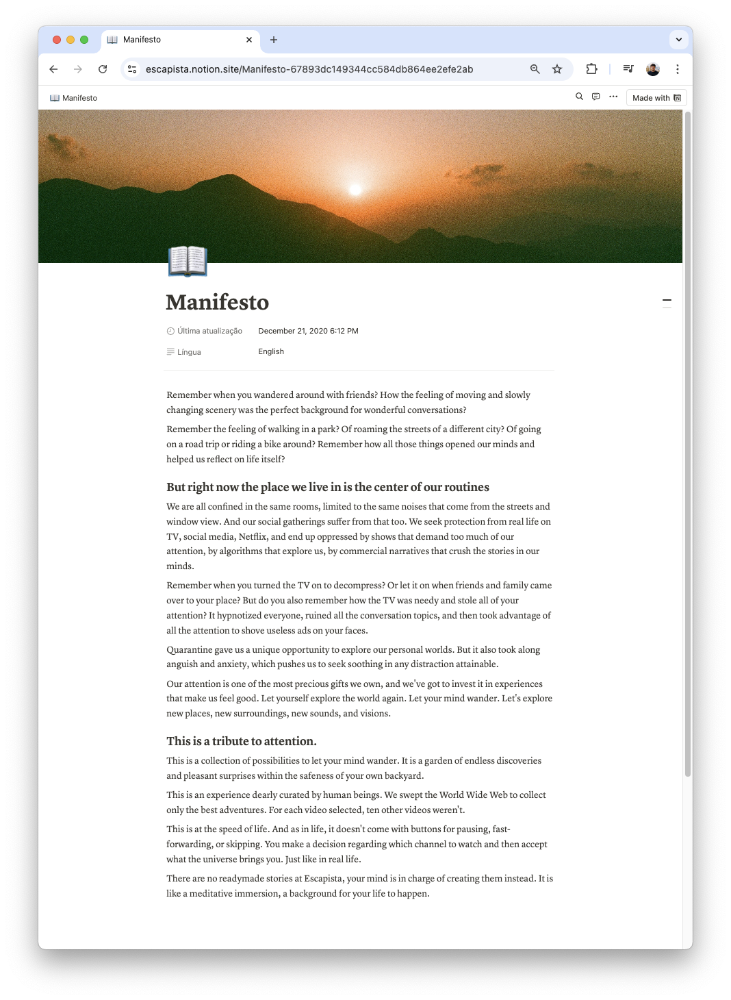
```
 
# Implementation

The first proof of concept was a very rough prototype made in [Glitch.com](https://glitch.com/), a fun little sandbox tool. After some tweaking and seeing the general idea worked, I started scaffolding a proper webapp stack around it.

<!-- ```grid|1 
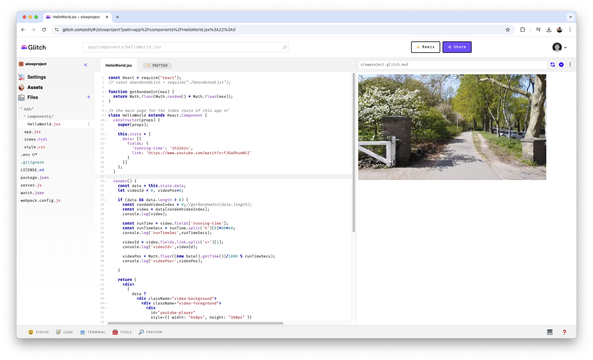
``` -->
 
## The tech stack

I started creating an integration with [Airtable](https://airtable.com/), which would serve as both our Database and CMS (content management system). By using a YouTube Embedded Player under the hood I could simplify any complexity about storing and streaming videos, but also all views and ad revenue would to the original video creators. For layout and styling I used [Tailwind CSS](https://tailwindcss.com/), a framework with an innovative approach that I've been meaning to try for a while.

```grid|1

```

<!-- ```grid|1
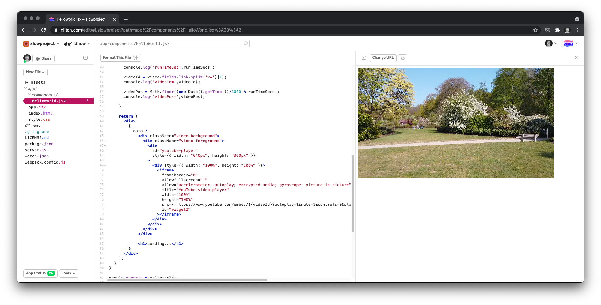
``` -->

## Building a content management system

A lot of my focus on the development side was on creating a system for storing, rating and categorizing the videos, all using the super-friendly Airtable interface. This was crucial since the experience was so simple, the curation should be of the highest quality, and we'd invest many and many hours on searching and categorizing the best videos we could find.

<jumbo>
    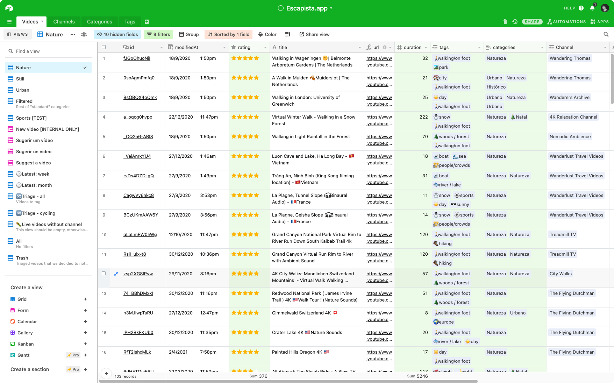
</jumbo>

The database is comprised of mainly 3 entities: Videos, Channels and Tags, all which can be edited separately and are linked like a regular database. This is then connected to the website backend, which retrieves, processes and caches this data and build the video "scheduling".

<jumbo>
    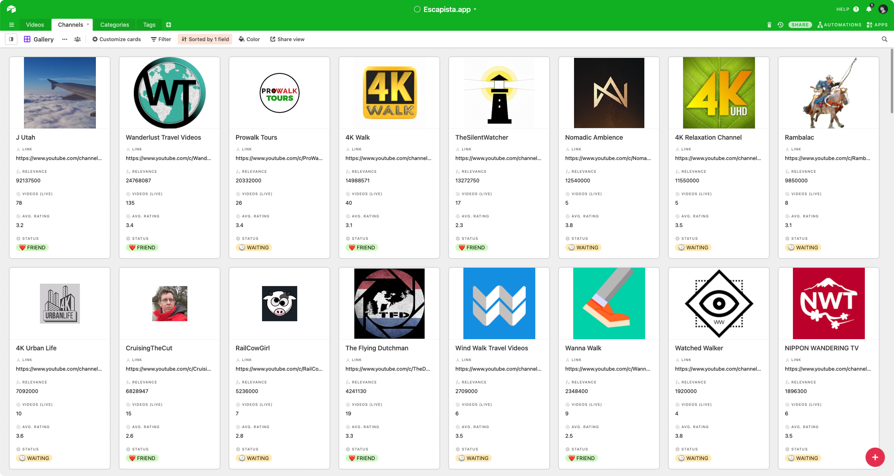  
</jumbo>
 
## A simple yet flexible tagging system

We created a flexible tag system that allowed us to classify the videos on some main dimensions independently of how the website would organize them. At this point we knew we wanted to have just a few channels, but we didn't know which would be.

<jumbo>
      
</jumbo>


## The broadcast schedule algorithm

Even though the channels' schedules are live, just like in a regular TV channel, there's no real syncing mechanism in the background. I've developed a simple algorithm that runs in the client and that uses the computer clock (which is automatically synced by the Operational System) as a index for videos. This enables anyone sharing the link with a friend or family member to watch the same video, provided they're at the same timezone, while doing a call for example.

```grid|1  
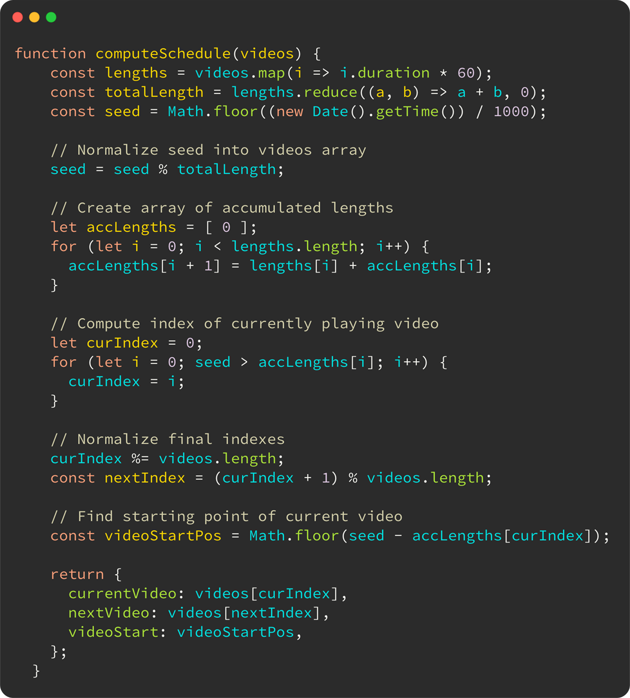
```
 

# Launching and monitoring

We created a launch plan that included [a big launch on ProductHunt](https://www.producthunt.com/posts/escapista), one of the biggest communities for tech products. We were very happy with the result, accumulating more than 270 upvotes and ending up in the top ranked launches for the week and gaining lots of organic traction from posterior blog posts.
 
```grid|1
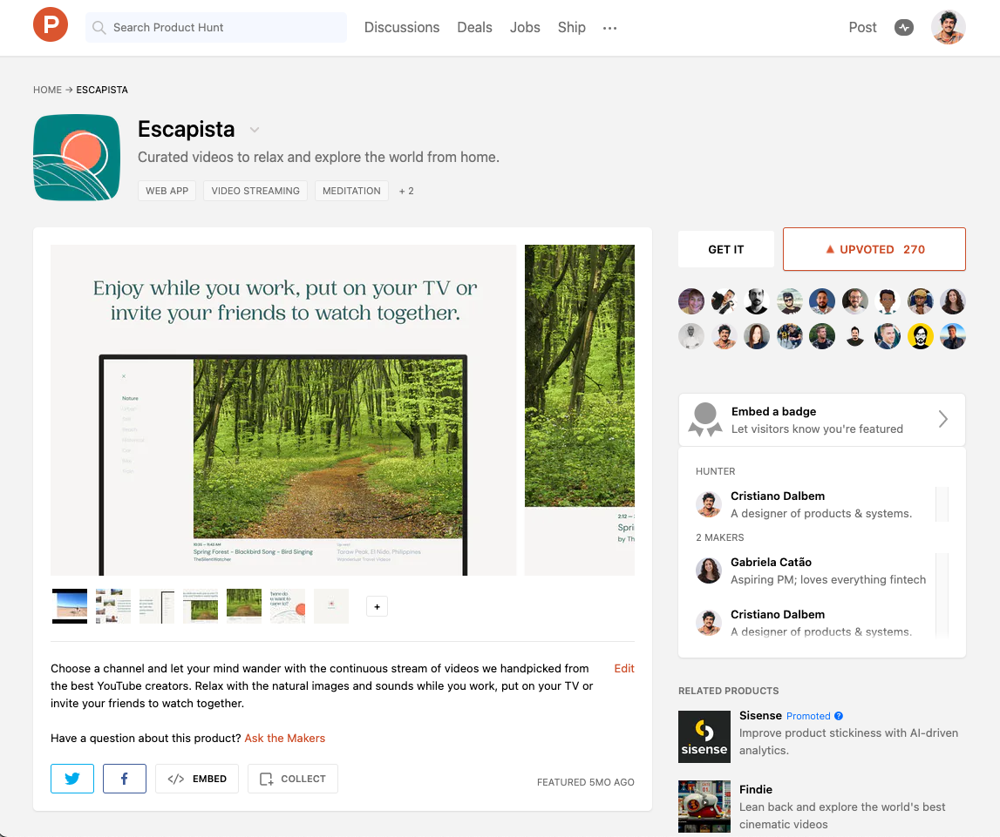
```


## Measuring what matters

The product metrics were designed inspired by the HEART framework, but instead of using regular dimensions such as Adoption, Engagement, ... we used our own product goals as dimensions for thinking and organizing the different signals and metrics. These were implemented using the new Google Analytics 4, which has a brand new events system.

<jumbo>
    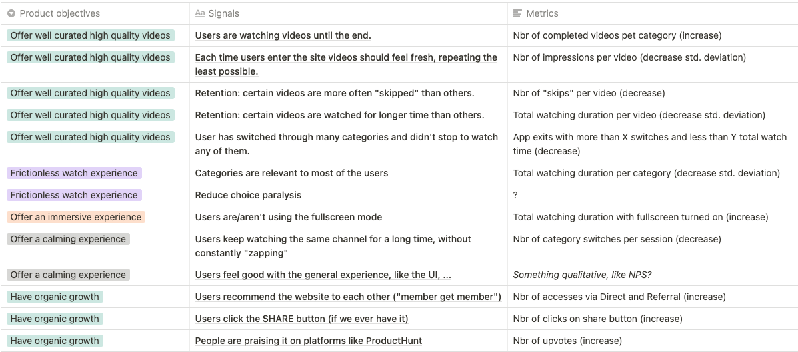
</jumbo>

To measure the quantitative metrics I've implemented custom events in Google Analytics, and this is how the dashboard looks like.

<jumbo>
    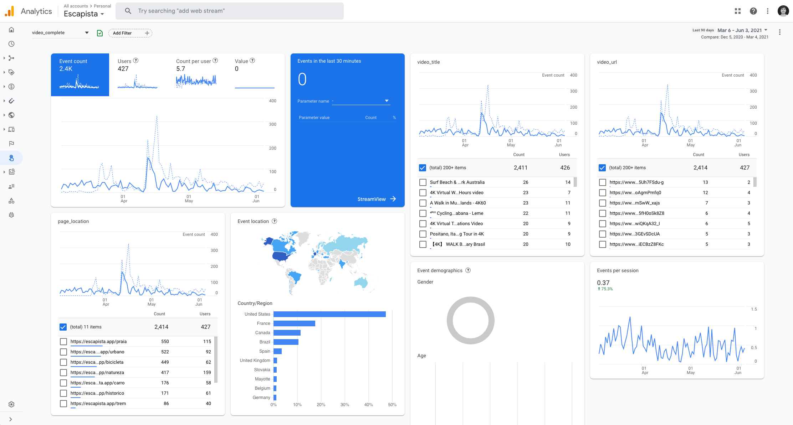
</jumbo>

From the qualitative side we also have a Typeform survey embedded on the website that makes it very easy for users to leave feedbacks about their experience.
<!-- It's made up of 4 simple questions:
* What did you like the best?
* What could be better?
* What did you think about the video curation?
* Anything else you'd like to share? -->

# Results

Since the ProductHunt launch we continue being marketed organically by news platforms, blogs, websites and on Social Media in general. For a non-profit project like this one it's great not having to spend any dollar in marketing. 

```grid|1

```

We're quite happy with the amount of hours people have spend on the website, which corresponds to more than 100 entire days watching Slow TV videos! 

<!-- Currently we think there's room for improving user stickiness and triggering network effects by encouraging users to share with others.  -->
 
<results-banner
    data='{
        "videos views": "60,000+", 
        "unique users": "15,000+",
        "hours of playback": "2500+",
        "coffees bought": "35"
    }'>
</results-banner>

And, of course, we're utterly happy with the several heart-warming user feedbacks we received already.
  
<jumbo>
    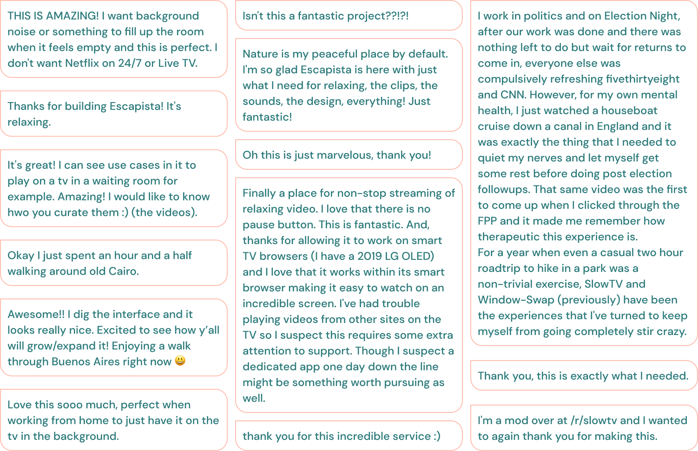   
</jumbo>


<ai-disclaimer></ai-disclaimer>

# Links
 
<links-list
    items='[ 
        {
            "label": "Website",
            "url": "http://escapista.app/"
        },
        {
            "label": "ProductHunt post",
            "url": "https://www.producthunt.com/posts/escapista/"
        },
        {
            "label": "GitHub",
            "url": "https://github.com/cmdalbem/escapista"
        },
        {
            "label": "Buy Me a Coffee",
            "url": "https://www.buymeacoffee.com/cmdalbem"
        }
    ]'>
</links-list> 
