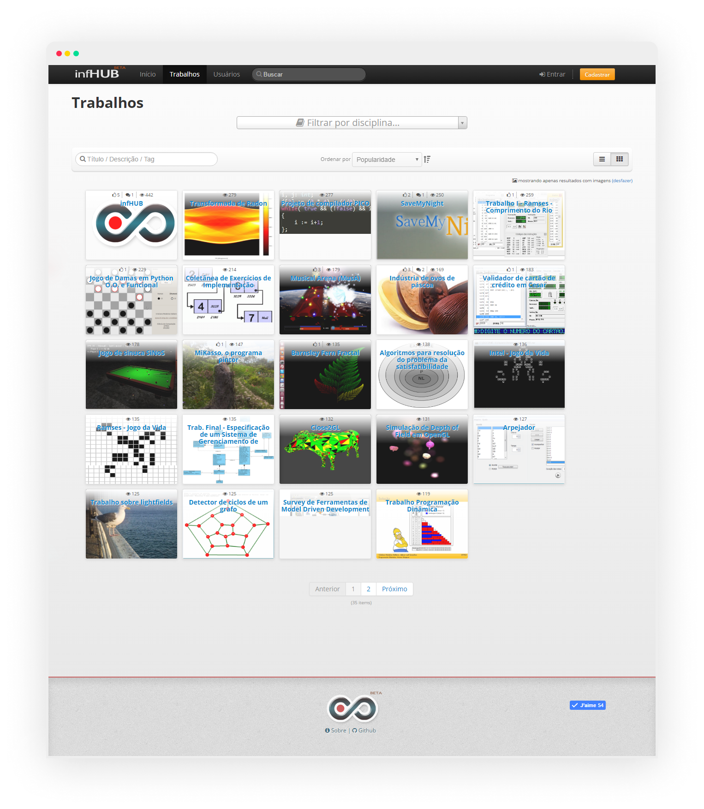

## Problem

How many awesome people there are in our University that we never get to know their work, just because we didn't take the same classes at the same time?

Everyone back in my uni seemed to be so creative, and developed solutions with such high quality. Once in a while some final projects were such masterpieces that their existence would shared orally by students for years - but these were exceptions.

"Have you seen that guy who made a kart racing game with our teachers' faces? And that one who built the fastest data structure any student has ever built?".

Most students already had GitHub accounts, but I wanted something more - something more social, and contextualized to our universe. Me and my team envisioned a platform to search and publish projects, either if they were code, reports or presentation. It should be easy to filter by courses, and we should be able to ranked them by popularity and appreciation.

## Research

This was a project that was born to satisfy our own needs and those of close friends, so it was easy targeting the user's pain points as well as ideating together to find solutions.

As a benchmark we took inspiration from similar platforms, like GitHub (hence the name) and Behance.

Our target audience was students of our university, from both Computer Science and Computer Engineering courses, as well as teachers. The main Jobs to be Done were:
- Find specific projects from specific courses or topics
- Explore the best projects
- Easily host and publish their own projects get noticed by the community.

If everything went well, the students' profile pages could even work as a portfolio for showing their work to potential employers.


## Development

Enlisted in the Software Systems Laboratory course, I found the perfect opportunity to implement the idea. As part of the project we were challenged to learn from scratch web technologies and practice some Agile methods we heard about, like Scrum — all in 6 months.

Most of the technologies we chose to use were completely new to us, like Ruby on Rails, Amazon AWS Services, Heroku - even jQuery was novelty. Ah, and there was also that little UI library called Twitter Bootstrap, which years later would still inspire me to creating great Design Systems.

I was so happy with the result that I ended up extending it beyond that semester course, and some months later we made the platform available to the students of our University.


## Results

I’ve done most of designing and development, and it was super satisfying to see it being used and appreciated for its functionalities and ease of use. The hard work resulted in more than 27,000 pageviews and 5500 unique users, and until today it's still used by the community.

It also got me more interested in Usability, and what I would find out later to be called UX. During the time I worked on this project I came in contact with two classic books that shone a light in the making of the project: "Don't Make Me Think", by Steve Krug, and "Prioritizing Web Usability", by Jakob Nielsen. The latter I ended up skimming most of the chapters, I thought it was full of great ideas however was much more formal and boring compared to the first one.

<results-banner
    data='{
        "projects uploaded": "142",
        "unique users": "6,000+",
        "pageviews": "29,000+"
    }'>
</results-banner>


```grid|2


```

```grid|2
 

```
 
<!--  -->


## Links

https://infhub.herokuapp.com

https://github.com/cmdalbem/redetrabalhosinf