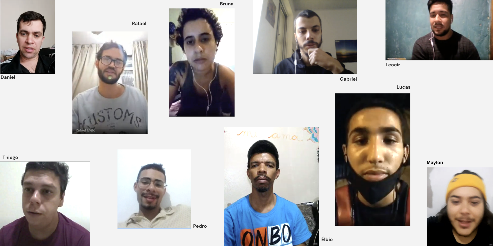
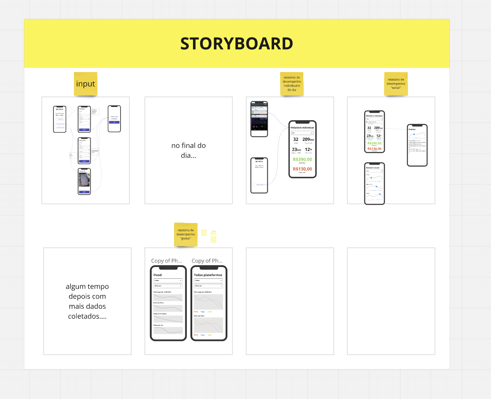

---
projectType: 'personal'
date: "2020-11"
date2: "2024-06"
title: "Meu Corre"
minibio: "Bootstrapping a personal financial management app for delivery workers in Brazil."
description: "Meu Corre is an app developed to support delivery workers in becoming financially aware during their often precarious daily work routine. By encouraging financial awareness, the app seeks to contribute to the individual organization of each worker as well as serve as a tool for the fight for rights by producing data on an unprecedented scale in Brazil."
color: '#F7B700'
tags: ['design','product management','research','entrepreneur']
team: "Igor Dalla Vecchia (researcher, entrepreneur), Caroline Jacobi (social media), Gabriela Hermann (communication, PR), Gabriela Pessoa (researcher), Daniel Dias (development)"
cover: './cover.png'
liveLink: 'https://meucorre.com.br'


  
--- 

# Overview

[Meu Corre](https://meucorre.com.br/)  was a social impact entrepeneurship project I co-lead with Igor Dalla Vecchia, an old friend who was doing his Masters on the relationship of brazilian courier workers with platforms. As his background was mostly with Social Sciences, I was the responsible for everything to the product (Discovery, Strategy, Research, UX/UI Design) and to major technical decisions.

We successfully got funded with more than R$ 200.000,00 by important brazilian institutions for entrepeneurship and social impact initiatives such as FAPERJ, CNPq and Fundo Brasil. A part from the money to invest in the app development, for almost 2 years we also had training workshops and mentorship in topics such as entrepreneurship, business and product management.

The team behind “Meu Corre” consisted of various contributors with diverse expertise, including designers, developers, legal experts, and communication specialists. Special mention goes to delivery workers themselves, who participated in interviews and tests to help shape the app.

<!-- adicionar fiocruz e outros editais -->

# Problem statement
<!-- 
## How it all began
In 2019, when he began his specialization in Urban Planning in Rio de Janeiro - RJ, geographer Igor Vecchia settled in the central region, specifically in the Fátima neighborhood. While experiencing the landscape of downtown Rio, he began to notice the growing presence of delivery workers roaming the city streets, a sight that aroused his curiosity.

Over the course of several months and careful listening, messages were systematized. The production of data and the exchange with workers opened up the possibility of formulating a specific tool for delivery workers, something that could support the understanding of working conditions and that could be built collaboratively.

During this period, I also lived in Rio de Janeiro. Together, we shared professional experiences and reflections on their work demands, discussing the potential for more democratic uses of technology by people. Geographer Igor’s concerns, combined with designer Cristiano’s ideas, resulted in a technology project that aims to cross-reference information and support the organization of delivery workers. This is how Meu Corre was born, a financial management app created exclusively for workers in this category. -->

## The problem
The “Meu Corre” project was born out of the need to address the challenges faced by delivery workers in Brazil. The idea initially emerged before the pandemic but gained momentum during it when delivery workers played a vital role in helping people stay at home while they were out on the streets, often in precarious conditions.

Delivery platforms often entice workers with promises of flexibility and entrepreneurship. However, the reality is much harsher, involving operational costs, financial unpredictability, and a lack of time for personal organization. 

<!-- These conditions have made the need for tools that support financial management and organization increasingly clear. -->


# Research
The project followed a user-centered design methodology since the beginning. Igor had been collecting data from various social media sources, from community posts in Facebook to chat groups in WhatsApp. This helped him notice the first patterns and draft hypothesis.

## Interviewing the workers

Right after joining the project I planned and conducted in-depth interviews with delivery workers from across Brazil to deepend that understand. At this point the objectives were still very broad: to understand their context, routines, background, goals and motivations to work with delivery.

```grid|1

``` 

From these interviews we found out that their main painpoints were:
* They suffer from a high unpredictability with their financial lives. This kind of work has many invisible operating costs: gas, maintenance, food, cell phone plan, insurance. Without knowing, they're working as small companies but without any of the knowledge
* There's a total lack of structure for these workers. At the time of those interviews, the platforms didn't provide any equipment or facilities, and workers have to depend on public infraestructure (which is quite lacking in most Brazilian cities) or on the good-will of the private sector.
* Their lives with extremely rushed, from having to take care of their families, extense commutes to the parts of the city that had more activity with delivery apps, and at the same time having to wait long times for restaurantes to prepare the food and for the clients to pick it up.


<jumbo caption="At this point we started sketching the first visualizations, such as the classic Journey Map which helped us summarize and make sense of everything we've learned about a typical day of a delivery worker.">
    
</jumbo>

# Solution

## A lean Design Sprint

With the vast amount of data we had we summarized all our findings using the Opportunity Solution Tree diagram. From it we selected a few ideas we though were most promising and I organized a lean version of a full Design Sprint so, at the end of each cycle, we'd have a working prototype that we'd take to test with real users.

<jumbo caption="The Opportunity Solution Tree is a powerful framework for making sense of a complex project that have many objectives, problems and ideas for solutions. Click to see it larger.">
    
</jumbo> 
  


## The "Rates Central" concept 


```grid|1

``` 

The application focuses on helping delivery workers better manage their finances and increase their earnings through a centralized management tool.

Key Features:
* Financial Tracking: Simplified recording of both income and expenses, allowing workers to track all their sources of revenue.
* Customization: Workers can tailor the app to their needs by creating categories for expenses and income sources.
* Indicator Calculation: Automatic calculation of key indicators such as earnings per hour and per distance.
* Data Export: The ability to download personal data in spreadsheet format.
* Free Access: The app is and will remain free for all users.

```grid|1

``` 


## Refining and developing

Throughout the course of more than 1 year the project was continuously refined as we talked with more users, closed partnerships, developed business model ideas and started development with a software house we hired.

```grid|1

``` 

The final screens and features can be seen below, which were designed for our Google Play app website.

<jumbo>
    
</jumbo>

<jumbo>
    
</jumbo>


## The advocacy flywheel

The data generated by the "Meu Corre" project serves as a powerful tool for advocacy, shedding light on the working conditions and financial realities of delivery workers. By collecting, analyzing, and sharing insights derived from user data, the project not only informs better decision-making for individual workers but also supports efforts to push for fairer treatment, improved working conditions, and policy changes in the gig economy.

```grid|1

``` 

These data-driven narratives help amplify the voices of delivery workers, providing credible evidence to influence stakeholders, including policymakers, delivery platforms, and the general public.

# Next Steps and Future Plans

* Data Analysis and Reports: Continue analyzing user data to provide reports and insights.
* Improved Features: Incorporate user feedback to enhance the app’s functionalities.
* New Partnerships: Seek additional funding and partnerships to sustain and develop the platform further.
* Collaborative Approach: Maintain an open invitation for individuals and organizations to collaborate on data treatment and project development.


# Learnings & conclusion

## Learn more


<links-list
    items='[ 
        {
            "label": "Website",
            "url": "https://meucorre.com.br/"
        },
        {
            "label": "Download the app (Google Play)",
            "url": "https://play.google.com/store/apps/details?id=br.com.meucorre&hl=pt_PT/"
        },
        {
            "label": "Official launch presentation (YouTube)",
            "url": "https://www.youtube.com/live/H0o19wM4AyU?si=7n2MAUWKTGi-7LY2&t=4501"
        },
        {
            "label": "Instagram",
            "url": "https://www.instagram.com/meucorreapp/"
        }
    ]'>
</links-list> 