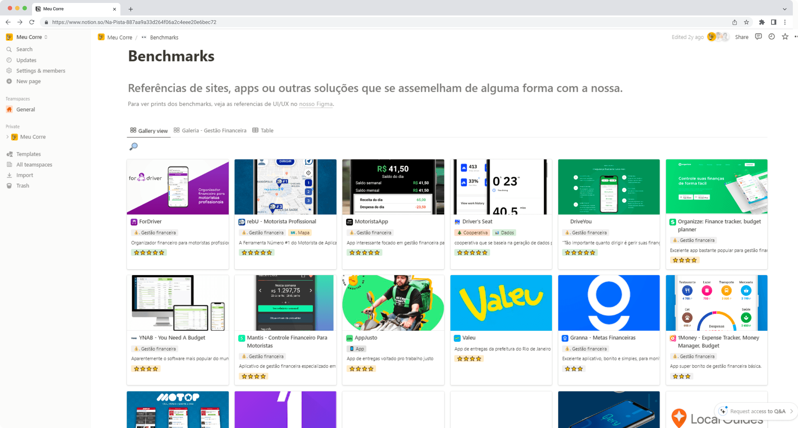

---
projectType: 'personalHighlight'
date: "2020-11"
date2: "2024-06"
title: "Meu Corre"
minibio: "Bootstrapping a personal financial management app for delivery workers in Brazil."
description: "Meu Corre is an app developed to support delivery workers in becoming financially aware during their often precarious daily work routine. By encouraging financial awareness, the app seeks to contribute to the individual organization of each worker as well as serve as a tool for the fight for rights by producing data on an unprecedented scale in Brazil."
color: '#F7B700'
tags: ['design','product management','research','entrepreneur']
team: "Igor Dalla Vecchia (researcher, entrepreneur), Henrique Nievinski (designer) Caroline Jacobi (social media), Gabriela Hermann (institutional relations), Gabriela Pessoa (researcher), Daniel Dias (developer)"
cover: './cover.png'
liveLink: 'https://meucorre.com.br'


  
--- 
 
# Overview

[Meu Corre](https://meucorre.com.br/) is a social impact entrepreneurship project I co-founded with Igor Dalla Vecchia, an old friend who was doing his Master on the relationship of brazilian courier workers with platforms. I was the responsible for everything concerning the product (Discovery, Strategy, Research, UX/UI Design) and major technical decisions.

We successfully got funded with more than R$ 200.000,00 by important brazilian institutions for entrepreneurship and social impact initiatives such as FAPERJ, CNPq and Fundo Brasil. We also had access to almost 2 years of workshops and mentorship in topics such as business and product management. This allowed us to successfully launch the app to the public in April of 2024.

The team behind “Meu Corre” consisted of various contributors with diverse expertise, including designers, developers, legal experts, and communication specialists. Special mention goes to delivery workers themselves, who participated in interviews and tests to help shape the app.
 

# Problem statement
<!-- 
## How it all began
In 2019, when he began his specialization in Urban Planning in Rio de Janeiro - RJ, geographer Igor Vecchia settled in the central region, specifically in the Fátima neighborhood. While experiencing the landscape of downtown Rio, he began to notice the growing presence of delivery workers roaming the city streets, a sight that aroused his curiosity.

Over the course of several months and careful listening, messages were systematized. The production of data and the exchange with workers opened up the possibility of formulating a specific tool for delivery workers, something that could support the understanding of working conditions and that could be built collaboratively.

During this period, I also lived in Rio de Janeiro. Together, we shared professional experiences and reflections on their work demands, discussing the potential for more democratic uses of technology by people. Geographer Igor’s concerns, combined with designer Cristiano’s ideas, resulted in a technology project that aims to cross-reference information and support the organization of delivery workers. This is how Meu Corre was born, a financial management app created exclusively for workers in this category. -->

The project was born out of our desire to build a tool to help address the challenges faced by delivery workers in Brazil. The idea initially emerged before the pandemic but gained momentum during it when delivery workers played a vital role in helping people stay at home while they were out on the streets, often in precarious conditions.

Delivery platforms often entice workers with promises of flexibility and entrepreneurship. However, the reality is much harsher, involving operational costs, financial unpredictability, and a lack of time for personal organization, not to mention serious health risks.

<jumbo caption="Photo by Alexandre Mota.">
    
</jumbo>
 

# Research

The project followed a user-centered design methodology since the beginning. Igor had been collecting data from various social media sources, from community posts in Facebook to chat groups in WhatsApp. This helped him notice the first patterns and draft some hypothesis we would build upon.


## Getting closer

Right after joining the project I planned and conducted in-depth interviews with delivery workers from across Brazil to deepen that understanding. We wanted to have a clear picture of how a typical day for them looks like, and we focused on the challenges they faced. We also tried to understand their networks, consumption of content related to delivery, and their financial organization. Finally, we invited them to zoom out and understand how they got there and what were their medium and long term goals.

```grid|1

``` 

From these interviews we found out that their main pain points were:
* **Unstable income**: they suffer from a high unpredictability with their financial lives. This kind of work has many invisible operating costs: gas, maintenance, food, cell phone plan, insurance. Without knowing, they're working as small companies but without any of the knowledge
* **Lack of support**: there's a total lack of structure for these workers - if it weren't for their strong sense of camaraderie, they'd be left all alone. At the time of those interviews, the platforms didn't provide any equipment or facilities, and workers have to depend on public infrastructure (which is quite lacking in most Brazilian cities) or on the good-will of the private sector.
* **Rushed routines**: their lives with extremely rushed, from having to take care of their families, long commutes to the parts of the city that had more activity with delivery apps, and at the same time having to wait long times for restaurants to prepare the food and for the clients to pick it up.


<jumbo caption="At this point we started sketching the first visualizations, such as the classic Journey Map which helped us summarize and make sense of everything we've learned about a typical day of a delivery worker.">
    
</jumbo>


## Zooming out

To build a strong foundation to the following phases we took the opportunity to look around at what kind of applications these workers were using to support their work: maps apps, financial organization apps, social networks, etc.

We also took a close look at how the platform apps looked like - even if we're clearly not in the business of creating another platform, this is their universe and it was important we understand this "vocabulary", be it visual or not.

```grid|1

``` 


# Exploring solutions

## The "fat" Design Sprint

With the vast amount of data we gathered up to this point, I helped the team summarize all our findings using the Opportunity Solution Tree diagram. From this, we selected a few ideas we though were most promising and I've guided through a Design Sprint to better polish the ideas and have something tangible to test with real users.

<jumbo caption="The Opportunity Solution Tree is a powerful framework for making sense of a complex project that have many objectives, problems and ideas for solutions. Click to see it larger.">
    
</jumbo> 
   

Normally Design Sprints are done in an intense week of work, but since this was a sideproject for all of us, we made a "fat" version of the sprint that would last a whole month. Inspired be Design Sprint 2.0 format popularized by AJ&Smart, I organized it like this:
* **Week 1 - Defining the challenge**: we'll summarize everything we've learned, from all the interviews we've done, countless articles and community posts we've read and hours of videos we've watched.
* **Week 2 - Produce solutions**: here we'll write "How might we?" statements and brainstorm rough feature ideas.
* **Week 3 - Voting and storyboard**: next we'll converge on our favorite ideas and try to sketch how these would look like in a storyboard - no need for UI designs here yet, it's all about making tangible our ideas. 
* **Week 4 - User tests**: finally, with an interactive prototype in hands, we'll test it with real people to get the best feedback possible. 


## The "Financial Strava" concept 

The "winner" concept of those sprints was the "Financial Strava", a kind of app that would merge the popular sports-tracking app Strava with the specificities of their work as delivery workers. The user would add their earnings and expenses to the app, which would help them track their daily and weekly goals and calculate some personal performance metrics.

What was amazing about this idea was the potential to understand their work at scale, which could be fed back to the workers as dashboards and reports to maximize their earnings: which platforms paid better, what were the best times to work, ...

<jumbo caption="In one of the last steps of the Sprint we voted on our favorite features and the team created a storyboard with the key interactions. From here I'd create an interactive prototype to test with real users.">
    
</jumbo> 

```grid|1

``` 

We've learned that:
* Users already had some financial organization but often it was done in pen and paper. This is a great opportunity of presenting the app as an improvement rather than a whole new habit.
* Inputting earnings one by one won't work! Users do dozens of deliveries per day, every day, and most like to settle their finances in the end of the week. We need to have a feature to add multiple earnings at once.
* Users compared the metrics with some that the platforms already provide them but that are in general very limited. They liked a lot how we could measure things the platforms can't, and do it cross-platforms in one central place.
* The dashboards and reports screen were a big fail! We used lots of numbers and charts while this audience has low literacy. The idea is great however, but we might do it as a separate product for a different audience.
* While almost all users were very excited with the idea of the app, they were not very happy with the idea of having to pay for it. This was not a big surprise, and our mentors already pointed out that we'd need to explore a Freemium business model.
  
## Designing and launching a MVP

Throughout the course of more than 1 year the project was continuously refined as we talked with more users, closed partnerships, developed business model ideas and started development with a software house we hired.

```grid|1

``` 

The final screens and features can be seen below. These were designed for our Google Play page:

<jumbo> 
    
</jumbo>

<jumbo>
    
</jumbo>

After a way too long development phase where we faced thousands of issues, technical challenges and scope cutting, this MVP was successfully launched to the general public with zero known bugs on April of 2024 with several live events we coordinated with partner institutions as well as influential workers on YouTube.

```grid|1

``` 

<!-- Key Features:
* Financial Tracking: Simplified recording of both income and expenses, allowing workers to track all their sources of revenue.
* Customization: Workers can tailor the app to their needs by creating categories for expenses and income sources.
* Indicator Calculation: Automatic calculation of key indicators such as earnings per hour and per distance.
* Data Export: The ability to download personal data in spreadsheet format.
* Free Access: The app is and will remain free for all users. -->


# Next Steps

Here are the main areas the project will continue evolving:
* **Data analysis and reports**: With more and more users recording their earnings and expenses in the app we'll start reaching statistical relevance so we can analyze that data and provide a vast diversity of reports and insights to different audiences, from the workers themselves to researchers and advocacy institutions.
* **Doubledown on engagement**: There are lots of opportunities to help user build the positive habits of financial management into their daily lives, such as leveraging more push notifications, emails and nudges inside the app.
* **New partnerships**: Keep seeking additional funding and partnerships to sustain and develop the platform further.
* **Iterating on core features**: Incorporate feedback from users who are using the tool in their real lives.
* **Advanced features**: Invest in features of high impact and high effort that were left out of the MVP, such as Automatic Earnings Sync and Geolocation Tracking.
* **New audiences**: Stakeholders have shown interest in investing on expanding the tool to new countries and even other gig workers such as Uber drivers. Initial research has shown that could be done without having to change too much the current experience.

<!-- ## The advocacy flywheel

The data generated by the "Meu Corre" project serves as a powerful tool for advocacy, shedding light on the working conditions and financial realities of delivery workers. By collecting, analyzing, and sharing insights derived from user data, the project not only informs better decision-making for individual workers but also supports efforts to push for fairer treatment, improved working conditions, and policy changes in the gig economy.

```grid|1

``` 

These data-driven narratives help amplify the voices of delivery workers, providing credible evidence to influence stakeholders, including policymakers, delivery platforms, and the general public. -->


# Results and learnings

It's really hard to summarize here in a few paragraphs how much I've learned and grow in almost 4 years of such an intense and different project, but here's an attempt:
* **Challenging assumptions about user needs**: Delivery workers' challenges extend beyond simplistic assumptions about financial instability. Many workers lacked intuitive tools to track their income and expenses, which highlighted the gap between the tech-driven gig economy narrative of "freedom and entrepreneurship" and the daily, often chaotic reality of delivery work.

* **Data as empowerment for advocacy**: The project reinforced our belief that structured data collection can shift the narrative about gig work from anecdotal complaints to evidence-backed advocacy. By providing delivery workers with actionable insights (such as the true cost of their earnings and platform-specific performance), the project underscored the potential for data-driven conversations about fair compensation, worker protections, and better working conditions.

* **Behavioral barriers to financial management**: Even when workers recognized the importance of tracking their finances, psychological barriers often prevent consistent habits. Insights from user research revealed the need for ultra-simple interfaces with powerful features that didn't just rely on rational arguments but tapped into behavioral nudges, such as goal tracking and positive reinforcement. Still, this is a highly complex challenge that even the biggest Fintechs in Brazil haven't solved yet.

* **Otherness over empathy**: Involving delivery workers in the testing and design process wasn't just a "best practice" but a necessity since these were people with social backgrounds drastically different from ours. However, this collaboration presented challenges — balancing worker participation with their demanding schedules required creative approaches and deep respect for their time. Moreover, it highlighted the power imbalances inherent in design discussions and how those needed to be actively mitigated (see more on ).

* **Financial sustainability as a social impact project**: Beyond merely securing funding, our experience highlighted how critical it is to position a tool like Meu Corre as a social good solution rather than a profit-driven product, even if going against the will of our initial mentors. Ensuring the app remains accessible and free demands not just partnerships but creative models of sustainability that aligned with our mission to empower gig workers without burdening them financially and, mainly, making sure incentives are aligned.

Here's a summary of the amazing results we've already amassed since the launch in April 2024:

<results-banner
    data='{
        "app installs in 1st month": "1376",
        "funding": "R$ 200k",
        "recorded expenses by users": "83.244",
        "currently active users": "631"
    }'>
</results-banner>

Working on "Meu Corre" was one of those projects that really stuck with me. It pushed me to step out of my bubble, partner with so many different people, listen without judgment, and rethink what meaningful "solutions" actually look like. The complete story is full of thousands of twists and challenges I had to skip here - but that’s where the best learning happened. More than just building an app, it was about building something we truly believed in, being full responsible for all of it outcomes, connecting with like-minded (or not) people, understanding their hustle, and figuring out how Design can actually make a difference in their lives.

#

_This case study leveraged modern generative AI technologies to summarize and extract key insights from four years of extensive project documentation. It also helped me suggesting improvements to ensure the writing was concise yet impactful and grammar checks, as English is not my primary language. All AI-generated content was thoroughly reviewed and manually edited before publishing._


# Learn more


<links-list
    items='[ 
        {
            "label": "Website",
            "url": "https://meucorre.com.br/"
        },
        {
            "label": "Download the app (Google Play)",
            "url": "https://play.google.com/store/apps/details?id=br.com.meucorre&hl=pt_PT/"
        },
        {
            "label": "Official launch presentation (YouTube)",
            "url": "https://www.youtube.com/live/H0o19wM4AyU?si=7n2MAUWKTGi-7LY2&t=4501"
        },
        {
            "label": "Instagram",
            "url": "https://www.instagram.com/meucorreapp/"
        }
    ]'>
</links-list> 


