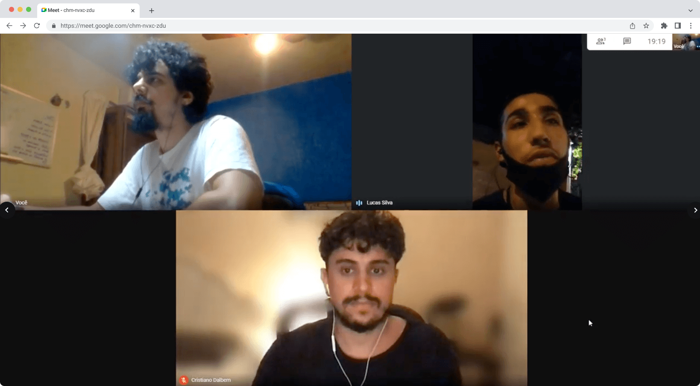
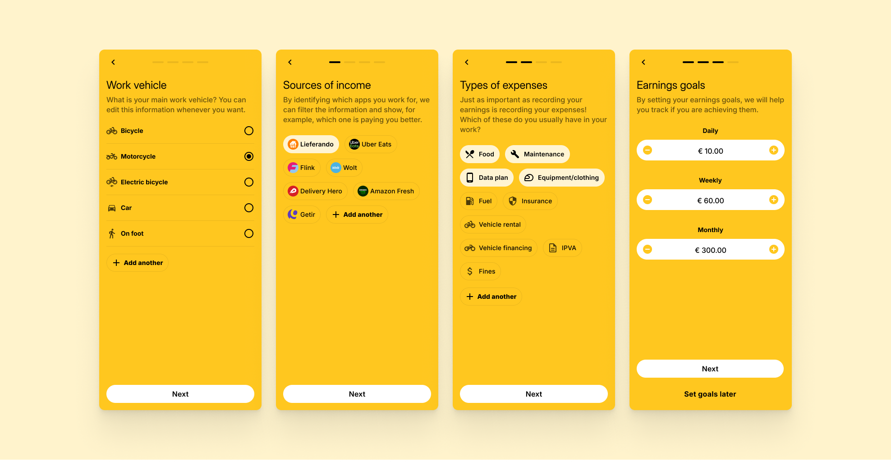
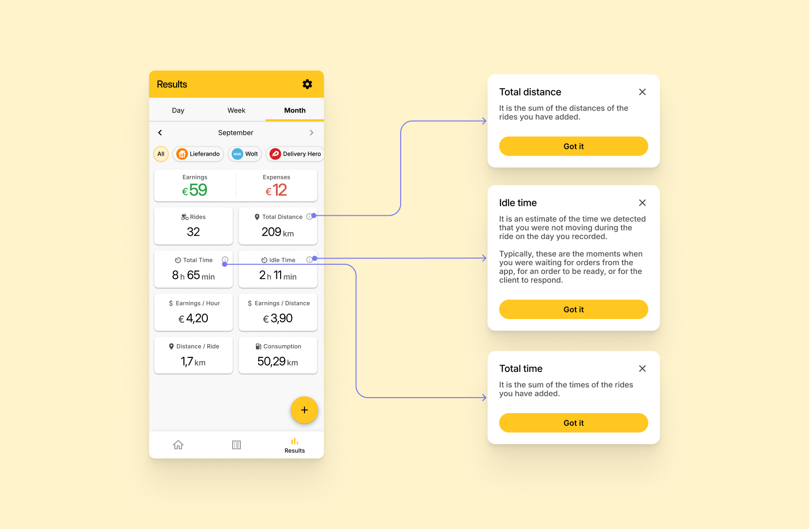
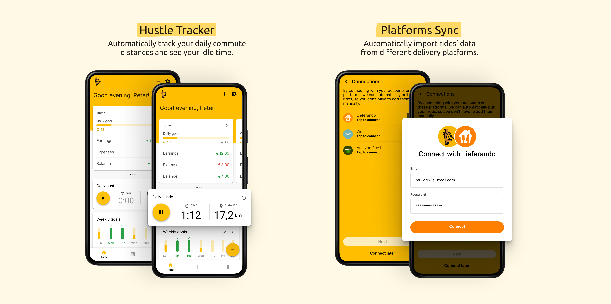
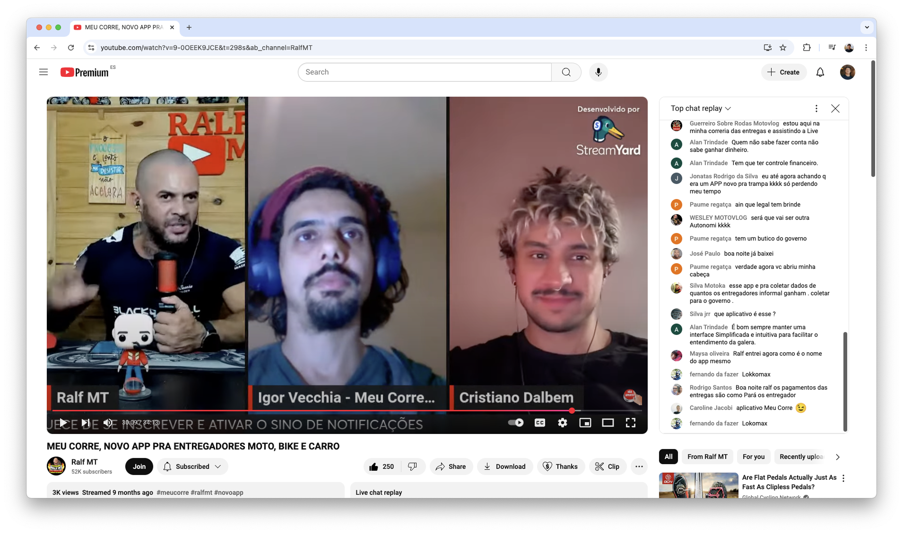

---
projectType: 'personalHighlight'
date: "2020-11"
date2: "2024-06"
lastUpdated: "2025-03"
title: "Meu Corre"
minibio: "Bootstrapping a personal financial management app for delivery workers."
description: "\"My Gig\" is an app designed to support delivery workers in becoming financially aware during their often precarious daily work routine. By fostering financial awareness, the app not only supports individual organization but also serves as a powerful advocacy tool by generating unprecedented data to inform the fight for workers' rights in Brazil."
color: '#F2AA00'
tags: ['design','product management','research','entrepreneur']
team: "Igor Dalla Vecchia (researcher, geographer)・Henrique Nievinski (designer)・Caroline Jacobi (social media)・Gabriela Hermann (institutional relations)・Gabriela Pessoa (researcher)・Daniel Dias (developer)・Daniel Brito (data scientist)"
cover: './cover.png'
liveLink: 'https://play.google.com/store/apps/details?id=br.com.meucorre'


  
--- 
 
# Overview
 
[Meu Corre](https://meucorre.com.br/) ("My Gig") is a social impact entrepreneurship project I co-founded with Igor Dalla Vecchia, a PhD candidate studying on the relationship of Brazilian courier workers with platforms. For over 4 years I led Product, contributing from Discovery, Strategy and Research to UX/UI Design and major technical decisions.

We successfully got funded with more than R$ 200k (~€33k) by FAPERJ, CNPq, and Fundo Brasil, important Brazilian research institutions, and gained access to 2 years of mentorship and workshops on Business and Product Management. This allowed us to successfully launch the app on Google Play in April/2024 and we have been iterating on it with user feedbacks while planning on next steps.

<!-- The team behind Meu Corre consisted of various contributors with diverse expertise, including designers, developers, legal experts, and communication specialists. Special mention goes to delivery workers themselves, who participated in interviews and tests to help shape the app. -->
 
```grid|1 
 
```

Working on Meu Corre was one of those projects that really stuck with me. It pushed me to step out of my bubble, partner with so many different people, listen without judgment, and rethink what really impactful "solutions" actually look like. 

  
  
# Problem statement
<!-- 
## How it all began
In 2019, when he began his specialization in Urban Planning in Rio de Janeiro - RJ, geographer Igor Vecchia settled in the central region, specifically in the Fátima neighborhood. While experiencing the landscape of downtown Rio, he began to notice the growing presence of delivery workers roaming the city streets, a sight that aroused his curiosity.

Over the course of several months and careful listening, messages were systematized. The production of data and the exchange with workers opened up the possibility of formulating a specific tool for delivery workers, something that could support the understanding of working conditions and that could be built collaboratively.

During this period, I also lived in Rio de Janeiro. Together, we shared professional experiences and reflections on their work demands, discussing the potential for more democratic uses of technology by people. Geographer Igor’s concerns, combined with designer Cristiano’s ideas, resulted in a technology project that aims to cross-reference information and support the organization of delivery workers. This is how Meu Corre was born, a financial management app created exclusively for workers in this category. -->

The project was born out of our desire to build a tool to help address the challenges faced by delivery workers in Brazil. The idea initially emerged before the pandemic but gained momentum during it when delivery workers played a vital role in helping people stay at home while they were out on the streets, often in precarious conditions.

Delivery platforms often attract workers with promises of flexibility and entrepreneurship. However, the reality is much harsher, involving operational costs, financial unpredictability, lack of work rights and time for personal organization, not to mention serious health risks.

<jumbo caption="Photo by Alexandre Mota.">
    
</jumbo>
 

# Research 

The project followed a user-centered design methodology since the beginning. Igor had been collecting data from social media interactions, from community posts in Facebook to chat groups in WhatsApp. This helped him notice the first patterns and draft hypothesis we would build upon.


## Getting closer, even if far away

Right after joining the project I planned and conducted in-depth interviews with delivery workers from across Brazil to deepen that understanding. Our sample included both bicycle and motorcycle riders from different regions of the country, ages and genders. We wanted to have a clear picture of how a typical day for them looks like, and we focused on the challenges they faced. We also tried to understand their networks, consumption of content related to delivery, and their financial organization. Finally, we invited them to zoom out and understand how they got there and what were their medium and long term goals.

In some cases their lives were so rushed that they joined our meetings in the street, in the middle between one delivery and another. We made sure the time they spent with us was fairly compensated.

```grid|1

```  

From these interviews we found out that their main pain points were:
* **Financial instability**: they suffer from a high unpredictability with their financial lives. Their work has invisible operating costs: gas, maintenance, food, cell phone plan, insurance, etc. Without knowing, they're working as small companies but without the tools to support it.
* **Limited financial organization**: At the same time, some do have some financial organization, like tracking daily/weekly earning goals in pen and paper or simple spreadsheets, but they lack consistency and often forget to consider these costs. 
* **Lack of support and fake promises**: there's a total lack of structure for these workers - if it weren't for their strong sense of camaraderie, they'd be left all alone. They're sold the idea of being entrepreneurs, but without any training for that. At the time of those interviews, the platforms didn't provide any equipment or facilities, and workers have to depend on public infrastructure (which is quite lacking in most Brazilian cities) or on the good-will of the private sector.
* **Rushed routines**: their lives are extremely rushed, from having to take care of their families, long commutes to distant parts of the city where there's more activity with delivery apps. At the same time, they often have to wait long times for restaurants to prepare the food and for the clients to pick it up. This leaves them without time to study or search for alternatives.


<jumbo caption="The classic User Journey Map helped us summarize and make sense of everything we've learned about a typical day of a delivery worker. Click to see it larger.">
    
</jumbo>


## Zooming out to zoom in

To build a strong foundation, I took the opportunity to look around at what kind of apps these workers were using to support their work: maps apps, financial organization apps, social networks, etc.

I also took a close look at how the platform apps looked like. Even if we're clearly not in the business of creating competition, these apps is our users' universe and it was important we understand this shared vocabulary, both visual (how do they look? what kind of interaction patterns are most common?) and textual (what terms they use? how's the tone of voice?). Often the worker's-side app was completely different from the consumer-side app.

```grid|1

``` 


# Exploring solutions

With the vast amount of data we gathered up to this point, I helped the team summarize all our findings using the Opportunity Solution Tree diagram. From this, we selected a few ideas we though were most promising and I've guided through a Design Sprint to better polish the ideas and have something tangible to test with real users.

<jumbo caption="The Opportunity Solution Tree is a powerful framework for making sense of a complex project that have many objectives, problems and ideas for solutions.">
    
</jumbo>    

## The Design ~Sprint~ Semi-Marathon

Normally Design Sprints are done in an intense week of work, but since Meu Corre was a sideproject for all of us, I planned a longer version of the process that would last a whole month: each week corresponding to one of the days of the Design Sprint 2.0 format popularized by [https://ajsmart.com/](AJ&Smart).

<!-- I organized it like this:
* **Week 1 - Defining the challenge**: we'll summarize everything we've learned, from all the interviews we've done, countless articles and community posts we've read and hours of videos we've watched.
* **Week 2 - Produce solutions**: here we'll write "How might we?" statements and brainstorm rough feature ideas.
* **Week 3 - Voting and storyboard**: next we'll converge on our favorite ideas and try to sketch how these would look like in a storyboard - no need for UI designs here yet, it's all about making tangible our ideas. 
* **Week 4 - User tests**: finally, with an interactive prototype in hands, we'll test it with real people to get the best feedback possible.  -->


## The "Financial Strava" concept 

The winner concept was the "Financial Strava", a kind of app that would merge the popular sports-tracking app Strava with the specificities of their work as delivery workers. The user would add their earnings and expenses to the app, which would help them track their daily and weekly goals and calculate some personal performance metrics.

<!-- <jumbo caption="In one of the last steps of the Sprint we voted on our favorite features and the team created a storyboard with the key interactions. From here I'd create an interactive prototype to test with real users.">
    
</jumbo>  -->

<!-- ```grid|1

```  --> 

What was amazing about this idea was the potential to understand their work at scale, which could be fed back to the workers as dashboards and reports to maximize their earnings: which platforms paid better and what were the best times to work.

The last week of the sprint was dedicated to run users tests with an interactive prototype.

<insights
    title="Main insights"
    items='[ 
    {
        "title": "A step in financial organization",
        "description": "Users already take notes on their earnings, but they often felt it was hard to maintain. This is a great opportunity of presenting the app as an improvement, rather than a whole new habit."
    },{
        "title": "Recording earnings one by one will not work",
        "description": "They do dozens of deliveries per day, every day, and most like to settle their finances in the end of the week. This led us to the insight of designing a feature that would enable recording multiple earnings at once."
    },{
        "title": "Metrics are a big win",
        "description": "Users compared the metrics with some that the platforms already provide them but that are in general very limited. They liked a lot how we could measure things the platforms cant, and do it cross-platforms in one central place."
    },{
        "title": "Keeping statistics simple",
        "description": "The dashboards and reports screen were a big fail. We used lots of numbers and charts while this audience has limited formal math education. The idea is great however, but we might do it as a separate product for a different audience."
    },{
        "title": "The need for freemium",
        "description": "While almost all users were very excited with the app, they were not very happy with the idea of having to pay for it. This was not a big surprise, and our mentors already pointed out that wed need to explore a Freemium business model."
    }]'>
</insights> 
  
# Building and launching a MVP

Throughout the course of the next year the "Financial Strava" was continuously refined as we talked with more users, closed partnerships, developed business model ideas and started development with a software house we hired.

A highlight during this phase was our participation on the online workshop 'Health and Workers' Rights in Times of Digital Platforms', a partnership with teachers and researchers from the highly influential Brazilian institutions [Fundação Oswaldo Cruz (Fiocruz)](https://portal.fiocruz.br/) and [DIEESE](https://www.dieese.org.br/) and the [UFRJ](https://ufrj.br/) and [UFF](https://www.uff.br/) universities. This forum allowed us to deepen our understanding of the users and to expose our ideas to a wider audience.

```grid|1

``` 

## Developing a familiar visual language

When building the foundations for typography, color palette and visual identity, I wanted to make sure the app would engage with our users, who have limited formal education and experience with technology. As low income people in Brazil tend to have Android devices, delivery platforms at that time only made available their app to that ecosystem. For that reason I've built the Design System on top of basic Google Material Design components and patterns, achieving a visual language that would be most familiar to that audience.

<!-- algo de design system -->

 
## Teaching the user on the go

A special attention was given to the first experience of the user with the app. Instead of the regular carousel kind of onboarding, which we think ours users with their rushed lives would most likely just skip, we gave extra though to the empty states. Some of our features, while common in the world of financial management apps, they can be very new to our audience.

<jumbo> 
    
</jumbo>
  
 

## A simple but customizable financial experience

When first signing up, we give the option for the user to customize the experience with what makes sense for them:
* **Vehicle**: The user can chose one among all mobility modes used by delivery workers. (and yes, although not officially permitted, some do work by foot)
* **Sources of income**: What platforms do they work for? We prepopulate with all the most popular platforms, but also enable them to add their own.
* **Expenses**: Again, we offer a bunch of default options for common expenses they might find in their work, but they can also add custom ones.
* **Goals**: One of the highlights of the app and a brilliant insight the team had from the research, we allow users to track their goals, a very common practice among these workers.
 
<jumbo> 
    
</jumbo>

 

## Optimizing the core interaction: adding earnings

A lot of attention was put in the recording of earnings, since this would be the core activity the user need to do to get value from the app. From our research we understood this could be extremely cumbersome if not handled right, so we introduced 2 features:
* **Quick add**: for the small, quick earnings of every day, a small modal allows to add it with very few taps.
* **Multiple earnings**: for the users who like settling their finances in the end of a period like a day or a week, we allow them to add multiple earnings at the same time by just inputting the totals and how many there were.
 
<video-container> 
    <video autoPlay controls loop width="100%" type="video/mp4">
        <source src="./add.mp4" type="video/mp4">
    </video> 
</video-container>


 
## Insightful but approachable metrics

From our learnings from research, we knew we had to be light on the metrics dashboard. That's why we ditched any charts, and focused on metrics some of these workers were already calculating and discussing about among themselves. Some tooltips provided extra explanations for some less obvious ones.

<jumbo> 
    
</jumbo>

<!-- 
The final screens and features can be seen below in these promotional assets designed for our [Google Play page](https://play.google.com/store/apps/details?id=br.com.meucorre):

<jumbo> 
    
</jumbo> -->

<!-- <jumbo>
     
</jumbo>
<jumbo>
    
</jumbo> -->


<!-- ## Hight impact/effort features 

Apart from iterating on the core flows, after the launch we started seeking funding to implement some new features that were left out of the MVP implementation. These were features classified as of high impact but also high effort, so it was strategic the we'd leave it to a second round. -->
 
<!-- <jumbo>
    
</jumbo>  -->
   

## Hustle tracker  

Another solution for automatizing the input of data into the app, the geotracking feature tracks the users' daily rides and automatically identifies the wasted idle time. This allows users to gain a clearer picture of how much time is spent actively working versus waiting, something that we heard is a big pain for them. On the platform side, the anonymized data we collect about their movement in the city provides invaluable insights for advocacy agents and policy makers.

<jumbo>  
    
</jumbo> 


## Platforms integrations

Automatically import rides' data from different delivery platforms. A highly requested feature since the first research, this feature proved to be way too costly for our MVP, but after the launch we'll seek funding to implement it.

```grid|1

```


# The launch

After a [way too] long development phase where we faced thousands of issues, technical challenges and scope cutting, this MVP was successfully launched to the general public with zero known bugs on April of 2024 with several live events we coordinated with partner institutions as well as influential workers on YouTube.

```grid|1

```  

I've also helped design our first social media posts, which is always out of my comfort zone, but necessary.

<jumbo> 
    
</jumbo> 

<!-- Key Features:  
* Financial Tracking: Simplified recording of both income and expenses, allowing workers to track all their sources of revenue.
* Customization: Workers can tailor the app to their needs by creating categories for expenses and income sources.
* Indicator Calculation: Automatic calculation of key indicators such as earnings per hour and per distance.
* Data Export: The ability to download personal data in spreadsheet format.
* Free Access: The app is and will remain free for all users. -->
 


 
<!-- ## The advocacy flywheel

The data generated by the "Meu Corre" project serves as a powerful tool for advocacy, shedding light on the working conditions and financial realities of delivery workers. By collecting, analyzing, and sharing insights derived from user data, the project not only informs better decision-making for individual workers but also supports efforts to push for fairer treatment, improved working conditions, and policy changes in the gig economy.

```grid|1

``` -->


 
# Results

Here's a summary of the amazing results we've already achieved since the launch in April 2024:

<results-banner
    data='{
        "raised in funding": "€ 33.000,00",
        "recorded rides": "60.400",
        "app installs in 1st month": "1376",
        "articles in the media": "17"
    }'>
</results-banner>


## Reception

We've been collecting amazing testimonials of people who has been using the app and expressing how it impacted their lives:

<quote author="Rogerio Alcir" context="Received via social media" >I thank you for making available an app that helps us so much, what I used to do in spreadsheets, was way more complex, today I do my organization in the app. Thank you very much for helping.</quote> 

<quote author="Luiz Henrique" context="Google Play review">Excellent app, it can control rides very well. Weeks, months, days... very good app without bugs. Excellent.</quote> 
 
<quote author="Anonymous user" context="Google Play review">Super cool app. I use it daily and I have to admit that the app is amazing. It meets all my needs from my work.</quote> 

The project has also been highlighted in various articles in the media, including important outlets in the country.

<jumbo>  
    
</jumbo>
 
   
<!-- # Next Steps

Since June/2024 I've stepped down from the team to focus on other projects, but I still provide counseling, discuss strategy and contribute on big decisions. Here are the main areas the project has been evolving since the launch and plans to continue in the near future:

* **Iterating on core features**: Incorporate feedback from users who are using the tool in their real lives to make it more useful and efficient for the core Jobs-To-Be-Dones. 
* **Data analysis and reports**: With more and more users recording their earnings and expenses in the app we'll start reaching statistical relevance so we can analyze that data and provide a vast diversity of reports and insights to different audiences, from the workers themselves to researchers and advocacy institutions.
* **Doubledown on engagement**: There are lots of opportunities to help user build the positive habits of financial management into their daily lives, such as leveraging more push notifications, emails and nudges inside the app.
* **New audiences & partnerships**: Stakeholders have shown interest in investing to expand the tool to new countries and even other gig workers such as Uber drivers. Initial research has shown that could be done without having to change too much the current experience. -->


# Learnings

It's really hard to summarize here in a few paragraphs how much I've learned and grew in almost 4 years of such an intense and different project, but here's an attempt:
* **Challenging assumptions about user needs**: Delivery workers' challenges extend beyond simplistic assumptions about financial instability. Many workers lacked intuitive tools to track their income and expenses, which highlighted the gap between the tech-driven gig economy narrative of "freedom and entrepreneurship" and the daily, often chaotic reality of delivery work.

* **Data as empowerment for advocacy**: The project reinforced our belief that structured data collection can shift the narrative about gig work from anecdotal complaints to evidence-backed advocacy. By providing delivery workers with actionable insights (such as the true cost of their earnings and platform-specific performance), the project underscored the potential for data-driven conversations about fair compensation, worker protections, and better working conditions.

* **Behavioral barriers to financial management**: Even when workers recognized the importance of tracking their finances, psychological barriers often prevent consistent habits. Insights from user research revealed the need for ultra-simple interfaces with powerful features that didn't just rely on rational arguments but tapped into behavioral nudges, such as goal tracking and positive reinforcement. Still, this is a highly complex challenge that even the biggest Fintechs in Brazil haven't solved yet.

* **Otherness over empathy**: Involving delivery workers in the testing and design process wasn't just a "best practice" but a necessity since these were people with social backgrounds drastically different from ours. However, this collaboration presented challenges — balancing worker participation with their demanding schedules required creative approaches and deep respect for their time. Moreover, it highlighted the power imbalances inherent in design discussions and how those needed to be actively mitigated.

<!-- adicionar ref ao "fair design"? -->

* **Financial sustainability as a social impact project**: Beyond merely securing funding, our experience highlighted how critical it is to position a tool like Meu Corre as a social good solution rather than a profit-driven product, even if going against the will of our initial mentors. Ensuring the app remains accessible and free demands not just partnerships but creative models of sustainability that aligned with our mission to empower gig workers without burdening them financially and, mainly, making sure incentives are aligned.


# Conclusion

Working on Meu Corre was one of those projects that really stuck with me. It pushed me to step out of my bubble, partner with so many different people, listen without judgment, and rethink what really impactful "solutions" actually look like. The complete story is full of thousands of twists and challenges I had to skip here - but that’s where the best learning happened. More than just building an app, it was about building something we truly believed in, being full responsible for all of it outcomes, connecting with like-minded (or not) people, understanding their hustle, and figuring out how Design can actually make a difference in their lives.


<ai-disclaimer><ai-disclaimer/>


# Learn more

<links-list
    items='[ 
        {
            "label": "Website",
            "url": "https://meucorre.com.br/"
        }, {
            "label": "App page at Google Play",
            "url": "https://play.google.com/store/apps/details?id=br.com.meucorre&hl=pt_PT/"
        }, {
            "label": "Official launch presentation (YouTube)",
            "url": "https://www.youtube.com/live/H0o19wM4AyU?si=7n2MAUWKTGi-7LY2&t=4501"
        }, {
            "label": "Instagram",
            "url": "https://www.instagram.com/meucorreapp/"
        }
    ]'>
</links-list> 


