# Context 

[Nubank](https://nubank.com.br/) (NYSE: NU) was born in 2013 with the mission to fight complexity to empower people by reinventing financial services. It's one of the world’s largest digital banking platforms, serving over 100 million customers across Brazil, Mexico, and Colombia. Nubank is considered one of the most innovative companies in the world ([Fast Company](https://www.fastcompany.com/91040515/nubank-most-innovative-companies-2024)) and is often associated with products and services that are simple-to-use, intuitive, and transparent.

```grid|1 
 
``` 

## Award-winning customer support

In 2024 Nubank has been awarded for the eighth consecutive year of the [Reclame Aqui Award](https://international.nubank.com.br/company/nubank-wins-reclame-aqui-award-for-the-eighth-consecutive-year), the leading consumer service evaluation platform in Brazil. Nubank also holds the RA 1000 seal, given to companies that stand out for exceptional service quality. Moreover, according to the Brazilian Central Bank, Nubank recorded the lowest complaint rate among the 15 largest financial institutions in the country in the third quarter of 2024.


## The team

The Customer Excellent Platform (CXP) was the team responsible for handling high volumes of customer contact and maintain control over the process. We monitor operation metrics related to efficiency (e.g. customer waiting time) and quality (e.g. user satisfaction), and serves as a platform team for Developers, Designers, Product Managers, and Agents. By having a small team managing the platform, it can scale and grow, allowing users to extend it to suit their own product and feature needs. Ultimately, the main stakeholder impacted by this work is the customer.


```grid|1  

```  
<!-- ```grid|1
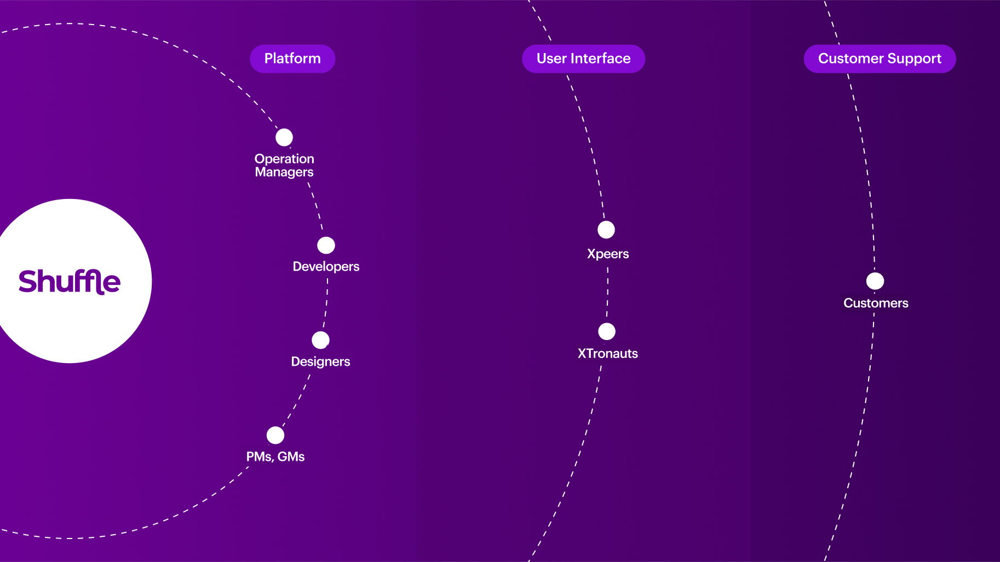
```  -->

## Shuffle, the CX swiss army knife

The product in the middle of all this is Shuffle, which is the tool used by Xpeers on a day-to-day basis to carry out the vast majority of their work. Like most of the rest of the platform, it was an internal creation of Nubank, made especially for our needs and systems, based on a microservices architecture. As a designer joining Nubank, I was tasked to focus on Shuffle, which I found out was the first time it happened.

<jumbo>
    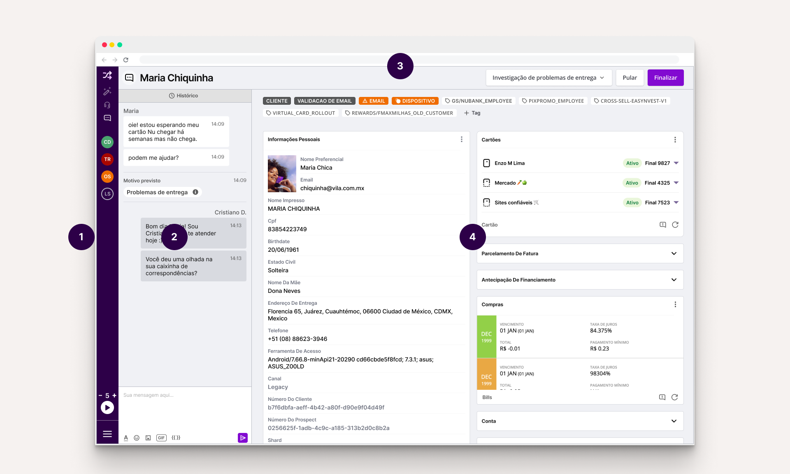
</jumbo> 

1. **Sidebar**: Allows to navigate through the different service channels.
2. **Chat panel**: Displays metadata, such as predicted contact reason, transfers made previously, and a complete history of previous contacts from that customer.
3. **Job bar**: Allows agents to classify the customer issue, control the given task like mark it as solved, skip or transfer to another team.
4. **PersonDeck**: The heart of Shuffle, where all customer information resides. It contains tags that identify unique properties of clients and widgets that encapsulate the information and actions an Xpeer may need to take during a service. (Fun fact: the term "deck" comes from the fact that it's made up of "cards.")

Not visible here, but an essential part of Shuffle is the **Canned Responses System**. This feature helps guarantee the quality of service by assisting Xpeers to remember all information that needs to be given to or requested, as well as bringing more consistency to the thousands of attendants.

# Understanding the users

As a designer joining the team and tasked to work on Shuffle, my first priority was to understand the users - their motivations, pain points, and how they interacted with the product.

<jumbo caption="Part of the documentation I organized in our team's Notion of all the User Shadowing sessions. I kept metadata about the user like what's their experience and what kind of customer issue they're focused on.">
    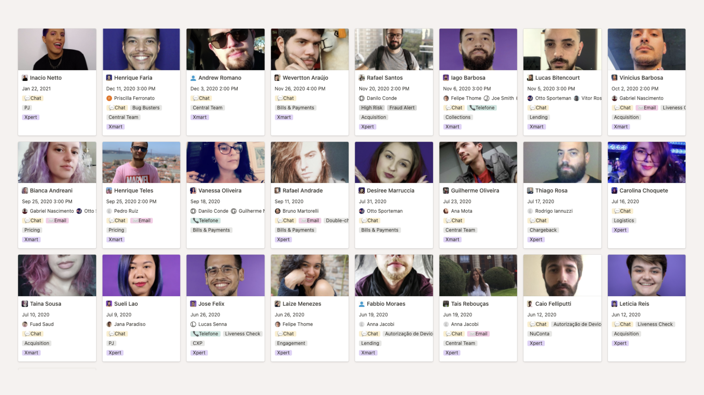
</jumbo>

## Shadowing sessions

We realized that the Xpeer Xperience, where employees worked as Xpeers for a few hours, wasn't enough to fully understand their needs. So, we introduced weekly shadowing sessions, observing Xpeers for an hour without interaction. This provided deeper empathy and valuable insights, challenging our preconceived notions about the product's usage.

<!-- ```grid|1
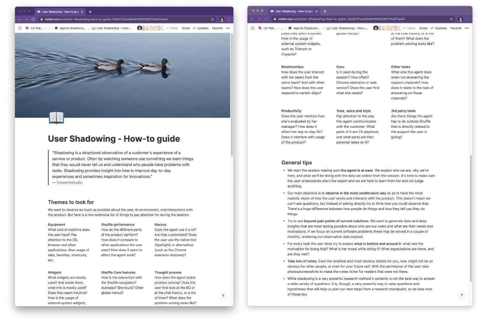
```  -->

<!-- ```grid|1
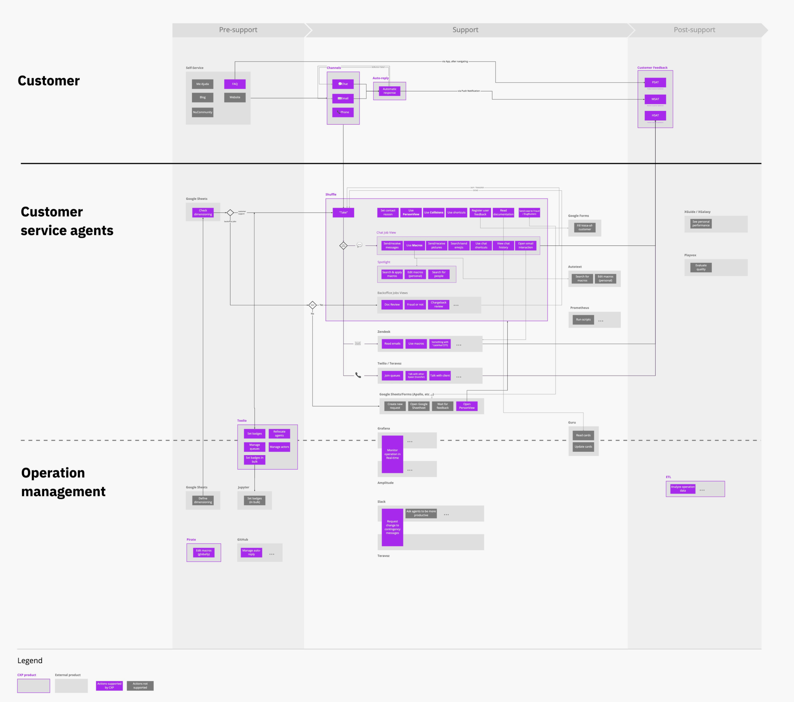
```  -->

<jumbo caption="A continuously-WIP blueprint I designed to summarize some of the learnings we had about how our users work. It depicts how the journey of different stakeholders meet, their main actions and what tools are used. Click to see it larger.">
    
</jumbo> 

We learned that most usability feedbacks never reached our team, because agents focused on communicating only problems severe enough to affect the operation. Also, problems concerning loading times were ignored, thinking it was the Wi-Fi or VPN. Shuffle had severe performance issues that we had no idea because everyone in the product team had high-performing machines.

We also discovered that despite Shuffle appearing overwhelming to someone who doesn't use it every day, Xpeers who use it for several hours become professional in using it and memorize the location of all information and actions, making them _ninjas_ in using the tool.

<!-- Finally, we realized that if our mission was to provide tools for the customer support team, then our objectives should be aligned with them. Thus, everything we did to improve Shuffle should impact and improve the operation and ultimately be felt by the customer. These insights led us to create a more effective and user-friendly product for Nubank's employees. -->

## The Agents' Pain Points Repository

To summarize and structure all knowledge we've acquired from multiple research sources, I created a live repository for continuous discovery of agents' pain points, designed to serve as a guide to whoever would be working on products that are used by agents to consume from and contribute to extend it.

```grid|1

``` 
 
<!-- # Prioritization

As a Product Designer, it was not enough to bring dozens of user insights and learnings to the team but also to help them gain clarity on what was most important and what to do next. And here, we're not just talking about focusing on what most impacts the user, but also what impacts the whole: from other users of the platform (which are multilayered, as we covered earlier), the customer itself, and what makes sense for the business and product strategy.

At this point, it was essential to balance the company's strategic drivers, the product's mission, and how different project ideas fit into this. For example, redesigning the interface components and creating a Design System could generate a great visual impact and empower Designers. But, compared to other bigger issues, the usability improvements of these projects would be minimal, and we'd probably not detect a significant increase in agents' productivity.

```grid|1
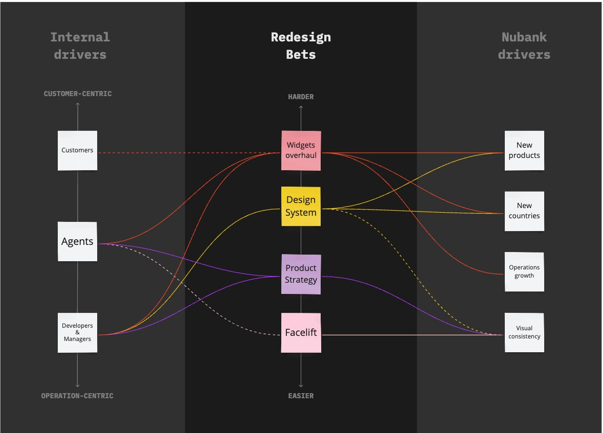
```   -->

# Redesigning the canned responses experience

While analyzing and organizing the dozens of insights, our attention started to gravitate toward a set of issues regarding how agents used canned responses, which are ready-made answers to common customer questions and problems. Although Shuffle had its own huge database of canned responses with an integrated search engine, most agents preferred to use a sketchy Chrome extension for handling those!

In addition to bugs that made users lose all their data and usability issues that led to inefficiencies and errors, there was a high-security risk of using an external browser extension over which we had no governance. Apart from these problems, we were leaving on the table a huge opportunity to apply usage data to improve our Artificial Intelligence models, which are the CX platform's cornerstone.

<!-- ```grid|1
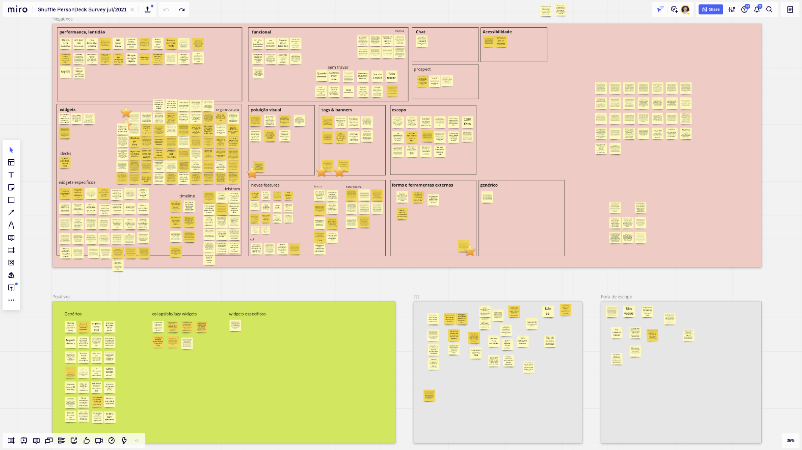
``` -->

After gathering insights from sources such as surveys, in-depth interviews, and our dear Shadowing sessions, we used the Problem-Solution Tree framework to visualize the main opportunities, categorize them and relate them to possible solution ideas.

<jumbo caption="The Opportunity Solution Tree was a helpful framework that I used to map and visualize our objective, problems we wanted to solve, and ideas for solutions. Click to see it larger.">
    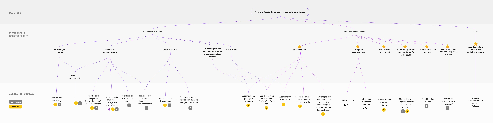
</jumbo>  

After prototyping and testing several concepts with users, we arrived at a new system that allows agents to search for information without losing focus on the customer. We also introduced new features that users loved:
* The ability to customize the existing canned responses shortcuts, so they could employ their preferred mnemonics, and also the ability to customize the content to adapt them to their personal tone of voice. Also, being able to create whole new responses.
* Not only we'd enable editing the content, but we also use rich formatting to highlight parts of it better. We also introduced a "smart placeholder" feature that automatically fills details of the canned response with data from the customer, e.g., `{{customer_name}}`, `{{account_balance}}`, etc.
* Instead of an interstitial modal that covered the whole screen (think of something like macOS' Spotlight), the winning design was a sidebar that allowed agents to keep an eye on the chat and widgets while searching for canned responses.
* Several improvements on how the search worked, such as being more flexible with typos and accented characters and also being more contextual, ranking the results based on the agent's team and current case classification.

<video-container caption="Low-fidelity prototype for the new Shuffle integrated system for searching, managing and applying canned responses."> 
    <video autoPlay controls loop width="100%" type="video/mp4">
        <source src="./macros.mp4" type="video/mp4">
    </video> 
</video-container>
 

# Optimizing the visualization of customers' data

One of the most significant signs that the product had not scaled so well with the company and agents' needs is the Widgets area. While there might have been half a dozen in the beginning, we were currently approaching more than 50 widgets! Even if agents had very different tasks and customer problems to solve, the way Shuffle organized and sorted these widgets was the exact same for everyone.

During the Shadowing Sessions, we often saw agents overlooking critical info on the customer profile. We hypothesized that this was caused by an interface that had a high cognitive load and poorly structured information architecture and visual hierarchy, all negative effects of that sea of widgets.

```grid|1
.")
``` 

From talking with agents, facilitating some co-creation workshops, and taking a close look at the data, we mapped the main objectives and constraints for this project:
* Agents are accustomed to the current layout of widgets, where they memorize positions and can quickly scroll directly to that position. We know any changes will have an initial negative impact, but we must make sure it's a real improvement.  
* Some agents are in teams with very predictable work, always solving similar customer issues and using the same widgets. Other agents were the opposite; depending on their current task or allocation, they needed to access unique data sets.
* We found out that when agents requested to improve the widgets organization, they expected this would improve Shuffle performance, one of their main complaints. That would not be the case, depending on how we'd develop these improvements.
* If we split the PersonDeck into multiple "decks," it's crucial that we don't also fragment the load time into multiple ones. This effect would make the agent even less productive than before when she had to wait a while for everything to load - but at least it was only once.

<jumbo caption="Wireframe prototypes designed to gather reactions from the Xpeers of different approaches we could explore to improve the organization of widgets.">
    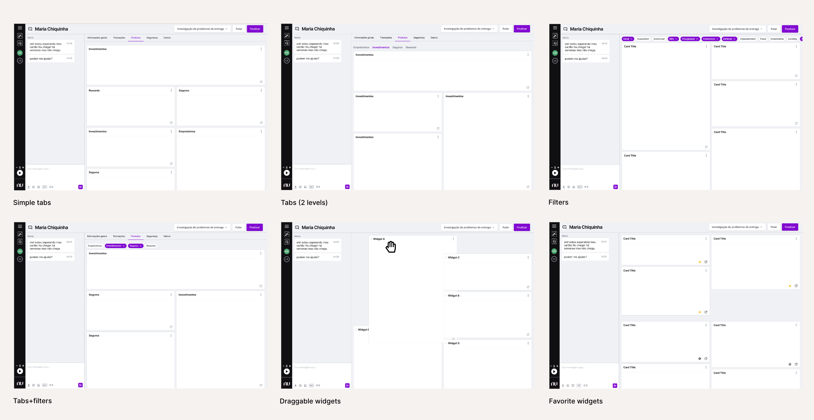
</jumbo>  

Since many ideas were on the table, we built several small wireframe prototypes to test the different concepts. After user-testing those, we gathered the engineering and product team to discuss them using a Decision Matrix technique.

```grid|1
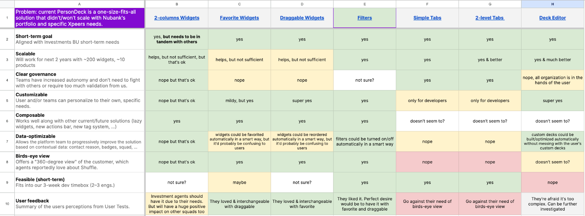
``` 

We concluded that a low-hanging fruit would be to implement filters for the widgets, organizing them by categories. These filters would be "remembered" by Shuffle for each agent, thus making a lot fewer widgets needed to be loaded and potentially improving one of the biggest problems reported by users: the software performance.

Another simple-to-implement feature that would generate a lot of value is favoriting widgets. A simple extra button in the lower right corner would allow users to choose their most used widgets to always be on top of the rest.

Combining these two features would allow an entirely new level of customization of widget visibility and ordering. Although it was not a fully realized flexibility, this was much easier to implement and use than a full-blown PersonDeck editor for each agent.

<jumbo caption="Combining 3 simple features (filters, favorites, and collapsible widgets) allowed Xpeers to customize their views while keeping the system simple to use and maintain.)">
    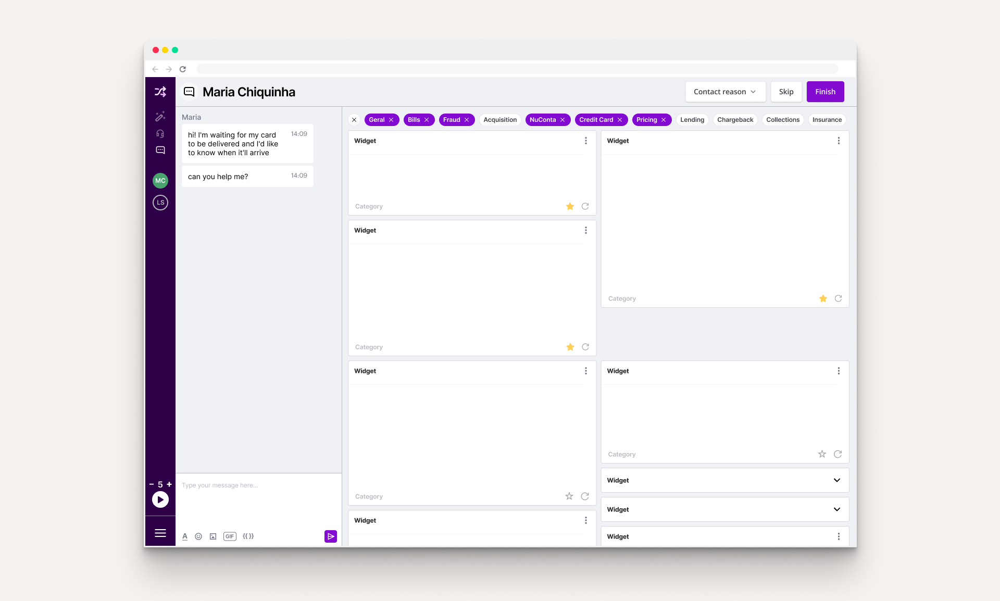
</jumbo>

# Low-hanging fruits

We also realized that there were a lot of low-hanging fruits: minor, low-effort improvements that improved the users' quality of life and, together, could make a real dent in the product's usability.

While we invested in in-depth Discovery to investigate more significant issues, we've tackled these small issues bit by bit, generating a much more positive atmosphere among Xpeers, who said that Shuffle hadn't had improvements for a long time. Here are just some of the examples.

## New notifications
I noticed that Xpeers frequently switched to other browser tabs to investigate issues, but Shuffle did not alert them if there were new customer messages in the meantime. We added sound effects for different notifications and a custom favicon and page title to reflect the status.

```grid|1

```

## Chat panel tech revamp
From the very first sessions, we noticed how sluggish it was to type. The problem was so severe that we often observed agents typing their messages in the browser address bar or another simple text editor to later copy and paste into Shuffle. As engineers were migrating this panel's underlying technology, I pushed the team to prioritize delivering better performance.

## Autotake
Before, users had to manually request new tickets, which was tiring and inefficient even if there was a keyboard shortcut. In the field, we even heard reports of people leaving small weights on their keyboards to keep pressing the action shortcut. Autotake is, as the name implies, a system with a minimal UI where the Xpeer sets the number of chats they wish to take at the same time, press "play", and the system will automatically allocate these as they come.

<jumbo caption="When developing Autotake, an interesting tool I devised to make sense of the problem was a double-headed Opportunity Tree, with one side the agents and the other their managers. This helped us find solutions, in the middle, that could solve the sometimes conflicting needs of these two users. Click to see it larger.">
    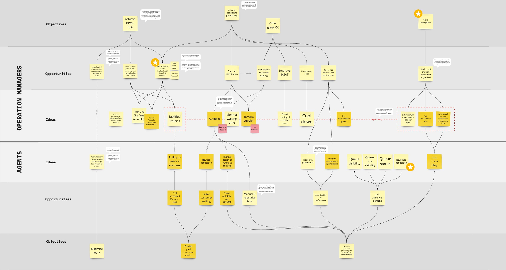
</jumbo>

## Typography updates

Moving from Open Sans to Inter, we increased the legibility of small text due to it being more optimized for screens. It also reduced screen real-estate usage due to its taller x-height, which works better for high-density designs.

```grid|1
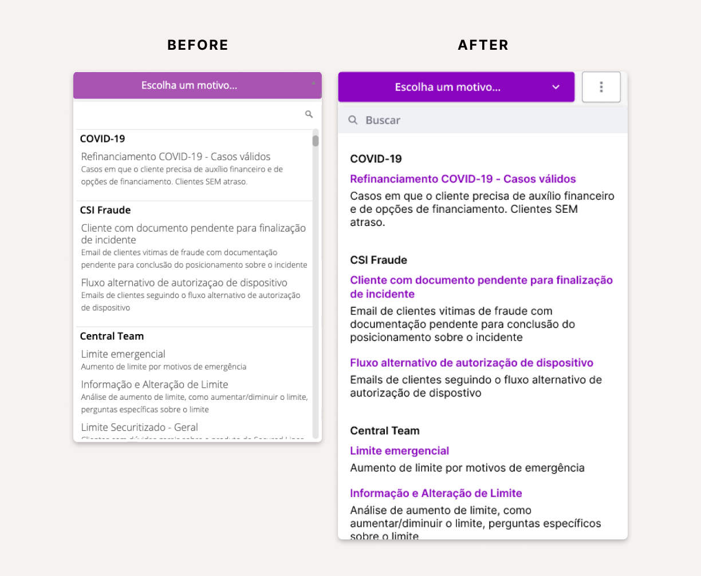
```

## New keyboard shortcuts
Essential for those who work with professional tools, they were not reliable due to bugs and we identified opportunities for new ones. One example was that there was a shortcut for concluding a job but not for choosing the contact reason from a dropdown menu, which had to be done with the mouse cursor.

## Dark mode
An experimental "mod" I coded myself with just CSS and a Chrome Plugin.


```grid|1
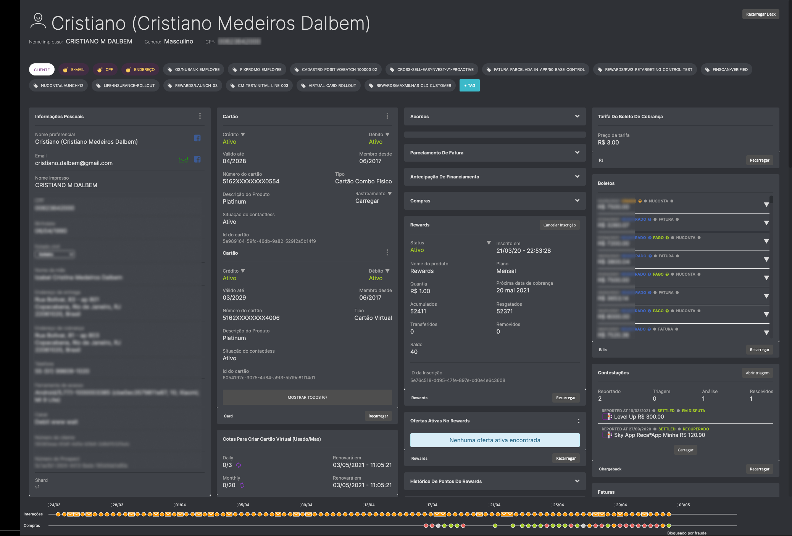
``` 

All these improvements, despite being very difficult to measure their impact individually when shipped, helped give a feeling of a product that was no longer frozen in time and made the Xpeers trust the team and ask for more.

<video-container jumbo="true" caption="Before/after: instead of a full redesign, by compounding multiple small changes we could drastically change the overall look & feel, making users feel like the product was not stuck in time. Most importantly, the changes improved not only form but function, driving real results by impacting the users' productivity and satisfaction with the tool."> 
    <video autoPlay controls loop width="100%" type="video/mp4">
        <source src="./beforeafter.mp4" type="video/mp4">
    </video> 
</video-container>


# Conclusion & learnings

Designing an internal, professional product such as Shuffle was very different from anything I've done before. However, keeping in mind the principles of good Design, all the rest follows. Here is a summary of the main learnings I had:
* Yes, offering great customer support is a lot about people. But providing the right tools to those people is equally important. Providing a great experience for our Xpeers is one of the best ways of leading by example and inspiring them to offer a great experience to our customers.
* Putting ourselves in the user's shoes is not enough since we might be very different from them. When the user is so different from the people building the products, the role of Design and Research becomes even more important. Observing the agents in their day-to-day work with Shadowing sessions and doing interviews was arguably the best way to understand them deeply.
* An internal product that is a platform not only has many stakeholders with potentially conflicting interests, but it also has many users. It's crucial to map them, their needs, and how they intersect or not.

I believe and hope that this work has set a foundation for future work, which is currently being done by an even larger team that nowadays is focusing on improving Shuffle. Even if a complete overhaul of the product was not feasible before due to too many uncertainties, after many learnings, this is being considered and might be a reality very soon.


<ai-disclaimer>
<ai-disclaimer/>


# Learn more

<links-list
    items='[
        {
            "label": "Blog post",
            "url": "https://building.nubank.com.br/designing-shuffle-the-internal-tool-that-powers-nubanks-award-winning-customer-service/"
        },
        {
            "label": "Nubank website",
            "url": "https://nubank.com.br/"
        }
    ]'>
</links-list> 
