  

# Context
[VTEX](https://vtex.com/) is a brazilian SaaS technology company focused on ecommerce solutions that have a daily impact on the work of thousands of people around the world. Leading brands of varying sizes and segments, with operations in 26 countries and in global expansion, rely on VTEX for the online sales of their products.
 
<!-- The main touchpoint of our product with the store owners is the Admin. It's where our clients configure and manage everything related to their operations, and where they'll spend most of their days. -->

```grid|1
 
```

## A strategic moment

The birth of our Design System was only possible because of the confluence of several conditions in the company:

* We were growing insanely fast, and so were the teams. New designers and developers were joining every day, thus sharing knowledge in a structured and scalable way was starting to be obligatory if we wanted to keep going fast.
* The company was developing for a few years already [VTEX IO](https://vtex.io/), a serverless platform for running e-commerce applications that. It was starting to get in a mature phase, so we were for the first time ready to start [dogfooding](https://en.wikipedia.org/wiki/Eating_your_own_dog_food) and using it to run our own Admins.
* There were early sketches of a VTEX App Store, a place where our big ecosystem of partners could easily develop, spread and monetize ecommerce extensions - all powered by IO.
* For the first time the company was investing on branding, with a new logo, visual identity, and a more professional communication. This was a great opportunity for refreshing the UI look & feel as well.

With this momentum we started seeing legacy systems being rewritten, so they could run under new platform. For the growing Product Design team it was an awesome opportunity to improve UX across the admins, but the team was still small for the demand and we needed to scale our design solutions.


# Process

A few years ago some Designers that were not working with us anymore started a similar initiative which clearly did not work out, so we started looking back at that moment with a critical and open-minded view to make sure we wouldn't repeat the errors of the past.

## I know what you did last Design System

Building on top of those insights we agreed on some important working principles:

* To quickstart we would use the same tech stack as VTEX IO, and we would bootstrap our system with [Tachyons](https://tachyons.io/), a CSS Framework that already had a Design System-like structure.
* We chose [Styleguidist](https://react-styleguidist.js.org/) to be the tool for building our component library and documentations automatically. In the past the team had started developing their own tool in house, but we didn't have time for that.
* The current Design Principles were mostly unknown in the company, which was a sign that they weren't very representative. Part of creating this new design system would be to revise them.
* Building a glossary of all components and variations being used in the platform is cool, but it's just too much work for all the hundreds of screen we had. Most importantly, we didn't feel it was so important being retrocompatible in that sense, and looking ahead was more important than looking back.
* References should go beyond general-purpose systems like Material, or plain component libraries like Bootstrap. We need to look at references that were more contextualized, and closest to what we needed to build. 

```grid|1
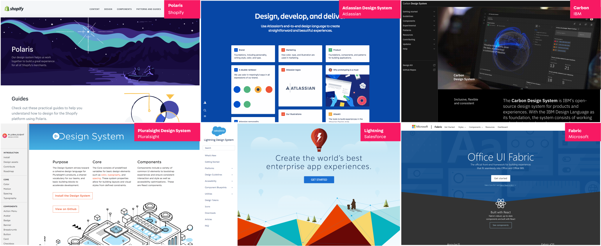
```

<!-- ```grid|1 
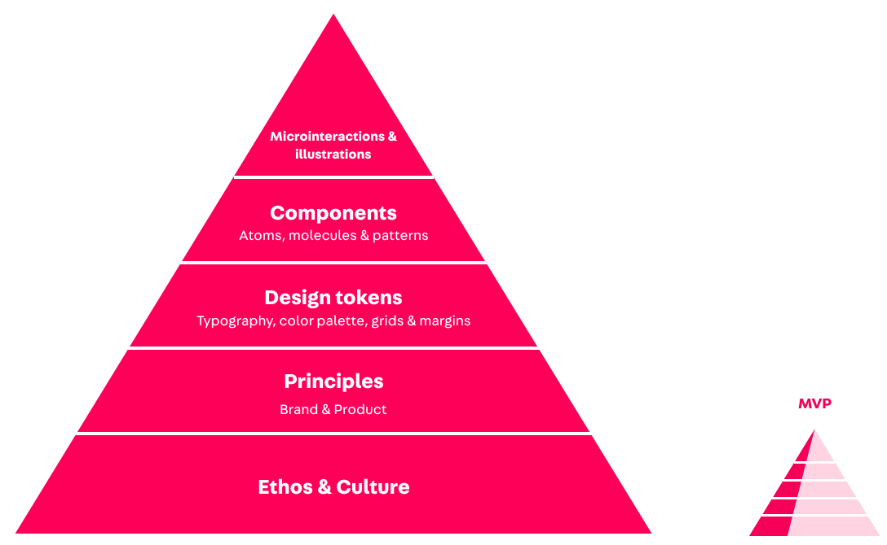
``` -->

## Setting the foundations 

Typography, spacing, grids and color palette were the first items to cross off the list. For these main foundations we drawn inspiration from the recently designed [Brand System](http://brand.vtex.com/). The rest of the styles came directly from Tachyons, our chosen CSS Framework, which bootstrapped us with a solid foundation on which we could iterate later.

The last part we developed were the Design Tokens. It was a little later in the game we found out we would need a set of basic components to be reused in the new Store Components system and Tachyons didn't support natively themes, so tokenizing our Design System was the way to go.

<jumbo>
    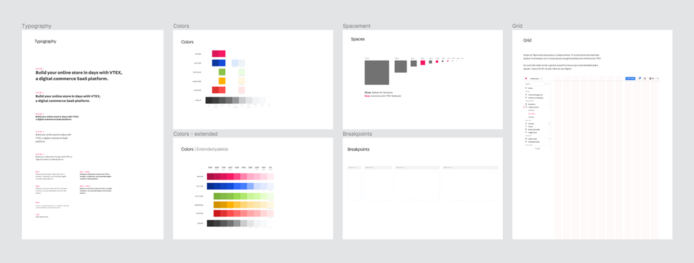
</jumbo>

<!-- One important learning was that starting off from an existing system shouldn't have made us lazy on doing research for these visual foundations and making all decisions intentional. Still today new designers sometimes question some decisions, to which we sometimes can only say "well, that's how Tachyons was". --> 
 
 
## A turning point: the migration to Figma

When we started this project Figma was the new kid on the block. The VTEX Design Team have been using Sketch for years, but at that time it lacked any support for Design Systems or even collaborative work. I quickly got very excited about Figma, so I took the initiative of learning everything I could about it and organizing workshops in the company to have everybody onboard. With everyone's buy in, I started building our new UI Kit in Figma, and I'm also continually helping others and sharing good practices.
 
<jumbo>
    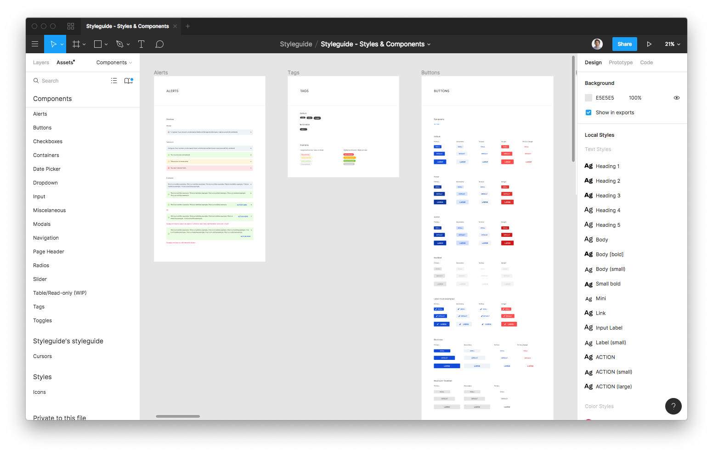
</jumbo>
 

## Building a culture through rituals 
It was very important from the very beginning to structure frequent meetings to discuss ideas and work on issues. These rituals provided a steady heartbeat to keep the project alive.

Part of our weekly rituals included meetings where people would bring new ideas or contributions and Designers and Developers gave their feedbacks. Since it was a highly collaborative work it was important to have such a free space where people could bring their ideas, but at the same time it wasn't like if anyone could do anything.

```grid|1
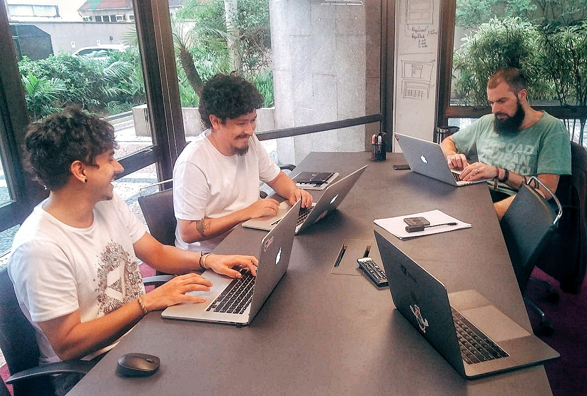
```  


## Documentation

As the saying goes: "if it's not documented it doesn't exist". There's a limit of the things we can opinionate with the component API, the rest depends on some written guidance. For each and every component in the Design System we defined it should have, and no PR would be approved without:
* An intuitive name (definitely not as easy as it sounds)
* A short description
* *Dos and Don'ts*, where Dos would explicit possible but non-obvious applications and Don'ts should predict and prevent possible misuses.
* Documentation of the React *props*, their defaults and acceptable values
* Some meaningful, contextualized examples of applications and variations.

<!-- It was easy writing these docs in Styleguidist using simple Markdown files. The default theme was not that great though, but I managed to tweak it by leveraging its built-in customization system, rendering a fairly decent-looking website IMHO. -->
   
<jumbo>
    
</jumbo>
 
I found it was very fun writing these docs. It was a exercise of empathy, putting myself on the shoes of lonely devs that could potentially not have designers with them, or even beginner designers learning about our interaction patterns. It was also a philosophical exercise, trying to understand what even basic components such as Buttons or Checkboxes were really made for and expressing it in a concise and accessible language.

<!-- ```grid|1 
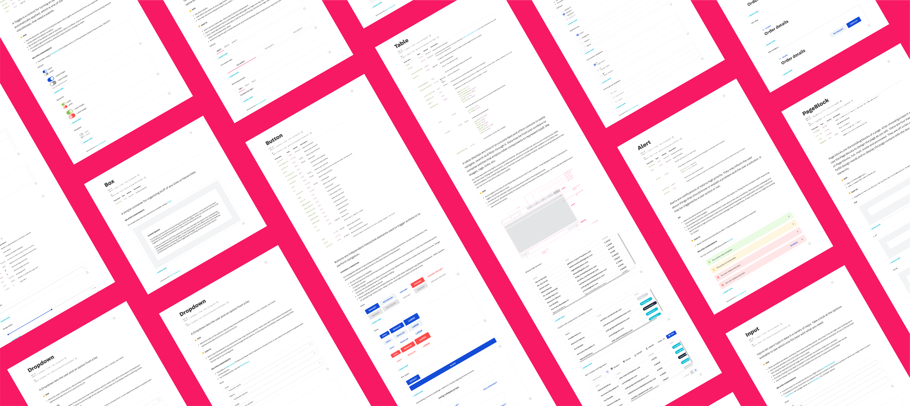 
``` -->

<video-container> 
    <video autoPlay controls loop width="100%" type="video/mp4">
        <source src="./styleguide.mp4" type="video/mp4">
    </video> 
</video-container>
 


I contributed closely with the design and development of several of Design System components. Here are some stories about my favorite ones: the **Table**, the **Filters** and the **Conditions Builder**. All of them were team efforts, but I consider I played a major role in their making.


# Component deep-dive: Data Table

After basic atomic components such as buttons and inputs, Tables are the most used components in Admin screens in almost every digital product.

## Identifying the biggest inconsistencies in the platform

Going through the legacy Admin screens it was clear it wasn't different for us. Most of them were comprised of mostly a big fat table and some controls such as column sorting, search, filtering, importing and exporting. These are examples of 4 admins that were designed in different times of the company and almost felt like 4 different platforms.

<jumbo>
    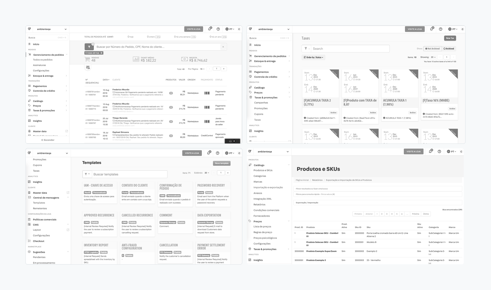
</jumbo>
 
We did an extensive benchmark research in digital products and found out that powerful table components were ubiquitous mainly in B2B products. This gave us lots of ideas of interesting features and possible approaches we could take to create ours. 

```grid|1
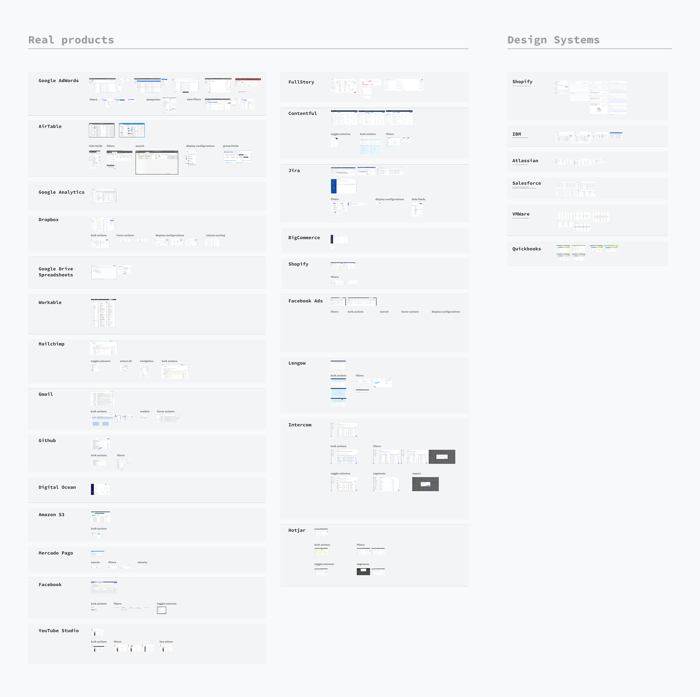 
```
   
## The new data table component 
  
We split the component in subcomponents that we would address one by one, making sure we were intentional in every design detail without being overwhelmed by its complexity.

<jumbo>
    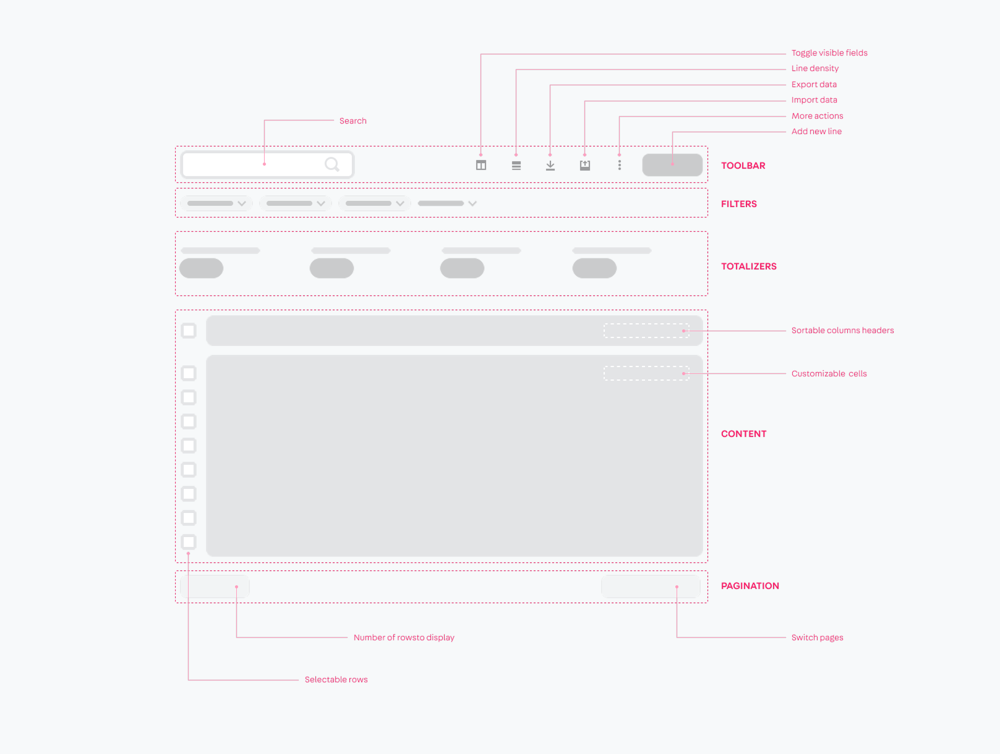
</jumbo>

As with everything about the Design System, the development was totally guided by demands in our projects. Because of that the development had to be halted a priorities changed a few times, which is fairly natural to any project like this. Yet, after a few months we had a working, feature-full version that was already being used by several projects in the company. At the time of this writing at least 10 projects are already reusing it, and more are certainly to come.

<jumbo caption="Example application of the Table component in the shining new Promotions Admin. It showcases almost all of current features: search, filter, toolbar, line and bulk actions, reorderable headers, custom cells and pagination.">
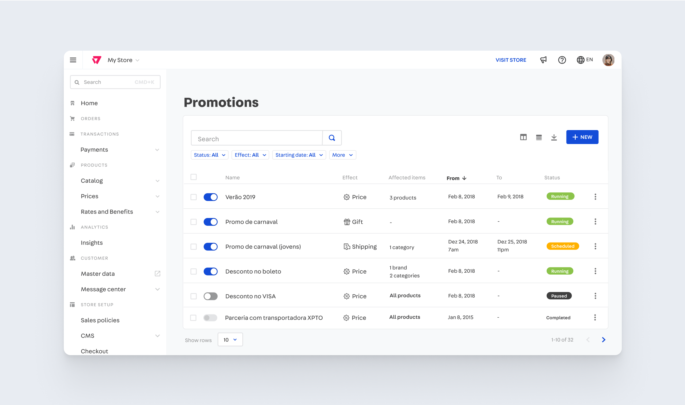
</jumbo>


# Component deep-dive: Filters

Along with tables, another very important part of any admin are filters. We wanted to design  a standard filter solution for VTEX that would be powerful enough to work with the overwhelming quantity and complexity of filters needed.

```grid|1
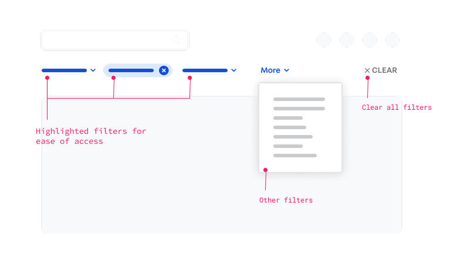
```  

An audit around the platform revealed we had half a dozen different variations of filters. The problems ranged from bad interaction choices, visual hierarchy, information architecture, discoverability and flexibility.
 
<!-- <jumbo caption="Examples of two very different filter interactions found in the legacy admins.">
    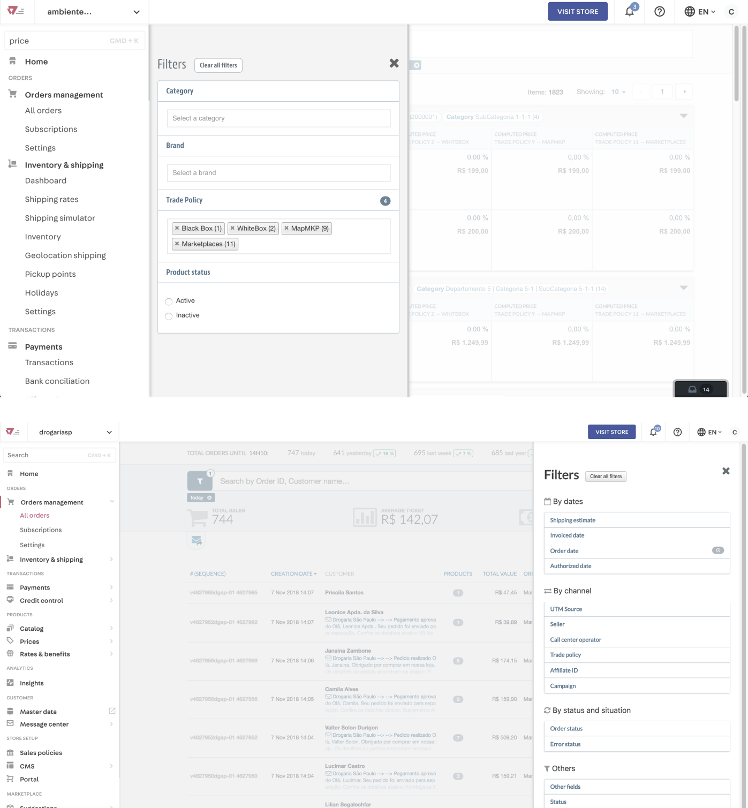
</jumbo> -->

## Exploring interaction concepts

We studied different interaction models for filters and analyzed the pros and cons of each one related to the problems we found in the current solutions.

<jumbo>
    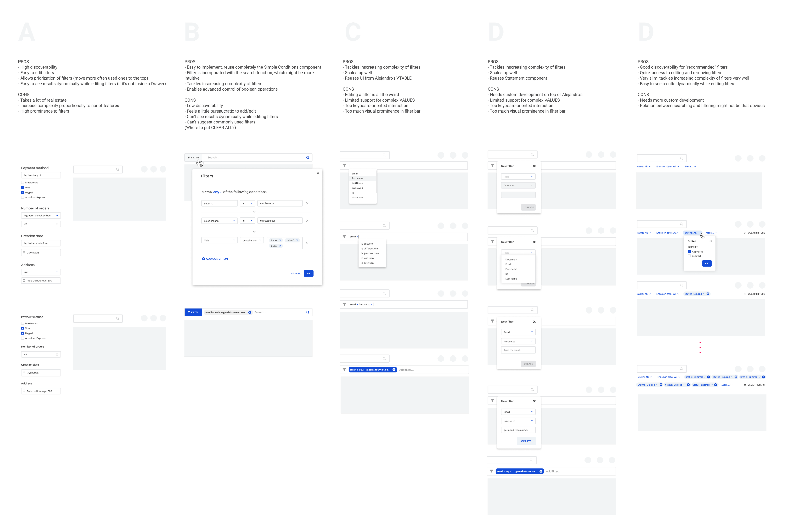
</jumbo>

The direction we chose to take focused in solving the following problems:
* **Screen real-estate**: some of our products offered from dozens to hundreds of possible filter variations, and we couldn't try to fit them all in the screen.
* **Live preview**: solutions with drawers made it hard to see the result of filtering directly along with the changing data, which made it harder to use especially if you're exploring data and trying different filter configurations.
* **Discoverability**: we designed a simple Select component that had typeahead search built-in, so it'd be easy to find filters even in long lists.
* **Flexibility**: we designed the Statement component to be a standard protocol for the most diverse filters imaginable, at the same time it was a common language to be reused with other components. 

```grid|1 

```

## The Filter Bar HOC
 
One way of using our filters system is by using the Filter Bar component, a HOC (high-order component, or component-of-components) that implements common interactions like turning filters on and off, creating new filters and clearing them. In the future we intend it to also implement saving filter preferences.

<jumbo>
    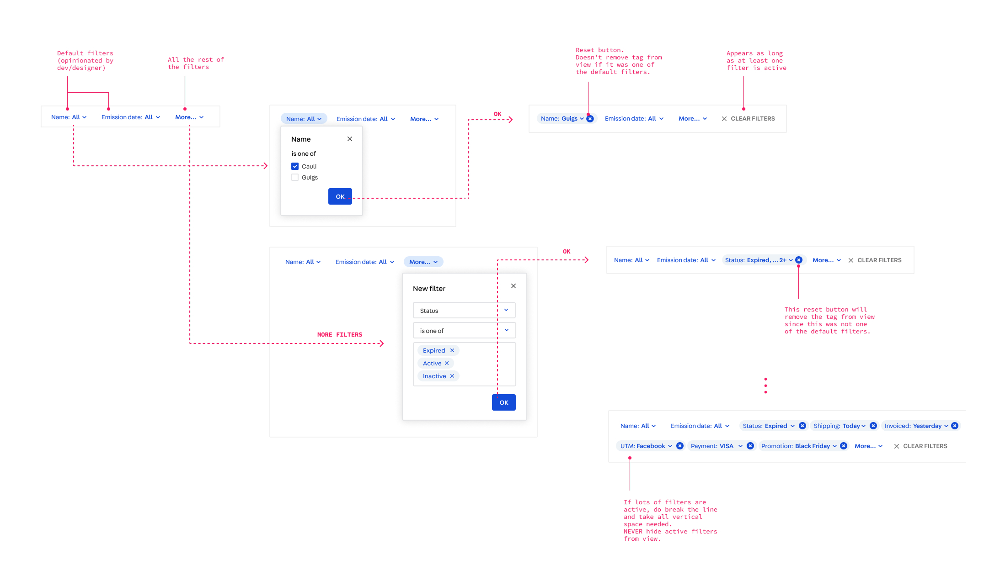
</jumbo>
 


# Component deep-dive: Conditions Builder

Conditions are statements that have boolean relationships. They are often seen being used in things liks filters, but also in more complex applications like IF-THEN programmable logics.


## Looking for inspiration

Looking at other digital products we found out this was a more common pattern than we initially thought, *especially* on the more advanced products. Some were truly inspiring, while others not that much. One common pitfall was giving control to each boolean operator individually, which can lead the user into creating unintentional precedence mistakes (e.g. in `a OR b AND c` the `AND` has precedence, but the user might not know that). Others had poor visual design, which made it look overwhelming and more complex it actually was.

<jumbo>
    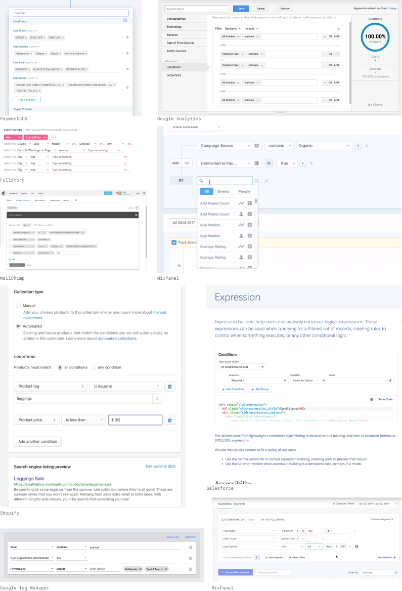
</jumbo>

We designed a Conditions Builder to be a common pattern for adding multiple conditions with simple (first level) boolean relationships. To chose the boolean operator there's a single global control, which prevents the precedence problem. It also helps users that are not used with boolean logic: either you chose that `all` conditions should be met or that `any` condition should be met. 

Each line is made of a Statement, that same component used in the Filter component.
  
<jumbo>
    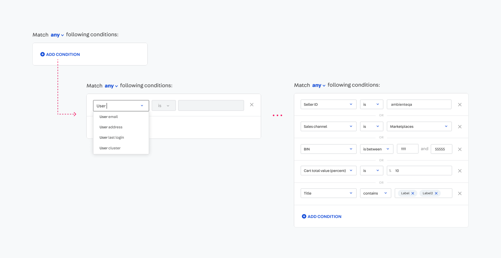
</jumbo>
 
It can also be extended to allow nesting of conditions, enabling the user to express complex booleans equations in an intuitive way.

```grid|1
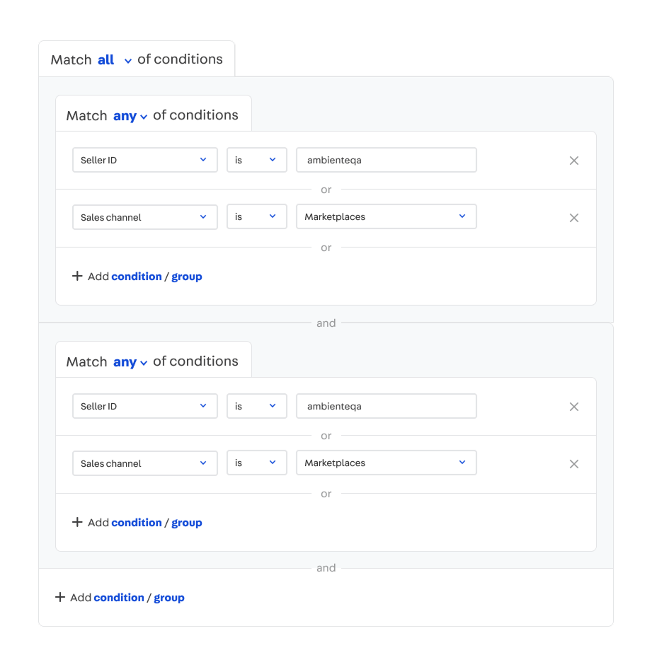
``` 
 
# Next steps

By the time of writing this case study, this project is still under way, constantly evolving with our growing maturity and also changing at the pace the company and our projects change. There's still a lot of work getting everyone onboard, making everybody feel welcome to contribute and at the same time have a more structured way of tracking ideas and problems.

## Evangelizing the Design System mindset

Beyond the natural evolution of having new components and improving documentation, one major way of improvement is communicating the value it brings to the company. We hope that by improving how people perceive the value of a Design System it'll naturally receive more spontaneous contributions. 

<jumbo>
    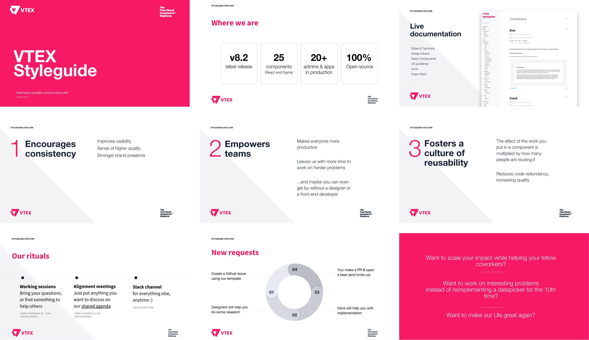
</jumbo>

For that I helped design and present the evolution of the project to the whole company in our Demo Friday sessions, as well as design assets such as illustrations to make our documentation and presentations for pleasing and visually engaging

<jumbo>
    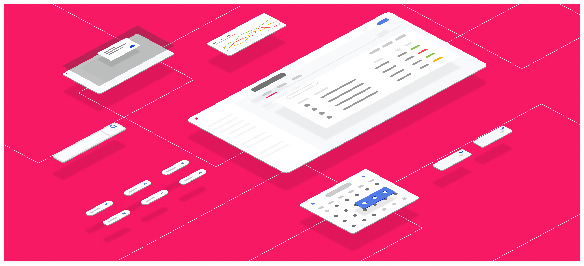
</jumbo>

# Acknowledgements

As mentioned before this was a highly collaborative project involving *many* people throughout the organization. Still, I'd like to give special thanks to the other Product Designers Raphael Simoens and Jonatas Maia, who have been highly engaged with it and great people to have discussions in general. I'd also like to thank the awesome front-end developers Breno Calazans, Kevin Chevalier, Guilherme Freitas, Lucas Bebber and Eric Reis.

For more people check the [full list of contributors in the Github repository](https://github.com/vtex/styleguide/graphs/contributors).

# Links

<links-list
    items='[
        {
            "label": "styleguide.vtex.com",
            "url": "https://styleguide.vtex.com"
        },
        {
            "label": "Project GitHub",
            "url": "https://github.com/vtex/styleguide/"
        }
    ]'>
</links-list>